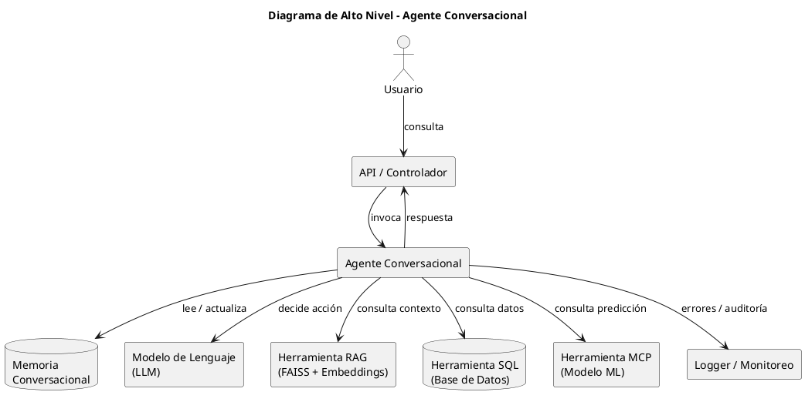

# Arquitectura del Proyecto - Agente Inteligente con MCP

## Información General
- **Proyecto:** Agente Inteligente para Recomendaciones en Supermercados  
- **Lenguaje principal:** Python 3.11+  
- **Frameworks:**  
  - [LangChain](https://www.langchain.com/) para integración de LLM, memoria y herramientas  
  - [FastAPI](https://fastapi.tiangolo.com/) para exponer el controlador (API REST)  
  - [FAISS](https://faiss.ai/) para búsquedas vectoriales en RAG  
- **Paradigmas aplicados:**  
  - Clean Architecture  
  - Domain-Driven Design (DDD)  
  - Modularidad y desacoplamiento  

---

## Componentes Principales

### 1. API / Controlador
- **Responsabilidad:** punto de entrada al sistema.  
- **Implementación:** `FastAPI` con un endpoint `/consulta` que recibe la **Pregunta** y devuelve una **Respuesta**.  
- **Clase:** `ControladorConversacion`.  

### 2. Agente Conversacional
- **Núcleo del sistema**, orquesta la interacción.  
- **Clases asociadas:**  
  - `AgenteConversacional`  
  - `Pregunta`  
  - `Respuesta`  
- **Dependencias:**  
  - `ModeloLenguaje` (ej. GPT-4, GPT-4o o Llama-3)  
  - `MemoriaConversacional` (historial multi-turno)  
  - Lista de `Herramienta`  

### 3. Herramientas
Cada herramienta implementa la interfaz común `Herramienta`.  

- **Herramienta RAG**  
  - Incluye `RetrieverFAISS`, `BaseVectorialFAISS` y `ModeloEmbeddings`.  
  - Se utiliza para consultas que requieren contexto externo.  

- **Herramienta SQL**  
  - Ejecuta queries sobre la base de datos del supermercado (inventarios, ventas).  

- **Herramienta MCP**  
  - Se comunica con un **servidor MCP** que expone modelos predictivos (ej. forecast de stock).  

- **Herramienta Búsqueda**  
  - Permite consultas a APIs externas o búsqueda web.  

- **Herramienta con Reintento**  
  - Decorador para cualquier herramienta.  
  - Reintenta hasta 3 veces en caso de error y registra logs.  

### 4. Logger / Monitoreo
- Registra cada interacción y error para trazabilidad y debugging.  
- Integración con `logging` de Python o `Prometheus`/`Grafana` para métricas.  

---

## Diagrama de Alto Nivel



---

## Diagrama UML de Clases

```plantuml
@startuml
title Arquitectura del Agente Conversacional - RAG (FAISS) + MCP + Orquestación mínima

' ====== Contrato base ======
interface Herramienta { 
  + ejecutar(entrada : String) : String 
}

class Pregunta { + texto : String }
class Respuesta { + texto : String }

class ModeloLenguaje { 
  + decidirAccion(contexto : String) : Accion
  + generarRespuesta(contexto : String) : String
}

class MemoriaConversacional { 
  + guardarInteraccion(p : Pregunta, r : Respuesta) : void
  + obtenerContexto() : String
}

class AgenteConversacional { 
  - modelo : ModeloLenguaje
  - memoria : MemoriaConversacional
  - herramientas : List<Herramienta>
  - prompt : PromptTemplate
  - parser : OutputParser
  - router : ToolRouter
  - logger : Logger
  + procesarConsulta(p : Pregunta) : Respuesta
}

class ControladorConversacion { 
  - agente : AgenteConversacional
  + manejarPregunta(p : Pregunta) : Respuesta
}

' ====== Tools existentes ======
class HerramientaBusqueda { + ejecutar(entrada : String) : String }
class HerramientaBBDD { + ejecutar(entrada : String) : String }
class HerramientaConReintento { - herramientaReal : Herramienta + ejecutar(entrada : String) : String }
class HerramientaRAG { - retriever : RetrieverFAISS - llm : ModeloLenguaje + ejecutar(entrada : String) : String }
class RetrieverFAISS { - vectorDB : BaseVectorialFAISS + recuperarContexto(consulta : String) : String }
class BaseVectorialFAISS { - documentos : List<String> - embeddings : ModeloEmbeddings + buscar(embedding : List<Float>) : List<String> }
class ModeloEmbeddings { + embed(texto : String) : List<Float> }

' ====== NUEVO: Tool MCP y cliente ======
class HerramientaMCP implements Herramienta {
  - client : MCPPredictClient
  - serializer : PayloadSerializer
  - logger : Logger
  + ejecutar(entrada : String) : String
}

class MCPPredictClient {
  - baseUrl : String
  - auth : APIKeyAuth
  - timeoutSeconds : int
  + predict(payload : String) : String
}

class APIKeyAuth {
  - headerName : String
  - apiKey : String
  + apply(headers : Map<String,String>) : void
}

class PayloadSerializer {
  + buildRequest(entrada : String) : String
  + parseResponse(json : String) : String
}

' ====== NUEVO: Orquestación LLM ======
class PromptTemplate { 
  + format(contexto : String, pregunta : String, herramientas : List<Herramienta>) : String
}
class OutputParser { 
  + parse(llmOutput : String) : Accion
}
class ToolRouter {
  + seleccionar(herramientas : List<Herramienta>, accion : Accion) : Herramienta
}

' ====== Utilitarios ======
class Logger { 
  + info(msg : String) : void
  + warn(msg : String) : void
  + error(msg : String) : void
}
class Configuracion {
  + get(key : String) : String
}

' ====== Relaciones principales ======
ControladorConversacion --> AgenteConversacional : delega
AgenteConversacional --> ModeloLenguaje : usa
AgenteConversacional --> MemoriaConversacional : contiene
AgenteConversacional o-- "1..*" Herramienta : usa
AgenteConversacional --> PromptTemplate : compone prompt
AgenteConversacional --> OutputParser : interpreta LLM
AgenteConversacional --> ToolRouter : selecciona tool
AgenteConversacional --> Logger : registra

MemoriaConversacional --> Pregunta
MemoriaConversacional --> Respuesta
AgenteConversacional --> Pregunta
AgenteConversacional --> Respuesta

Herramienta <|.. HerramientaBusqueda
Herramienta <|.. HerramientaBBDD
Herramienta <|.. HerramientaRAG
Herramienta <|.. HerramientaConReintento
Herramienta <|.. HerramientaMCP

HerramientaConReintento *-- Herramienta : reintenta sobre
HerramientaRAG --> RetrieverFAISS : consulta contexto
RetrieverFAISS --> BaseVectorialFAISS : búsqueda por vector
BaseVectorialFAISS --> ModeloEmbeddings : convierte texto a vector

HerramientaMCP --> MCPPredictClient : consume
MCPPredictClient --> APIKeyAuth : auth
HerramientaMCP --> PayloadSerializer : JSON
HerramientaMCP --> Logger : logs

' ====== Notas ======
note right of AgenteConversacional
  Flujo: 
  1) prompt.format(...) 
  2) LLM decide acción
  3) parser.parse -> Accion(tool,args)
  4) router.seleccionar -> invoca tool (incluye MCP si corresponde)
  5) guarda en Memoria y responde
end note

note right of HerramientaMCP
  Invoca POST {baseUrl}/predict
  Headers: Authorization: ApiKey <key>
  Body: PayloadSerializer.buildRequest(entrada)
end note
@enduml

```

---

## Infraestructura y Repositorio

```
/proyecto-agente-mcp
│── backend/
│   ├── api/                  # Controlador (FastAPI)
│   ├── core/                 # Configuración y dependencias
│   ├── domain/               # Entidades (Pregunta, Respuesta)
│   ├── services/             # Agente, Memoria, ModeloLenguaje
│   ├── tools/                # Herramientas (RAG, SQL, MCP, etc.)
│   └── tests/                # Tests unitarios y de integración
│
│── docs/                     # Documentación y diagramas
│── notebooks/                # Experimentos y EDA
│── requirements.txt          # Dependencias
│── README.md                 # Guía del proyecto
```

---

## Principios Clave
1. **Clean Architecture:** separación clara entre dominio, aplicación e infraestructura.  
2. **Extensibilidad:** se pueden agregar nuevas herramientas sin modificar el núcleo.  
3. **Escalabilidad:** integración con MCP para modelos especializados.  
4. **Reproducibilidad:** repositorio en GitHub con notebooks y resultados.  
