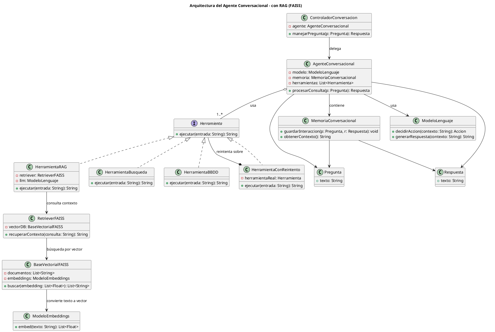

# Arquitectura del Proyecto - Agente Inteligente con MCP

## Información General
- **Proyecto:** Agente Inteligente para Recomendaciones en Supermercados  
- **Lenguaje principal:** Python 3.11+  
- **Frameworks:**  
  - [LangChain](https://www.langchain.com/) para integración de LLM, memoria y herramientas  
  - [FastAPI](https://fastapi.tiangolo.com/) para exponer el controlador (API REST)  
  - [FAISS](https://faiss.ai/) para búsquedas vectoriales en RAG  
- **Paradigmas aplicados:**  
  - Clean Architecture  
  - Domain-Driven Design (DDD)  
  - Modularidad y desacoplamiento  

---

## Componentes Principales

### 1. API / Controlador
- **Responsabilidad:** punto de entrada al sistema.  
- **Implementación:** `FastAPI` con un endpoint `/consulta` que recibe la **Pregunta** y devuelve una **Respuesta**.  
- **Clase:** `ControladorConversacion`.  

### 2. Agente Conversacional
- **Núcleo del sistema**, orquesta la interacción.  
- **Clases asociadas:**  
  - `AgenteConversacional`  
  - `Pregunta`  
  - `Respuesta`  
- **Dependencias:**  
  - `ModeloLenguaje` (ej. GPT-4, GPT-4o o Llama-3)  
  - `MemoriaConversacional` (historial multi-turno)  
  - Lista de `Herramienta`  

### 3. Herramientas
Cada herramienta implementa la interfaz común `Herramienta`.  

- **Herramienta RAG**  
  - Incluye `RetrieverFAISS`, `BaseVectorialFAISS` y `ModeloEmbeddings`.  
  - Se utiliza para consultas que requieren contexto externo.  

- **Herramienta SQL**  
  - Ejecuta queries sobre la base de datos del supermercado (inventarios, ventas).  

- **Herramienta MCP**  
  - Se comunica con un **servidor MCP** que expone modelos predictivos (ej. forecast de stock).  

- **Herramienta Búsqueda**  
  - Permite consultas a APIs externas o búsqueda web.  

- **Herramienta con Reintento**  
  - Decorador para cualquier herramienta.  
  - Reintenta hasta 3 veces en caso de error y registra logs.  

### 4. Logger / Monitoreo
- Registra cada interacción y error para trazabilidad y debugging.  
- Integración con `logging` de Python o `Prometheus`/`Grafana` para métricas.  

---

## Diagrama de Alto Nivel


---

## Diagrama UML de Clases



---

## Infraestructura y Repositorio

```
/proyecto-agente-mcp
│── backend/
│   ├── api/                  # Controlador (FastAPI)
│   ├── core/                 # Configuración y dependencias
│   ├── domain/               # Entidades (Pregunta, Respuesta)
│   ├── services/             # Agente, Memoria, ModeloLenguaje
│   ├── tools/                # Herramientas (RAG, SQL, MCP, etc.)
│   └── tests/                # Tests unitarios y de integración
│
│── docs/                     # Documentación y diagramas
│── notebooks/                # Experimentos y EDA
│── requirements.txt          # Dependencias
│── README.md                 # Guía del proyecto
```

---

## Principios Clave
1. **Clean Architecture:** separación clara entre dominio, aplicación e infraestructura.  
2. **Extensibilidad:** se pueden agregar nuevas herramientas sin modificar el núcleo.  
3. **Escalabilidad:** integración con MCP para modelos especializados.  
4. **Reproducibilidad:** repositorio en GitHub con notebooks y resultados.  
