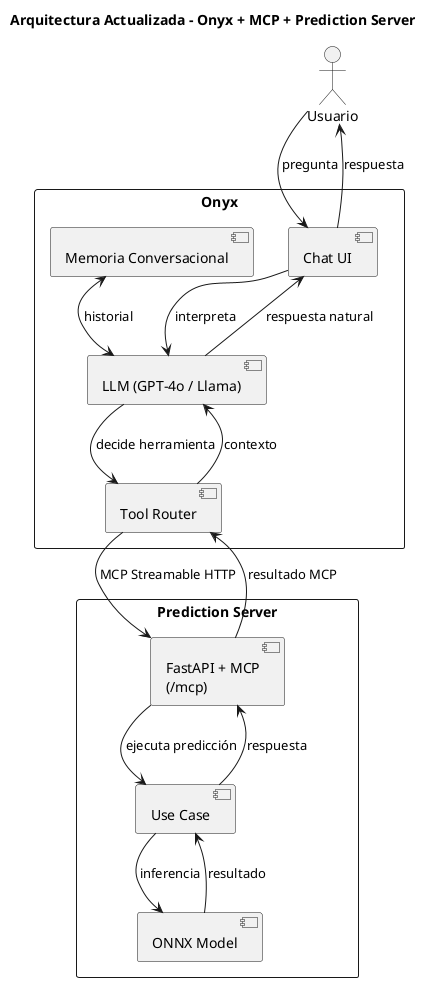

# Integración con Onyx como Interfaz de Chat

## Resumen

[Onyx](https://onyx.app) es una plataforma de asistente IA de código abierto que proporciona
interfaz de chat, orquestación de LLM, memoria conversacional y enrutamiento de herramientas.
Se conecta al servidor de predicción a través del **Model Context Protocol (MCP)**.

```
Usuario ─► Onyx (Chat UI + LLM + Memoria) ─► MCP Streamable HTTP ─► Prediction Server (/predict)
```

Onyx reemplaza la necesidad de construir un agente conversacional personalizado con LangChain.
El servidor de predicción expone sus capacidades como herramientas MCP usando la biblioteca
`fastapi-mcp`, que genera automáticamente herramientas MCP a partir de los endpoints FastAPI
existentes.

---

## Versión Testeada

| Componente | Versión | Notas |
|---|---|---|
| **Onyx** | `latest` (configurable vía `ONYX_VERSION` en `.env`) | Imágenes: `onyxdotapp/onyx-backend`, `onyxdotapp/onyx-web-server`, `onyxdotapp/onyx-model-server` |
| **Prediction Server** | `0.1.0` | Imagen construida localmente desde `Dockerfile` |
| **Docker Compose** | v2 (plugin) | Requerido — no usar `docker-compose` v1 |

> Para fijar una versión específica de Onyx, establecer `ONYX_VERSION=v0.20.0` (o la versión
> deseada) en el archivo `.env`.

---

## Arquitectura



### Red Docker

Todos los servicios se ejecutan en la red Docker compartida `app_network`:

```
┌─────────────────────────────── app_network ───────────────────────────────┐
│                                                                           │
│  prediction_server:8000  ◄──── MCP ────  api_server:8080 (Onyx backend)  │
│         │                                       │                         │
│    localhost:8000                          web_server:3000                 │
│    (API + docs)                           localhost:3000                   │
│                                           (Onyx UI)                       │
│                                                                           │
│  relational_db:5432    cache:6379    model_server (embeddings)            │
│  (PostgreSQL)          (Redis)       background (workers)                 │
│                                                                           │
└───────────────────────────────────────────────────────────────────────────┘
```

- El servidor de predicción es accesible **dentro** de la red Docker en:
  `http://prediction_server:8000/mcp`
- **No se necesita exponer el endpoint MCP públicamente** — Onyx se comunica
  internamente a través de la red Docker compartida.
- Los puertos expuestos al host son solo para conveniencia del desarrollador:
  - `8000` — API de predicción y documentación Swagger
  - `3000` — Interfaz web de Onyx

---

## Inicio Rápido con Docker (Recomendado)

### Prerrequisitos

- Docker Desktop (Windows/macOS) o Docker Engine + Compose plugin (Linux)
- Al menos **6 vCPU, 12-16 GB RAM, 32 GB disco** (Onyx necesita ≥4 vCPU, ≥10 GB RAM)
- Una API key de LLM (OpenAI, Anthropic, etc.) — o un LLM local (Ollama)

### 1. Configurar variables de entorno

```bash
cp .env.example .env
```

Editar `.env` y configurar al menos:
- `POSTGRES_PASSWORD` — contraseña segura para PostgreSQL
- `ENCRYPTION_KEY_SECRET` — generar con `python -c "import secrets; print(secrets.token_hex(32))"`
- `GEN_AI_API_KEY` — API key del proveedor LLM
- `GEN_AI_MODEL_PROVIDER` — `openai`, `anthropic`, `ollama`, etc.
- `GEN_AI_MODEL_VERSION` — modelo a usar (ej: `gpt-4o-mini`)

### 2. Iniciar los contenedores

```bash
bash scripts/containers.sh
```

O directamente con Docker Compose:

```bash
docker compose up -d
```

### 3. Verificar que los servicios están corriendo

```bash
# Estado de los contenedores
bash scripts/containers.sh status

# Health check del servidor de predicción
curl http://localhost:8000/health

# Verificar endpoint MCP
curl http://localhost:8000/mcp

# Documentación Swagger
# Abrir en navegador: http://localhost:8000/docs
```

### 4. Acceder a la interfaz de Onyx

Abrir en el navegador: **http://localhost:3000**

> La primera vez, Onyx puede tardar unos minutos en inicializar mientras descarga modelos
> de embeddings.

---

## Configuración sin Docker (Desarrollo Local)

Para ejecutar el servidor de predicción sin Docker (útil para desarrollo rápido):

```bash
# Instalar dependencias
pip install -e .

# Iniciar el servidor (backend dummy para testing)
MODEL_BACKEND=dummy python -m server.main

# Verificar
curl http://127.0.0.1:8000/health
curl http://127.0.0.1:8000/mcp
```

> Nota: En modo local, la URL MCP para Onyx será `http://host.docker.internal:8000/mcp`
> si Onyx corre en Docker, o `http://127.0.0.1:8000/mcp` si ambos corren nativamente.

---

## Registro del Servidor MCP en Onyx

### Paso a paso en el Admin Panel

1. Acceder a **http://localhost:3000** e iniciar sesión (si `AUTH_TYPE` no es `disabled`).
2. Ir al **Admin Panel** (ícono de engranaje o `/admin`).
3. Navegar a **Tools** > **Actions**.
4. Hacer clic en **"From MCP server"**.
5. En el campo URL, ingresar:
   - Con Docker: **`http://prediction_server:8000/mcp`**
   - Sin Docker (Onyx local): `http://127.0.0.1:8000/mcp`
   - Sin Docker (Onyx en Docker, server local): `http://host.docker.internal:8000/mcp`
6. Hacer clic en **"List Actions"**.
7. Verificar que aparece la herramienta **`predict_stock`** con su descripción.
8. Hacer clic en **"Save"** o **"Add"** para registrar las acciones.

> **Importante:** La URL interna `http://prediction_server:8000/mcp` solo funciona cuando
> ambos servicios están en la misma red Docker (`app_network`). Esta es la configuración
> por defecto de `docker-compose.yml`.

---

## Creación del Agente/Persona

### 1. Crear el agente

1. En el Admin Panel, ir a **Agents / Assistants**.
2. Hacer clic en **"Create New Assistant"**.
3. Nombre: **"Asistente de Inventario"** (o el nombre preferido).

### 2. Configurar el prompt del sistema

Copiar y pegar el siguiente prompt:

```
Eres un asistente inteligente especializado en gestión de inventario de supermercados.

Tu función principal es ayudar a los usuarios a planificar sus pedidos de stock usando
predicciones de demanda. Cuando el usuario pregunte sobre necesidades futuras de stock,
pronósticos de demanda, o cuántas unidades de un producto debe pedir una tienda, usa
la herramienta predict_stock.

Comportamiento esperado:
1. Confirma los parámetros con el usuario antes de ejecutar la predicción:
   - ID del producto (ej: PROD-001)
   - ID de la tienda (ej: STORE-A)
   - Rango de fechas (fecha inicio y fecha fin)
2. Ejecuta la predicción usando la herramienta predict_stock.
3. Presenta los resultados de forma clara:
   - Tabla con fecha y cantidad predicha por día.
   - Resumen con el total de unidades para el período.
   - Recomendación de pedido.

Si el usuario proporciona datos históricos de ventas, inclúyelos en el campo history
de la predicción para mejorar la precisión.

Responde siempre en el mismo idioma que use el usuario.
```

### 3. Habilitar la herramienta

1. En la sección **"Tools"** del agente, habilitar **`predict_stock`**.
2. Guardar el agente.

### 4. Probar la integración

Iniciar una conversación con el agente creado y hacer preguntas como:

> "¿Cuántas unidades del producto PROD-001 debería pedir la tienda STORE-A
> para la primera semana de marzo 2026?"

El agente debería:
1. Identificar que necesita usar `predict_stock`.
2. Extraer los parámetros de la pregunta (o confirmar con el usuario).
3. Llamar al servidor MCP con los parámetros correctos.
4. Presentar los resultados en lenguaje natural con una tabla y recomendación.

---

## Herramientas MCP Expuestas

| Herramienta | Operación | Descripción |
|---|---|---|
| `predict_stock` | `POST /predict` | Predice la demanda de un producto en una tienda para un rango de fechas |

> La operación `check_health` (`GET /health`) está excluida intencionalmente del MCP
> ya que es solo para monitoreo de infraestructura.

### Esquema de entrada (`predict_stock`)

```json
{
  "product_id": "PROD-001",
  "store_id": "STORE-A",
  "start_date": "2026-03-02",
  "end_date": "2026-03-08",
  "history": [
    {"date": "2026-02-25", "quantity": 150},
    {"date": "2026-02-26", "quantity": 140}
  ]
}
```

- `product_id` (string, requerido) — Identificador del producto.
- `store_id` (string, requerido) — Identificador de la tienda.
- `start_date` (date, requerido) — Fecha de inicio del período de predicción.
- `end_date` (date, requerido) — Fecha de fin del período de predicción.
- `history` (array, opcional) — Datos históricos de ventas recientes.

### Esquema de salida

```json
{
  "product_id": "PROD-001",
  "store_id": "STORE-A",
  "predictions": [
    {"date": "2026-03-02", "quantity": 145.0},
    {"date": "2026-03-03", "quantity": 132.0}
  ]
}
```

---

## Notas de Red y Seguridad

### Red Docker compartida

- Todos los servicios están en la red `app_network` (bridge driver).
- La comunicación MCP entre Onyx y el prediction server es **interna** — no atraviesa
  la red pública.
- No se necesita configuración de firewall ni DNS.

### CORS

El servidor de predicción incluye middleware CORS configurable vía la variable de entorno
`CORS_ORIGINS`:
- **Desarrollo:** `*` (permitir todos los orígenes) — es el valor por defecto.
- **Producción:** Restringir a orígenes específicos (ej: `http://localhost:3000,https://tudominio.com`).

### Autenticación

- La autenticación del prediction server no está habilitada por defecto (diseñado para
  uso interno dentro de la red Docker).
- Si se expone el servidor fuera de la red Docker, considerar agregar autenticación
  con API key (Phase 6).
- Onyx tiene su propia autenticación configurable vía `AUTH_TYPE` en `.env`.

---

## Solución de Problemas

| Problema | Solución |
|----------|----------|
| Onyx no lista herramientas | Verificar que el prediction server está corriendo: `curl http://localhost:8000/mcp`. Revisar que la URL en Onyx sea `http://prediction_server:8000/mcp`. |
| Error de conexión desde Onyx | Confirmar que ambos servicios están en `app_network`: `docker network inspect <project>_app_network`. |
| Predicciones inesperadas | Verificar `MODEL_BACKEND` en `.env`. Si es `dummy`, las predicciones serán constantes. |
| Onyx tarda en iniciar | Normal en el primer inicio — descarga modelos de embeddings (~2-5 min). Verificar con `bash scripts/containers.sh logs model_server`. |
| Error "connection refused" en MCP | El prediction server puede no estar listo aún. Esperar a que pase el health check: `docker compose ps`. |
| CORS errors en el navegador | Verificar que `CORS_ORIGINS` incluya el origen correcto. Para desarrollo, usar `*`. |
