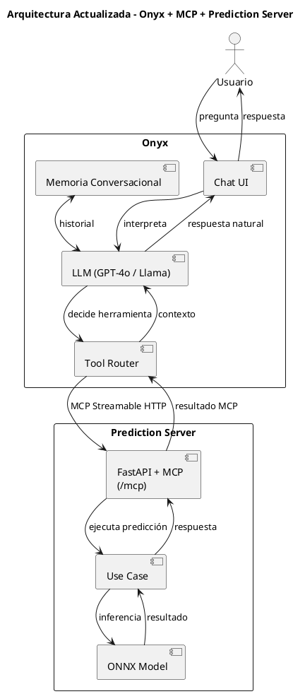

# Integración con Onyx como Interfaz de Chat

## Resumen

[Onyx](https://onyx.app) es una plataforma de asistente IA de código abierto que proporciona
interfaz de chat, orquestación de LLM, memoria conversacional y enrutamiento de herramientas.
Se conecta al servidor de predicción a través del **Model Context Protocol (MCP)**.

```
Usuario ─► Onyx (Chat UI + LLM + Memoria) ─► MCP Streamable HTTP ─► Prediction Server (/predict)
```

Onyx reemplaza la necesidad de construir un agente conversacional personalizado con LangChain.
El servidor de predicción expone sus capacidades como herramientas MCP usando la biblioteca
`fastapi-mcp`, que genera automáticamente herramientas MCP a partir de los endpoints FastAPI
existentes.

---

## Arquitectura



---

## Configuración del Prediction Server

### 1. Instalar dependencias

```bash
pip install -e .
# o bien:
pip install -r requirements.txt
```

### 2. Iniciar el servidor

```bash
MODEL_BACKEND=dummy python -m server.main
```

### 3. Verificar que el servidor está corriendo

```bash
# Health check
curl http://127.0.0.1:8000/health

# Predicción HTTP directa
curl -X POST http://127.0.0.1:8000/predict \
  -H "Content-Type: application/json" \
  -d '{"product_id":"P1","store_id":"S1","start_date":"2026-03-02","end_date":"2026-03-04"}'

# Verificar endpoint MCP
curl http://127.0.0.1:8000/mcp
```

---

## Configuración de Onyx

### 1. Registrar el servidor MCP

1. Acceder al **Admin Panel** de Onyx.
2. Ir a **Actions** (Acciones).
3. Seleccionar **"From MCP server"**.
4. Ingresar la URL del servidor MCP: `http://<host>:8000/mcp`
5. Hacer clic en **"List Actions"**.
6. Verificar que aparece la herramienta `predict_stock`.

### 2. Crear un Agente/Persona

1. Ir a **Agents / Personas** en el Admin Panel.
2. Crear un nuevo agente o editar uno existente.
3. En la sección de herramientas, habilitar `predict_stock`.
4. Configurar un prompt del sistema sugerido:

```
Eres un asistente inteligente para gestión de inventario de supermercados.
Cuando el usuario pregunte sobre necesidades futuras de stock, pronósticos
de demanda, o cuántas unidades de un producto debe pedir una tienda, usa
la herramienta predict_stock.

Siempre confirma los parámetros con el usuario antes de ejecutar la predicción:
- ID del producto
- ID de la tienda
- Rango de fechas
```

### 3. Probar la integración

Iniciar una conversación con el agente y preguntar:

> "¿Cuántas unidades del producto PROD-001 debería pedir la tienda STORE-A
> para la primera semana de marzo 2026?"

El agente debería:
1. Identificar que necesita usar `predict_stock`.
2. Extraer los parámetros de la pregunta.
3. Llamar al servidor MCP.
4. Presentar los resultados en lenguaje natural.

---

## Herramientas MCP expuestas

| Herramienta      | Descripción                                          |
| ---------------- | ---------------------------------------------------- |
| `predict_stock`  | Predice la demanda de un producto en una tienda para un rango de fechas |

> La herramienta `check_health` está excluida intencionalmente del MCP ya que
> es solo para monitoreo de infraestructura.

---

## Solución de problemas

| Problema | Solución |
|----------|----------|
| Onyx no lista herramientas | Verificar que el servidor está corriendo y que `/mcp` responde |
| Error de conexión | Revisar firewall/red entre Onyx y el servidor de predicción |
| Predicciones inesperadas | Verificar que `MODEL_BACKEND` apunte al modelo correcto (no `dummy`) |
