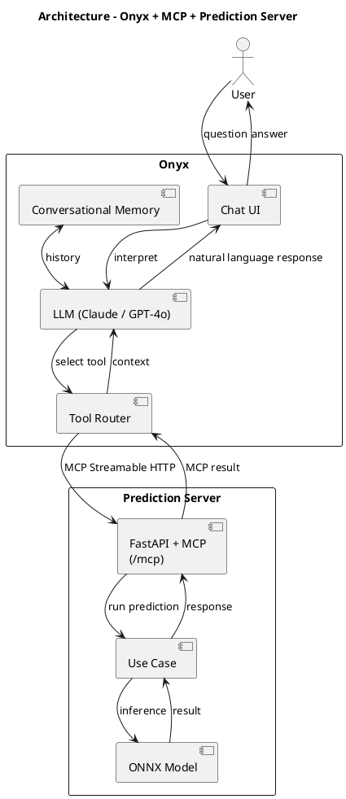

# Onyx Integration as Chat Interface

## Overview

[Onyx](https://onyx.app) is an open-source AI assistant platform that provides
a chat interface, LLM orchestration, conversational memory, and tool routing.
It connects to the prediction server via the **Model Context Protocol (MCP)**.

```
User ─► Onyx (Chat UI + LLM + Memory) ─► MCP Streamable HTTP ─► Prediction Server (/predict)
```

Onyx replaces the need to build a custom conversational agent with LangChain.
The prediction server exposes its capabilities as MCP tools using the
`fastapi-mcp` library, which automatically generates MCP tools from existing
FastAPI endpoints.

---

## Tested Versions

| Component | Version | Notes |
|---|---|---|
| **Onyx** | `latest` (configurable via `ONYX_VERSION` in `.env`) | Images: `onyxdotapp/onyx-backend`, `onyxdotapp/onyx-web-server`, `onyxdotapp/onyx-model-server` |
| **Prediction Server** | `0.1.0` | Image built locally from `Dockerfile` |
| **Docker Compose** | v2 (plugin) | Required — do not use `docker-compose` v1 |
| **MCP (Python)** | `>=1.8.0,<1.26.0` | Pinned to avoid breaking changes in 1.26.0 (incompatible with Onyx's MCP client) |

> To pin a specific Onyx version, set `ONYX_VERSION=v0.20.0` (or the desired
> version) in the `.env` file.

---

## Architecture



### Docker Network

All services run on the shared Docker network `app_network`:

```
┌─────────────────────────────── app_network ───────────────────────────────┐
│                                                                           │
│  prediction_server:8000  ◄──── MCP ────  api_server:8080 (Onyx backend)  │
│  alias: prediction-server.local         │                                 │
│         │                          web_server:3000                        │
│    localhost:8000                  localhost:3000                          │
│    (API + docs)                   (Onyx UI)                               │
│                                                                           │
│  relational_db:5432    cache:6379    index (Vespa search engine)          │
│  (PostgreSQL)          (Redis)       model_server (embeddings)            │
│                                      background (workers)                 │
└───────────────────────────────────────────────────────────────────────────┘
```

- The prediction server is reachable **inside** the Docker network at:
  `http://prediction-server.local:8000/mcp`
- The network alias `prediction-server.local` is used because Onyx's URL
  validation rejects hostnames without dots (e.g., `prediction_server`).
- **No public exposure of the MCP endpoint is needed** — Onyx communicates
  internally through the shared Docker network.
- Ports exposed to the host are for developer convenience only:
  - `8000` — Prediction API and Swagger docs
  - `3000` — Onyx web interface

---

## Quick Start with Docker (Recommended)

### Prerequisites

- Docker Desktop (Windows/macOS) or Docker Engine + Compose plugin (Linux)
- At least **6 vCPU, 12–16 GB RAM, 32 GB disk** (Onyx needs ≥4 vCPU, ≥10 GB RAM)
- An LLM API key (OpenAI, Anthropic, etc.) — or a local LLM (Ollama)

### 1. Configure environment variables

```bash
cp .env.example .env
```

Edit `.env` and configure at least:

| Variable | How to set | Notes |
|---|---|---|
| `POSTGRES_PASSWORD` | A strong password | Used by Onyx's PostgreSQL database |
| `ENCRYPTION_KEY_SECRET` | `python -c "import secrets; print(secrets.token_urlsafe(24))"` | **Must be exactly 16, 24, or 32 characters** (not hex-encoded). Onyx has a bug in `_get_trimmed_key()` that requires plain ASCII strings of exact AES key size. |
| `AUTH_TYPE` | `basic` | `disabled` is no longer supported in recent Onyx versions. Use `basic` for username/password authentication. |
| `GEN_AI_API_KEY` | **Leave empty** | For non-OpenAI providers (Anthropic, Ollama), leave this empty and configure the LLM via the Onyx Admin UI after first login. Onyx's dev auto-setup only supports OpenAI. |
| `GEN_AI_MODEL_PROVIDER` | `anthropic`, `openai`, `ollama` | Only informational when API key is empty — actual config is done via UI. |
| `GEN_AI_MODEL_VERSION` | `claude-sonnet-4-6`, `gpt-4o-mini`, etc. | Must use the full model ID (e.g., `claude-sonnet-4-6`, not `sonnet-4.6`). |

> **Important:** Onyx's automatic LLM setup (`setup_postgres()`) only works with
> OpenAI. If you set `GEN_AI_API_KEY` with a non-OpenAI key, the background worker
> will crash with a model validation error. For Anthropic or other providers, leave
> `GEN_AI_API_KEY` empty and configure the provider through the Admin UI.

### 2. Start the containers

```bash
docker compose up -d
```

### 3. Verify services are running

```bash
# Container status
docker compose ps

# Prediction server health check
curl http://localhost:8000/health

# Verify MCP endpoint
curl http://localhost:8000/mcp

# Swagger documentation
# Open in browser: http://localhost:8000/docs
```

### 4. Access the Onyx interface

Open in browser: **http://localhost:3000**

> On first launch, Onyx may take a few minutes to initialize while downloading
> embedding models.

### 5. Stop all containers

```bash
docker compose down
```

To also remove persistent volumes (database, model cache, Vespa index):

```bash
docker compose down -v
```

---

## Initial Onyx Setup (First Launch)

The first time you access the Onyx interface, you need to complete the initial
setup. Without these steps, chat and MCP tools **will not work**.

### 1. Create the first user (Admin)

1. Open **http://localhost:3000**.
2. With `AUTH_TYPE=basic`, register a user. **The first registered user
   automatically becomes an Administrator.**

> Only Administrators can access the Admin Panel, configure LLMs,
> register MCP tools, and create agents.

### 2. Configure the LLM provider

This is the most critical step. Without a configured LLM, Onyx cannot process
messages or invoke tools.

1. Click the **profile icon** (top-right corner).
2. Select **"Admin Panel"**.
3. Go to the **"LLM"** section (or **"AI Models"**).
4. Select the desired provider:

   | Provider | Requires | Notes |
   |----------|----------|-------|
   | **OpenAI** | OpenAI API key | Recommended models: `gpt-4o-mini` (fast/cheap), `gpt-4o` (best quality) |
   | **Anthropic** | Anthropic API key | Models: `claude-sonnet-4-6`, `claude-opus-4-6`. Get key at [console.anthropic.com](https://console.anthropic.com/settings/keys) |
   | **Ollama** | Ollama running locally | Free, no API key. Models: `llama3`, `mistral`, `qwen` |
   | **Azure OpenAI** | Azure endpoint + API key | For organizations with Azure |
   | **Custom** | Base URL + API key | Any OpenAI-compatible API |

5. Fill in the fields:
   - **Display Name**: descriptive name (e.g., "Anthropic Production")
   - **API Key**: the provider's key
   - **Default Model**: main model for chat and tools (e.g., `claude-sonnet-4-6`)
   - **Fast Model** (optional): lightweight model for internal tasks like naming
     conversations and expanding queries (e.g., `claude-haiku-4-5-20251001`)

6. Click **"Save"** or **"Test & Save"**.

> **Important:** Do NOT configure the LLM via environment variables for
> non-OpenAI providers. Onyx's auto-setup hardcodes the OpenAI provider, and
> setting `GEN_AI_API_KEY` with an Anthropic key will cause the background
> worker to crash. Always configure non-OpenAI providers through the Admin UI.

#### Using a local LLM with Ollama (free)

To avoid API costs during development or the thesis demo:

1. Install [Ollama](https://ollama.ai) on the host machine.
2. Download a model: `ollama pull llama3.3`
3. In the Onyx Admin Panel, configure the provider as **Ollama** with
   base URL: `http://host.docker.internal:11434` (accesses the host's Ollama from Docker).

### 3. Verify Onyx is working

Before configuring MCP tools, verify that basic chat works:

1. Go to the main chat screen (**http://localhost:3000**).
2. Type a simple message: *"Hello, are you working?"*
3. Onyx should respond using the configured LLM.

If it doesn't respond or shows an error, check:
- That the LLM is configured correctly in the Admin Panel.
- That the API key is valid.
- Backend logs: `docker compose logs api_server`

---

## Service Health Checks

### Per-service health checks

```bash
# Prediction server (ours)
curl http://localhost:8000/health
# Expected: {"status":"ok"}

# Onyx API server (internal port 8080, not exposed by default)
# Check via Docker:
docker exec onyx_api_server curl -s http://localhost:8080/health
# Expected: {"success":true, ...}

# Overall container status
docker compose ps
```

### Interpreting container status

| Container | Expected Status | If it fails |
|-----------|----------------|-------------|
| `prediction_server` | `Up (healthy)` | Check logs: `docker compose logs prediction_server` |
| `onyx_api_server` | `Up` | Check LLM config and DB: `docker compose logs api_server` |
| `onyx_web_server` | `Up` | Check that `api_server` is running |
| `onyx_background` | `Up` | Task worker — check connection to Redis and DB |
| `onyx_model_server` | `Up` | Downloads embedding models on first launch (~2–5 min) |
| `onyx_relational_db` | `Up (healthy)` | Check `POSTGRES_PASSWORD` in `.env` |
| `onyx_cache` | `Up (healthy)` | Redis — rarely fails |
| `index` (Vespa) | `Up` | Search engine — check logs: `docker compose logs index` |

### Useful logs for diagnosis

```bash
# Logs for a specific service
docker compose logs api_server

# Logs for all services
docker compose logs

# Last 50 lines of the prediction server
docker compose logs --tail 50 prediction_server
```

---

## Onyx Version Management

### Pin a specific version

To ensure reproducibility (especially for the thesis defense), pin the
Onyx version in `.env`:

```bash
# In .env — use a specific stable version
ONYX_VERSION=v0.20.0
```

> **Recommendation for thesis:** Pin the version once the integration works
> correctly. Use `latest` during development and switch to a fixed version
> before the demo.

### Check available versions

```bash
# See the latest stable published version
curl -s https://cloud.onyx.app/api/versions
```

### Update Onyx

```bash
# Change ONYX_VERSION in .env, then:
docker compose down
docker compose up -d
```

### Version notes

- Stable versions use the format `vX.Y.Z` (e.g., `v0.20.0`).
- `latest` points to the latest stable published release.
- Onyx's `main` branch is for development — **do not use in production**.
- Onyx publishes new stable releases on Mondays; hotfixes are released immediately.

---

## Running Without Docker (Local Development)

To run the prediction server without Docker (useful for rapid development):

```bash
# Install dependencies
pip install -e .

# Start the server (dummy backend for testing)
MODEL_BACKEND=dummy python -m server.main

# Verify
curl http://127.0.0.1:8000/health
curl http://127.0.0.1:8000/mcp
```

> Note: In local mode, the MCP URL for Onyx will be `http://host.docker.internal:8000/mcp`
> if Onyx runs in Docker, or `http://127.0.0.1:8000/mcp` if both run natively.

---

## Registering the MCP Server in Onyx

### Step by step in the Admin Panel

1. Go to **http://localhost:3000** and log in.
2. Go to the **Admin Panel** (gear icon or `/admin`).
3. Navigate to **Tools** > **Actions**.
4. Click **"From MCP server"**.
5. In the URL field, enter:
   - With Docker: **`http://prediction-server.local:8000/mcp`**
   - Without Docker (Onyx local): `http://127.0.0.1:8000/mcp`
   - Without Docker (Onyx in Docker, server local): `http://host.docker.internal:8000/mcp`
6. Click **"List Actions"**.
7. Verify that the **`predict_stock`** tool appears with its description.
8. Click **"Save"** or **"Add"** to register the actions.

> **Important:** The internal URL `http://prediction-server.local:8000/mcp` only works
> when both services are on the same Docker network (`app_network`). This is the default
> configuration in `docker-compose.yml`. The network alias `prediction-server.local` is
> defined in the `prediction_server` service — note the hyphen (not underscore).

---

## Creating the Agent/Persona

### 1. Create the agent

1. In the Admin Panel, go to **Agents / Assistants**.
2. Click **"Create New Assistant"**.
3. Name: **"Inventory Assistant"** (or your preferred name).

### 2. Configure the system prompt

Copy and paste the following prompt:

```
You are an assistant specialized in supermarket inventory management. Your goal is to help plan stock orders using demand predictions.

## When to use predict_stock

Use the predict_stock tool when the user asks about:
- Future stock needs
- Demand forecasts or predictions
- How many units of a product to order

## Workflow

1. **Gather parameters**: Before running a prediction, make sure you have:
   - `product_id`: Product ID (e.g., PROD-001)
   - `store_id`: Store ID (e.g., STORE-A)
   - `start_date`: Forecast start date (YYYY-MM-DD)
   - `end_date`: Forecast end date (YYYY-MM-DD)
   - `history` (optional): If the user provides historical sales data, include it as date-quantity pairs to improve accuracy.

   If any required parameter is missing, ask for it before proceeding. Do not make up values.

2. **Run the prediction**: Call predict_stock with the gathered parameters.

3. **Present results**:
   - Table with predicted quantity per day.
   - Total units for the entire period.
   - Concrete order recommendation based on the results.

## Rules

- Always respond in the same language the user is using.
- Never assume values for product_id or store_id; always confirm them with the user.
- If the prediction fails or returns an error, explain the problem clearly and suggest how to fix it.
```

### 3. Enable the tool

1. In the agent's **"Tools"** section, enable **`predict_stock`**.
2. Save the agent.

### 4. Test the integration

Start a conversation with the created agent and ask questions like:

> "How many units of product PROD-001 should store STORE-A order
> for the first week of March 2026?"

The agent should:
1. Identify that it needs to use `predict_stock`.
2. Extract the parameters from the question (or ask the user to confirm).
3. Call the MCP server with the correct parameters.
4. Present the results in natural language with a table and recommendation.

---

## Exposed MCP Tools

| Tool | Operation | Description |
|---|---|---|
| `predict_stock` | `POST /predict` | Predicts demand for a product at a store over a date range |

> The `check_health` operation (`GET /health`) is intentionally excluded from MCP
> as it is only for infrastructure monitoring.

### Input schema (`predict_stock`)

```json
{
  "product_id": "PROD-001",
  "store_id": "STORE-A",
  "start_date": "2026-03-02",
  "end_date": "2026-03-08",
  "history": [
    {"date": "2026-02-25", "quantity": 150},
    {"date": "2026-02-26", "quantity": 140}
  ]
}
```

- `product_id` (string, required) — Product identifier.
- `store_id` (string, required) — Store identifier.
- `start_date` (date, required) — Prediction period start date.
- `end_date` (date, required) — Prediction period end date.
- `history` (array, optional) — Recent historical sales data.

### Output schema

```json
{
  "product_id": "PROD-001",
  "store_id": "STORE-A",
  "predictions": [
    {"date": "2026-03-02", "quantity": 145.0},
    {"date": "2026-03-03", "quantity": 132.0}
  ]
}
```

---

## Network and Security Notes

### Shared Docker network

- All services are on the `app_network` network (bridge driver).
- MCP communication between Onyx and the prediction server is **internal** — it
  does not traverse the public network.
- No firewall or DNS configuration is needed.

### CORS

The prediction server includes configurable CORS middleware via the `CORS_ORIGINS`
environment variable:
- **Development:** `*` (allow all origins) — this is the default.
- **Production:** Restrict to specific origins (e.g., `http://localhost:3000,https://yourdomain.com`).

### Authentication

- Prediction server authentication is not enabled by default (designed for
  internal use within the Docker network).
- If the server is exposed outside the Docker network, consider adding API key
  authentication (Phase 6).
- Onyx has its own configurable authentication via `AUTH_TYPE` in `.env`.
  Use `basic` for username/password login (the default).

---

## Troubleshooting

| Problem | Solution |
|---------|----------|
| Onyx doesn't list tools | Verify the prediction server is running: `curl http://localhost:8000/mcp`. Check that the URL in Onyx is `http://prediction-server.local:8000/mcp` (hyphen, not underscore). |
| Connection error from Onyx | Confirm both services are on `app_network`: `docker network inspect <project>_app_network`. |
| Unexpected predictions | Check `MODEL_BACKEND` in `.env`. If set to `dummy`, predictions will be constant. |
| Onyx slow to start | Normal on first launch — downloads embedding models (~2–5 min). Check with `docker compose logs model_server`. |
| "Connection refused" on MCP | The prediction server may not be ready yet. Wait for the health check to pass: `docker compose ps`. |
| CORS errors in browser | Check that `CORS_ORIGINS` includes the correct origin. For development, use `*`. |
| `onyx_background` crash-looping | Check logs: `docker compose logs background`. Common causes: invalid `ENCRYPTION_KEY_SECRET` (must be exactly 16/24/32 chars), missing Vespa service, or invalid LLM configuration. |
| "Application error: client-side exception" at localhost:3000 | Usually means `api_server` or `background` is down. Check `docker compose ps` and fix backend issues first. |
| "Failed to discover tools" in Onyx | MCP version mismatch — ensure `mcp<1.26.0` is pinned in `requirements.txt`. Rebuild the prediction server image: `docker compose build prediction_server`. Also verify the URL uses `prediction-server.local` (hyphen). |
| Model validation error in background logs | `GEN_AI_API_KEY` is set with a non-OpenAI key. Clear it in `.env` and configure the LLM provider via the Admin UI instead. |
| AES invalid key size error | `ENCRYPTION_KEY_SECRET` must be exactly 16, 24, or 32 **characters** (not hex-encoded). Generate with: `python -c "import secrets; print(secrets.token_urlsafe(24))"` |
| 404 on `/api/health` or `/api/auth/register` | Add `OVERRIDE_API_PRODUCTION=true` to the `web_server` environment in `docker-compose.yml`. |
| S3 NoCredentialsError in api_server logs | Add `FILE_STORE_BACKEND=postgres` to both `api_server` and `background` environments in `docker-compose.yml`. |

---

## Key Configuration in docker-compose.yml

The following environment variables in `docker-compose.yml` are critical and were
discovered during integration testing:

| Variable | Service | Value | Why |
|---|---|---|---|
| `FILE_STORE_BACKEND` | api_server, background | `postgres` | Latest Onyx defaults to S3; without this, you get `NoCredentialsError` |
| `OVERRIDE_API_PRODUCTION` | web_server | `true` | Enables the Next.js `/api/*` proxy; without it, API calls return 404 |
| `DANSWER_RUNNING_IN_DOCKER` | api_server, background | `true` | Legacy flag still required by Onyx internals |
| `USE_SEPARATE_BACKGROUND_WORKERS` | background | `false` | Required by supervisord configuration |
| `USE_LIGHTWEIGHT_BACKGROUND_WORKER` | background | `true` | Required by supervisord configuration |
| `VESPA_HOST` | api_server, background | `index` | Points to the Vespa search engine service |
| `CUSTOM_TOOL_ENDPOINT` | api_server | `http://prediction-server.local:8000/mcp` | Pre-registers the MCP tool endpoint |

---

## Docker Compose Services

| Service | Image | Purpose |
|---|---|---|
| `prediction_server` | Built from `Dockerfile` | Stock prediction API + MCP endpoint |
| `relational_db` | `postgres:15.2-alpine` | PostgreSQL database for Onyx |
| `cache` | `redis:7.4-alpine` | Redis cache for Onyx |
| `index` | `vespaengine/vespa:8.609.39` | Vespa search engine — document indexing and retrieval |
| `model_server` | `onyxdotapp/onyx-model-server` | Embedding and reranking models (runs locally) |
| `background` | `onyxdotapp/onyx-backend` | Background worker: document indexing, celery tasks |
| `api_server` | `onyxdotapp/onyx-backend` | Main FastAPI backend: REST API + MCP tool registration |
| `web_server` | `onyxdotapp/onyx-web-server` | Next.js frontend served via nginx |
