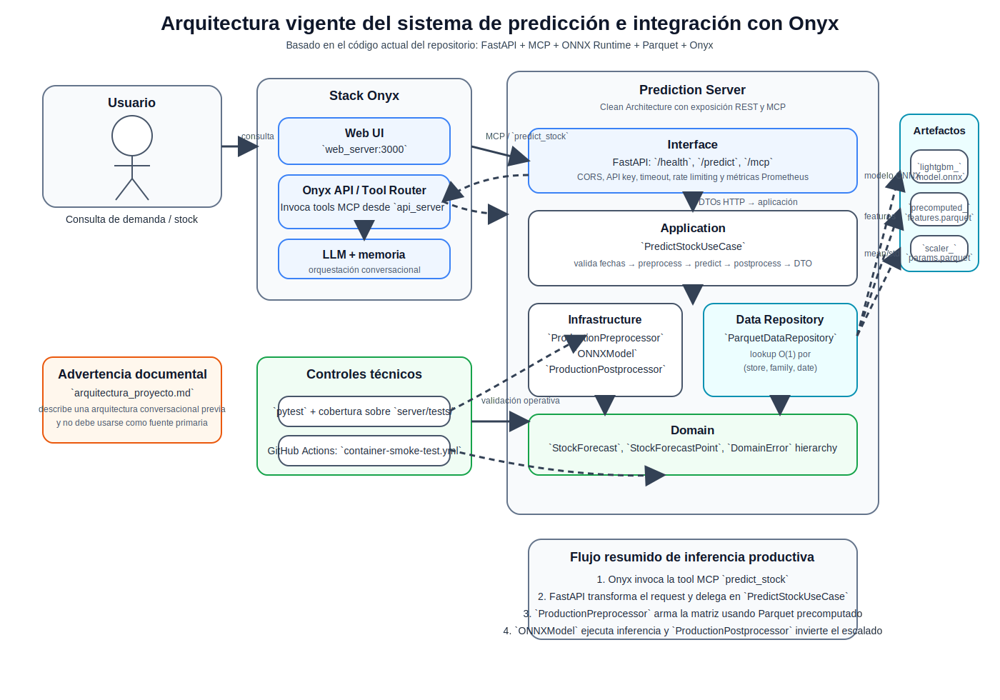

# Arquitectura e implementación del sistema

La Figura 6 resume la arquitectura vigente del sistema, mostrando la separación por capas del servidor de predicción, su exposición por REST y MCP, y su integración con Onyx y con los artefactos de inferencia.

**Figura 6. Arquitectura vigente del sistema de predicción e integración con Onyx.** Diagrama de alto nivel de la arquitectura efectivamente implementada en el repositorio. La figura muestra la interacción entre el usuario, el stack conversacional de Onyx, el servidor de predicción organizado según Clean Architecture, los artefactos de inferencia en `ONNX` y `Parquet`, y los principales controles técnicos observables en la solución. Fuente: elaboración propia a partir de [README.md](/mnt/c/Users/juana/PycharmProjects/tesis-umpe-supermarket-stock-prediction/README.md), [.docs/data_serving_architecture.md](/mnt/c/Users/juana/PycharmProjects/tesis-umpe-supermarket-stock-prediction/.docs/data_serving_architecture.md), [.docs/onyx_integration.md](/mnt/c/Users/juana/PycharmProjects/tesis-umpe-supermarket-stock-prediction/.docs/onyx_integration.md), [container.py](/mnt/c/Users/juana/PycharmProjects/tesis-umpe-supermarket-stock-prediction/server/infrastructure/container.py), [api.py](/mnt/c/Users/juana/PycharmProjects/tesis-umpe-supermarket-stock-prediction/server/interface/http/api.py) y [docker-compose.yml](/mnt/c/Users/juana/PycharmProjects/tesis-umpe-supermarket-stock-prediction/docker-compose.yml).*

## Arquitectura lógica del sistema

La solución implementada en el repositorio adopta una organización por capas consistente con el patrón de Clean Architecture, explicitado en la documentación principal del proyecto y verificable en la estructura del directorio `server/`. En términos observables, la aplicación se divide en cuatro niveles: `domain`, `application`, `infrastructure` e `interface`. Esta partición no cumple solo una función de ordenamiento del código, sino que establece una regla de dependencias según la cual las capas internas no dependen de decisiones tecnológicas de las capas externas. En consecuencia, la lógica del problema y la orquestación del caso de uso principal pueden describirse de manera relativamente independiente del framework web, del formato del modelo o del mecanismo de despliegue. En el contexto de sistemas de machine learning aplicados, este tipo de separación también es coherente con la necesidad de contener deuda técnica y controlar de manera explícita los puntos de contacto entre lógica de negocio, artefactos de modelo y componentes operativos (Sculley et al., 2015; Breck et al., 2017).

La capa de dominio contiene las entidades `StockForecast` y `StockForecastPoint`, además de la jerarquía de excepciones `DomainError`, `ValidationError`, `PredictionError` y `DataNotFoundError`. Desde una perspectiva de diseño, estas clases definen el vocabulario mínimo del problema de predicción sin incorporar dependencias a FastAPI, ONNX Runtime ni esquemas HTTP. Este desacoplamiento es un rasgo arquitectónico central de la implementación observada, ya que evita que las reglas esenciales del sistema queden mezcladas con preocupaciones de transporte o infraestructura.

La capa de aplicación formaliza el contrato interno del servicio. Allí se definen los DTOs `PredictStockInput`, `PredictStockOutput` y `PredictionPoint`, junto con los puertos `PreprocessorPort`, `ModelPort`, `PostprocessorPort` y `DataRepositoryPort`. La presencia de estos puertos permite afirmar que el sistema no depende de una implementación única del preprocesamiento, del modelo o del repositorio de datos, sino de interfaces que pueden ser satisfechas por adaptadores distintos. Esta observación es relevante porque el repositorio implementa, de hecho, variantes alternativas para varias responsabilidades: un backend `dummy` para pruebas y desarrollo, y un backend `onnx` para inferencia real; un preprocesamiento `basic` y otro `production`; un postprocesamiento simple y otro basado en parámetros de escalado persistidos en archivos Parquet.

La orquestación del flujo de predicción se concentra en `PredictStockUseCase`. Este caso de uso valida la ventana temporal solicitada, invoca el preprocesamiento, ejecuta el modelo, postprocesa el resultado y finalmente transforma la salida de dominio en un DTO apto para su exposición externa. La implementación también redondea las cantidades al entero más cercano al momento de construir `PredictStockOutput`, decisión coherente con el hecho de que la salida se utiliza como soporte para decisiones discretas de reposición. La existencia de esta unidad central de orquestación refuerza la lectura de que la arquitectura no está organizada alrededor del framework web, sino alrededor del caso de uso principal del sistema: producir predicciones de demanda o stock para una combinación de producto, tienda y rango temporal.

## Adaptadores de infraestructura y pipeline de inferencia

La capa de infraestructura materializa las interfaces definidas por la capa de aplicación. En ella se encuentran los adaptadores de modelo, los componentes de preprocesamiento y postprocesamiento, la configuración por entorno y el contenedor de dependencias. La pieza central de ensamblado es `server/infrastructure/container.py`, donde se implementa la selección de backends y la construcción del `PredictStockUseCase` a partir de la configuración activa.

El diseño distingue dos modos de inferencia. El primero, orientado a desarrollo y pruebas, utiliza `DummyModel`, `BasicPreprocessor` y `BasicPostprocessor`. Este flujo devuelve predicciones constantes o basadas en rasgos temporales muy simples, y su principal valor es permitir la validación funcional del servicio sin depender de un modelo entrenado ni de artefactos de datos pesados. El segundo modo, destinado al escenario productivo, utiliza `ONNXModel`, `ProductionPreprocessor`, `ProductionPostprocessor` y `ParquetDataRepository`. Esta segunda ruta es la más relevante para la tesis, dado que representa la implementación efectiva del pipeline de inferencia del modelo de demanda entrenado fuera del servicio.

El adaptador `ONNXModel` encapsula la interacción con ONNX Runtime. Su responsabilidad es resolver la ruta del artefacto `.onnx`, cargar la sesión de inferencia de forma diferida y ejecutar el modelo sobre una matriz de entrada de tipo `float32`. El código muestra que este adaptador puede operar de dos maneras: si `PreprocessedData` incluye una matriz de `features`, la utiliza directamente; si no la incluye, recurre a un modo básico en el que genera cuatro atributos temporales simples (`horizon_step`, `day_of_week`, `month`, `is_weekend`). Esta capacidad de fallback cumple una función de compatibilidad hacia atrás, pero al mismo tiempo deja claro que el modo productivo esperado es el basado en características precomputadas. La elección de `ONNX` como formato del artefacto es consistente con su definición oficial como mecanismo de interoperabilidad y portabilidad entre herramientas y entornos de inferencia (ONNX, 2026).

El componente `ProductionPreprocessor` constituye un elemento particularmente importante del diseño. En lugar de recalcular rezagos, medias móviles y variables exógenas durante cada request, este adaptador consulta un repositorio de datos precomputados a través de `DataRepositoryPort`. Para cada fecha solicitada realiza una búsqueda por `(store_id, product_id, target_date)` y ensambla una matriz de características lista para ser consumida por el modelo ONNX. Cuando la fecha solicitada excede el máximo disponible en el repositorio, el preprocesador reutiliza la última fila precomputada disponible. Esta regla es observable en el código y debe ser descrita como una decisión de implementación para manejo de horizontes futuros, no como una garantía empírica de optimalidad predictiva.

El repositorio concreto que implementa este contrato es `ParquetDataRepository`. Su funcionamiento se basa en la carga en memoria de dos archivos Parquet: uno con las características precomputadas y otro con los parámetros del `LocalStandardScaler` por serie. Una vez cargados, construye índices en memoria para búsquedas de complejidad constante por `(store_nbr, family, date)` y por `(store_nbr, family)`. El diseño resultante es adecuado para el caso analizado porque la documentación técnica y el propio repositorio asumen que los datos de Kaggle son estáticos. En ese contexto, el costo de un pre-cómputo offline y de una carga inicial en memoria se considera aceptable frente al costo de recomputar atributos temporales complejos en cada invocación.

El `ProductionPostprocessor` completa el pipeline productivo aplicando la transformación inversa del escalado local. A partir de los parámetros `(mean, std)` recuperados del repositorio, reconstruye las predicciones en la escala original de ventas y luego recorta los valores negativos a cero. Esta decisión es consistente con la naturaleza del problema de negocio, donde las cantidades pronosticadas representan demanda o necesidades de stock y, por tanto, no deberían tomar valores negativos. Corresponde señalar, sin embargo, que esta regla es una decisión de postprocesamiento de ingeniería; no demuestra por sí misma que el modelo esté bien calibrado, sino que adapta su salida a un dominio operativo interpretable.

## Capa de interfaz: API REST, contratos HTTP y MCP

La capa `interface` expone las capacidades del sistema mediante FastAPI. El archivo `server/interface/http/api.py` define dos endpoints principales: `GET /health` como sonda de vida y `POST /predict` como punto de entrada para solicitudes de predicción. Sobre esta misma aplicación se monta además la integración MCP mediante `FastApiMCP`, lo que permite que la operación `predict_stock` sea descubierta automáticamente por asistentes basados en LLM, en particular por Onyx.

Desde el punto de vista de implementación, la API no contiene lógica de negocio sustantiva. Su función consiste en validar el payload de entrada mediante esquemas Pydantic, transformar el request HTTP en un DTO de aplicación, invocar el caso de uso singleton y mapear las excepciones de dominio a respuestas HTTP. Esta separación confirma que el framework web opera como un adaptador de entrada y no como el centro del sistema.

El esquema `PredictionRequest` impone restricciones relevantes: longitud mínima y máxima para identificadores, validación del rango temporal y un límite superior para el horizonte de predicción, controlado por la variable `MAX_HORIZON_DAYS`. Asimismo, el request puede incluir `history`, aunque el estado actual del repositorio no demuestra de manera concluyente que este campo modifique el comportamiento del backend productivo basado en Parquet. En este punto conviene distinguir entre capacidad del contrato HTTP y uso efectivo del dato en la ruta de inferencia actualmente implementada.

La capa HTTP incorpora además un conjunto de preocupaciones transversales relevantes para una implementación aplicada: middleware de correlación (`CorrelationIdMiddleware`), autenticación por API key (`ApiKeyMiddleware`), timeout (`TimeoutMiddleware`), CORS, rate limiting mediante `slowapi` e instrumentación Prometheus. Estos elementos muestran que la implementación no se limita a servir un modelo, sino que considera requisitos operativos de trazabilidad, seguridad y observabilidad. En el contexto de una tesis aplicada, esta observación refuerza la idea de que el artefacto construido aspira a una operación controlada y no solo a una demostración experimental dentro de un notebook, un enfoque alineado con criterios de readiness productiva para sistemas ML más amplios que la mera exactitud predictiva (Breck et al., 2017).

La integración MCP merece una mención específica porque conecta el servidor con la interfaz conversacional. El endpoint `/mcp` se monta sobre la misma aplicación FastAPI y expone la operación `predict_stock` con un esquema de entrada derivado del contrato HTTP. La evidencia de pruebas en `server/tests/test_mcp.py` indica que esta integración no es meramente declarativa: el repositorio valida el handshake de inicialización, la exposición del tool esperado y la exclusión del endpoint de salud del catálogo de herramientas.

## Integración con Onyx y topología de despliegue

La documentación del proyecto y el archivo `docker-compose.yml` muestran que el servidor de predicción no opera de forma aislada, sino como parte de una solución compuesta que integra un stack completo de Onyx. En el despliegue definido por Compose conviven, además del `prediction_server`, los servicios `api_server`, `web_server`, `background`, `model_server`, `index`, `relational_db` y `cache`, junto con el frontend `app_web`. Esta topología ubica al servidor de predicción como un servicio especializado, consumido internamente por Onyx a través del endpoint MCP.

La decisión de usar el alias de red `prediction-server.local` para el servicio de predicción está documentada en la guía de integración con Onyx. Su propósito es resolver una restricción práctica de validación de URL del cliente MCP de Onyx dentro de la red Docker compartida. Este detalle evidencia que parte de la implementación responde a necesidades reales de interoperabilidad entre servicios, no solo a consideraciones del modelo de predicción.

El `Dockerfile` adopta una estrategia de construcción en dos etapas. La primera instala dependencias de runtime en un prefijo aislado, mientras que la segunda construye una imagen final basada en `python:3.11-slim`, copia el código fuente, define variables de entorno por defecto y ejecuta el servidor con `uvicorn`. Un aspecto particularmente importante de este archivo es la justificación explícita del uso de un único worker: dado que el preprocesador de producción carga en memoria un diccionario grande derivado de Parquet, múltiples workers multiplicarían el consumo de memoria. Esta observación constituye una justificación técnica concreta y trazable para una decisión de despliegue que, de otro modo, podría parecer arbitraria. En términos más generales, explicitar este tipo de trade-off operativos es consistente con la literatura que advierte que en sistemas ML productivos las decisiones de infraestructura forman parte del control de complejidad y no solo del empaquetado final (Sculley et al., 2015).

La configuración del sistema se concentra en la dataclass `Settings`, cargada desde variables de entorno. Entre las más relevantes se encuentran `MODEL_BACKEND`, `MODEL_PATH`, `PREPROCESSOR_BACKEND`, `DATA_PATH`, `SCALER_PATH`, `API_KEY`, `RATE_LIMIT` y `MAX_HORIZON_DAYS`. Este enfoque permite que el mismo código soporte diferentes modos de operación sin cambios estructurales. Desde una perspectiva aplicada, esta configurabilidad es relevante porque separa lógica estable de parámetros de despliegue y facilita la portabilidad operacional entre entornos de desarrollo, pruebas y ejecución containerizada.

## Evidencia de implementación y controles técnicos

La arquitectura implementada no se sostiene solo en documentación declarativa. El repositorio contiene una suite de pruebas unitarias e integrales que cubren componentes de dominio, adaptadores de infraestructura, contratos HTTP y transporte MCP. A esto se suman flujos de integración continua en GitHub Actions: `test.yml` ejecuta `pytest` con cobertura sobre `server/tests/`, mientras que `container-smoke-test.yml` construye la imagen, inicia el servicio con backend `dummy` y verifica la accesibilidad de `/health`, `/docs`, `/openapi.json` y `/predict`. Esta evidencia no prueba el desempeño del modelo productivo, pero sí respalda que la implementación software fue concebida con criterios mínimos de validación técnica.

Corresponde distinguir, sin embargo, entre validación del sistema y validación del modelo. Las pruebas y workflows observados confirman la estabilidad del servicio, sus contratos de entrada y salida y la viabilidad del empaquetado containerizado, pero no sustituyen la evaluación experimental de la calidad predictiva del modelo final. Esta distinción es importante para no sobredimensionar el aporte arquitectónico como si equivaliera a evidencia de exactitud empírica.

## Alcance real de la arquitectura vigente y límites documentales

Aunque el repositorio contiene un documento titulado `arquitectura_proyecto.md`, este debe leerse con cautela. El propio archivo declara que la arquitectura originalmente planificada de un agente conversacional basado en LangChain fue reemplazada por Onyx como plataforma de chat. Por tanto, ese documento conserva valor como antecedente histórico o referencia de diseño, pero no debe utilizarse como fuente primaria para describir la arquitectura vigente del sistema. La arquitectura actualmente implementada se apoya en FastAPI, MCP, ONNX Runtime, preprocesamiento con Parquet y despliegue con Docker Compose junto a Onyx.

En este sentido, la contribución de implementación del proyecto puede resumirse como la construcción de un servicio especializado de predicción que desacopla el modelo de inferencia, el pipeline de preparación de datos y la interfaz conversacional. El servidor encapsula el caso de uso de predicción y lo expone simultáneamente como API REST y como herramienta MCP, mientras que Onyx se encarga de la interacción conversacional, la orquestación del LLM y el enrutamiento de herramientas. Esta separación de responsabilidades constituye una decisión arquitectónica observable y coherente con la aspiración de integrar ciencia de datos en un entorno de uso aplicado.

No obstante, el repositorio también deja vacíos que deben reconocerse. El primero es que parte de la documentación aún mezcla componentes vigentes con elementos heredados de una arquitectura previa. El segundo es que existen capacidades de interfaz, como el campo `history`, cuya explotación efectiva no queda completamente demostrada en la ruta productiva actual. El tercero es que la validación operativa del stack completo con Onyx depende de un entorno de contenedores relativamente pesado, lo que limita su reproducibilidad en contextos con recursos reducidos. Estas limitaciones no invalidan la arquitectura implementada, pero sí deben ser explicitadas para evitar sobrepresentar el grado de madurez del sistema.
