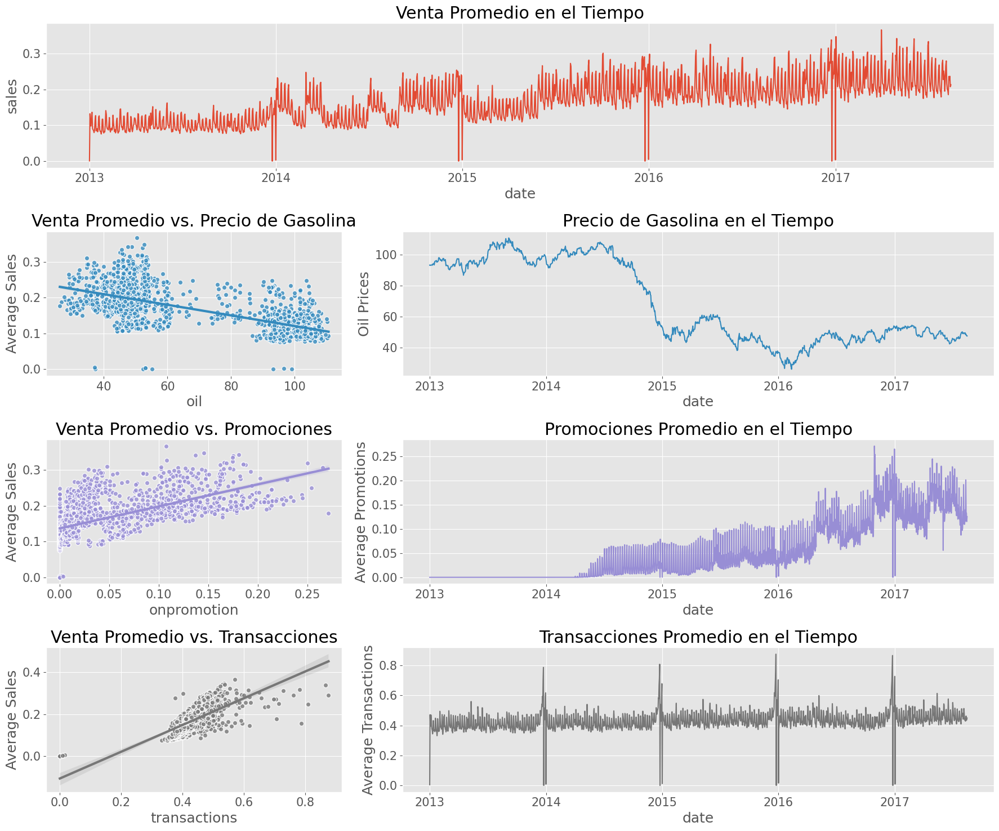
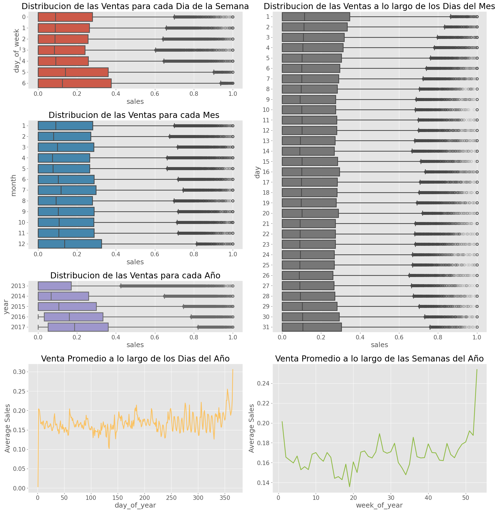
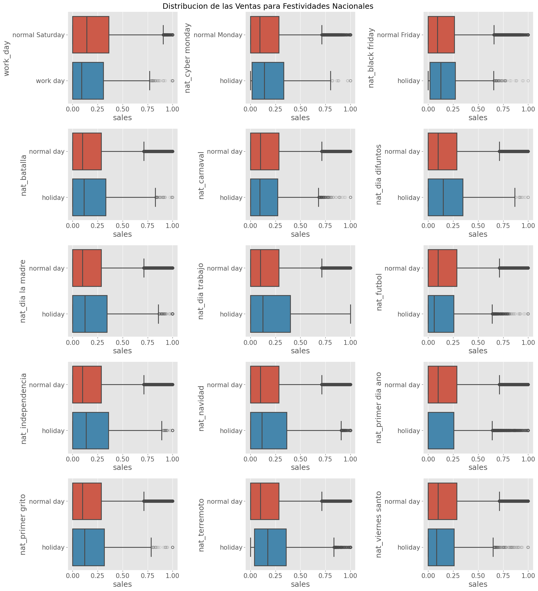
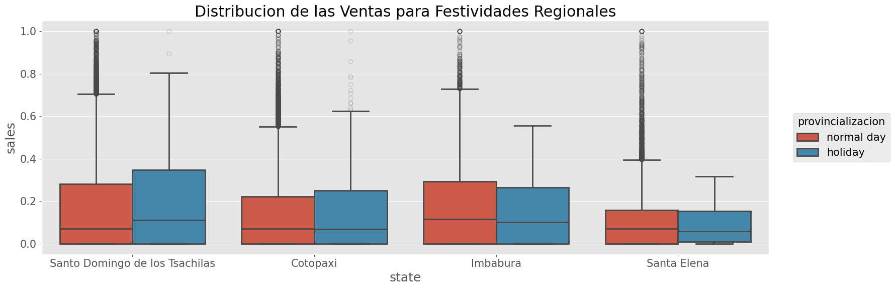
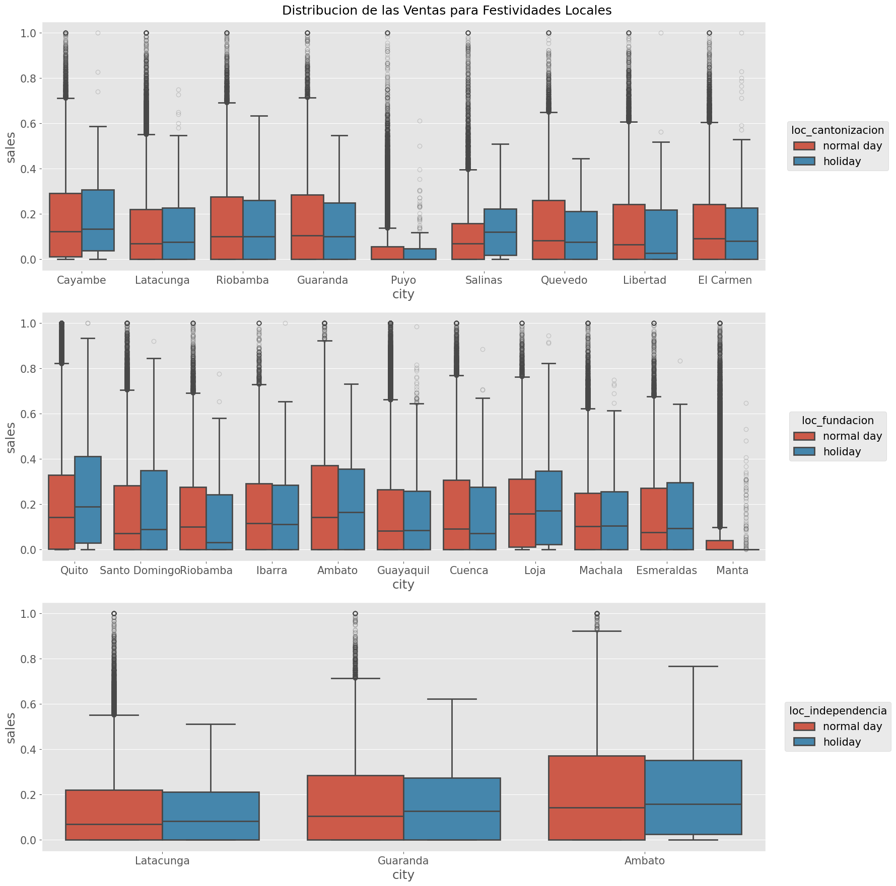

# Análisis exploratorio de datos (EDA)

## Alcance y fuentes del análisis

El análisis exploratorio se apoya en dos tipos de evidencia complementaria. Por un lado, se utilizaron directamente los archivos `train.csv`, `test.csv`, `oil.csv`, `transactions.csv`, `stores.csv` y `holidays_events.csv` contenidos en `data/`. Por otro, se incorporó el material documental y visual disponible en los notebooks `.notebooks/analisis_exploratorio_ecuador_sales_forecast.ipynb`, `.notebooks/analisis_exploratorio_ecuador_sales_forecast_academic.ipynb` y `.notebooks/Global_Simple_LightGBM_Timeseries_Forecast_Final_academic.ipynb`. Esta combinación permite distinguir entre hallazgos descriptivos recalculados directamente sobre los datos y hallazgos visuales ya explicitados dentro de los cuadernos. Desde una perspectiva de tesis aplicada, este tipo de análisis resulta consistente con la literatura que sitúa el forecasting minorista como un problema donde la comprensión descriptiva del calendario, la heterogeneidad y las señales comerciales es relevante antes de fijar el diseño predictivo final (Fildes, Ma, & Kolassa, 2022).

En términos observables, el conjunto de entrenamiento contiene 3.000.888 registros y seis variables (`id`, `date`, `store_nbr`, `family`, `sales`, `onpromotion`), mientras que el conjunto de prueba contiene 28.512 registros y cinco variables (`id`, `date`, `store_nbr`, `family`, `onpromotion`). El entrenamiento cubre desde el 1 de enero de 2013 hasta el 15 de agosto de 2017, y el conjunto de prueba desde el 16 hasta el 31 de agosto de 2017. El problema queda así definido como un panel temporal multiserie de ventas diarias por combinación tienda-familia.

La estructura básica del panel es consistente con la formulación del problema de negocio. El archivo `train.csv` registra 54 tiendas, 33 familias de producto y 1.782 series temporales únicas, cifra que coincide con el output documentado en el notebook exploratorio. Sin embargo, el análisis del nuevo cuaderno permite precisar un punto importante que en una versión anterior de esta sección aparecía simplificado: el conjunto crudo no cubre todos los días del intervalo calendario. El notebook reporta 1.684 fechas únicas dentro de un rango de 1.688 días y muestra que las cuatro fechas ausentes son `2013-12-25`, `2014-12-25`, `2015-12-25` y `2016-12-25`. En consecuencia, el panel observado es completo respecto de las fechas efectivamente presentes en el archivo, pero no respecto del calendario continuo, por lo que la regularización temporal posterior constituye una decisión metodológica sustantiva y no un detalle menor. Esta observación también es coherente con la literatura sobre múltiples series, donde la estructura temporal y la comparabilidad entre trayectorias son condiciones relevantes para modelado conjunto posterior (Hewamalage, Bergmeir, & Bandara, 2020; Montero-Manso & Hyndman, 2021).

## Calidad de datos y completitud temporal

En la auditoría directa de los CSV no se detectaron valores nulos en las variables de `train.csv` ni en `holidays_events.csv`. Tampoco se registran ventas negativas en el conjunto de entrenamiento. No obstante, sí aparecen 939.130 observaciones con ventas iguales a cero, equivalentes al 31,30 % del total. Este rasgo no debe entenderse como un problema de faltantes, sino como una manifestación estructural del fenómeno observado: una parte relevante de las series presenta días sin ventas, ya sea por baja demanda, indisponibilidad de producto o cierres operativos.

El nuevo notebook refina esta lectura al mostrar que la estructura de ceros no es homogénea. Una vez reindexado el panel para cubrir el calendario continuo, se identifican 53 series con ventas nulas en todos los días del período. Asimismo, entre las 1.729 series restantes se observa una distribución muy asimétrica de ceros iniciales: la mediana es de 2 días, pero el cuartil superior alcanza 366 y el máximo llega a 1.651. En términos prácticos, 724 series presentan más de 365 días iniciales sin ventas. En cambio, los ceros finales son mucho menos frecuentes: la mediana es 0, el tercer cuartil también es 0, y solo 12 series superan 365 días finales sin ventas. Estas cifras respaldan una afirmación más precisa que la disponible en la versión previa del EDA: el problema dominante no es la desaparición masiva de productos al final del período, sino la presencia de series con inicios tardíos o largos tramos iniciales sin actividad.

El tratamiento de covariables auxiliares también revela limitaciones de completitud. El notebook muestra que `oil.csv` presenta 486 fechas faltantes entre el inicio del entrenamiento y el fin del horizonte de prueba, y que las 486 corresponden a fines de semana. Esta regularidad es consistente con la lógica de mercados no operativos en sábado y domingo, pero genera un desalineamiento con las ventas supermercadistas, que sí se registran en esos días. De modo análogo, el archivo `transactions.csv` debería contener 91.152 registros para cubrir los 54 locales a lo largo de los 1.688 días del rango de entrenamiento una vez regularizado el calendario. Sin embargo, el cuaderno reporta 83.488 registros observados, 7.546 ausencias atribuibles a días con ventas agregadas iguales a cero y 118 registros faltantes adicionales. Estos resultados justifican las decisiones posteriores de interpolación y completitud descritas en la metodología.

## Heterogeneidad entre series, tiendas y familias

El agregado de ventas por familia muestra una concentración marcada en un conjunto reducido de categorías. Durante el período analizado, `GROCERY I` acumula el mayor volumen total de ventas, seguida por `BEVERAGES`, `PRODUCE`, `CLEANING` y `DAIRY`. Este patrón indica que las escalas de venta difieren considerablemente entre familias, por lo que una misma variación absoluta no tiene igual significado en todos los productos. Desde la perspectiva del modelado, esta heterogeneidad refuerza la conveniencia de utilizar transformaciones que atenúen diferencias de escala antes de entrenar un modelo global.

La misma lógica se observa a nivel de tienda. El agregado por `store_nbr` muestra que las tiendas 44, 45, 47 y 3 concentran los mayores volúmenes acumulados. En términos de negocio, esto implica que la demanda no puede interpretarse como un fenómeno uniforme dentro de la cadena, sino como una combinación de mercados locales con intensidades distintas. La necesidad de modelar el comportamiento por combinación de tienda y familia, en lugar de trabajar únicamente con promedios globales, queda así empíricamente respaldada.

La variabilidad temporal agregada también es significativa. Las ventas totales diarias oscilan entre 2.511,62 y 1.463.083,96 en la escala original de `sales`. Esta amplitud no permite asumir estabilidad temporal simple y hace razonable explorar componentes semanales, mensuales y de calendario. En este punto, el notebook exploratorio aporta además evidencia visual de que la cantidad diaria de series con ventas iguales a cero muestra una tendencia descendente general a lo largo del tiempo, con picos notorios en Navidad y en el primer día del año. Dado que este último hallazgo está sustentado principalmente en visualizaciones del cuaderno y no en una tabla exportada independiente, conviene tratarlo como un patrón visual documentado y no como una medición cerrada adicional.

## Promociones, transacciones, petróleo y patrones de calendario

La variable `onpromotion` es una de las señales exógenas más relevantes del repositorio. En `train.csv`, el 20,37 % de las observaciones presenta promociones activas y el valor máximo observado es 741. A nivel descriptivo, las observaciones con promoción registran una media de ventas de 1.137,69 y una mediana de 373, frente a 158,25 y 3, respectivamente, en observaciones sin promoción. Esta diferencia no autoriza por sí sola una interpretación causal, pero sí respalda la hipótesis de que la variable captura información útil para anticipar cambios en la demanda. En términos conceptuales, esta lectura es compatible con trabajos que destacan la relevancia de señales comerciales y días especiales para la predicción de demanda en retail (Huber & Stuckenschmidt, 2020).

El notebook exploratorio agrega una segunda capa de evidencia al analizar series agregadas y escaladas. Reproduciendo el procesamiento allí implementado, la correlación lineal entre ventas medias diarias y promociones medias diarias es `0,5749`, mientras que la correlación con las transacciones medias diarias es `0,6867` y la correlación con el precio del petróleo interpolado es `-0,6202`. Estos valores cuantifican, a nivel descriptivo agregado, la misma dirección de asociación que el cuaderno sugiere visualmente. Debe subrayarse, sin embargo, que se trata de correlaciones sobre series agregadas y preprocesadas, por lo que no corresponden a inferencias causales ni reemplazan un análisis por segmento o una validación predictiva.

La Figura 1 resume la relación descriptiva entre las ventas promedio y tres covariables agregadas de interés: promociones, transacciones y precio del petróleo.

**Figura 1. Ventas promedio, promociones, transacciones y petróleo.** Relación descriptiva entre la evolución temporal de las ventas promedio y las covariables agregadas `onpromotion`, `transactions` y `oil`, junto con sus gráficos de asociación visual. La figura se utiliza como evidencia exploratoria del vínculo descriptivo entre demanda y variables exógenas. Fuente: elaboración propia a partir de `.notebooks/analisis_exploratorio_ecuador_sales_forecast.ipynb`, celda 57.

Los patrones de calendario también resultan relevantes. En la agregación directa por día de la semana, las ventas medias son mayores en domingo (`463,09`) y sábado (`433,34`) que en el resto de la semana, mientras que jueves presenta el menor promedio (`283,54`). A nivel mensual, diciembre exhibe la mayor media del período (`453,74`) y febrero una de las menores (`320,93`). El notebook exploratorio refuerza estos hallazgos mediante boxplots y curvas promedio para `day`, `month`, `year`, `day_of_week`, `day_of_year`, `week_of_year` y `date_index`, y documenta además un patrón de crecimiento general por año. En este caso también corresponde distinguir entre hecho y lectura interpretativa: el repositorio contiene evidencia visual suficiente para sostener la presencia de patrones temporales, pero no una prueba estadística formal de estacionalidad en todas las series. La atención prestada aquí a calendario y días especiales resulta consistente con la literatura usada en esta tesis para justificar la posterior incorporación de variables temporales derivadas (Huber & Stuckenschmidt, 2020).

La Figura 5 concentra los principales patrones de calendario observados en el EDA, incluyendo diferencias por día de la semana, mes y año, así como variaciones intraanuales.

**Figura 5. Patrones de ventas por variables de calendario.** Distribución y evolución de las ventas según `day_of_week`, `month`, `year`, `day`, `day_of_year` y `week_of_year`, utilizando períodos sin feriados para reducir interferencias del calendario festivo. La figura aporta evidencia visual sobre regularidades semanales, mensuales y anuales que justifican el uso posterior de variables temporales derivadas. Fuente: elaboración propia a partir de `.notebooks/analisis_exploratorio_ecuador_sales_forecast.ipynb`, celda 67.

## Feriados, escala territorial y relevancia relativa

El archivo `holidays_events.csv` contiene 350 registros sin valores nulos y 103 descripciones únicas de eventos, distribuidos entre 221 filas de tipo `Holiday`, 56 de tipo `Event`, 51 de tipo `Additional`, 12 de tipo `Transfer`, 5 de tipo `Bridge` y 5 de tipo `Work Day`. El nuevo notebook aporta una desagregación útil sobre el alcance territorial de estos eventos: las festividades nacionales tienen como `locale_name` único a `Ecuador`, las regionales se asocian a cuatro provincias (`Cotopaxi`, `Imbabura`, `Santa Elena`, `Santo Domingo de los Tsachilas`) y las locales se distribuyen entre 19 ciudades. Esta evidencia justifica el tratamiento diferenciado de feriados nacionales, regionales y locales durante el preprocesamiento.

El mismo cuaderno muestra además que muchas festividades aparecen fragmentadas en descripciones adyacentes o variantes semánticas, como ocurre con `Navidad-4`, `Navidad-3`, `Navidad-2`, `Navidad-1`, `Navidad` y `Navidad+1`. Esta fragmentación respalda la decisión de estandarizar etiquetas y agrupar eventos de naturaleza similar antes de convertirlos en variables indicadoras. En la salida del notebook puede verse también la generación de dummies nacionales como `nat_navidad`, `nat_dia trabajo`, `nat_terremoto` y `nat_primer dia ano`, así como dummies locales y regionales.

Respecto de su efecto sobre ventas, el cuaderno exploratorio aporta evidencia visual mediante boxplots. Allí se afirma que algunos eventos nacionales, como Día del Trabajo, Navidad y el terremoto de 2016, presentan diferencias más marcadas entre días festivos y no festivos que las observadas en feriados regionales y locales. Esta lectura es coherente con el resultado tabular del notebook de modelado, donde once eventos son retenidos por correlación absoluta superior a `0,1`, incluyendo `Navidad-2`, `Traslado Primer dia del ano`, `Terremoto Manabi+2`, `Primer dia del ano` y `Navidad`. Dado que la evidencia de impacto relativo proviene mayormente de inspección visual y de correlaciones descriptivas agregadas, corresponde tratarla como soporte exploratorio para la selección de variables festivas, no como demostración causal definitiva.

La Figura 2 muestra que ciertos eventos nacionales presentan diferencias visuales más marcadas entre días festivos y no festivos, lo que respalda su consideración dentro del análisis exploratorio.

**Figura 2. Distribución de ventas en festividades nacionales.** Comparación visual de la distribución de ventas entre días festivos nacionales y días no festivos para eventos seleccionados, incluyendo feriados de alcance nacional y sábados designados como `Work Day`. La figura aporta evidencia exploratoria sobre la relevancia relativa de ciertos eventos nacionales en la dinámica de ventas. Fuente: elaboración propia a partir de `.notebooks/analisis_exploratorio_ecuador_sales_forecast.ipynb`, celda 60.

La Figura 3 sugiere que las festividades regionales presentan diferencias visuales más acotadas que las observadas en los eventos nacionales.

**Figura 3. Distribución de ventas en festividades regionales.** Comparación visual entre días con festividad regional y días sin festividad regional en las provincias para las que el dataset registra este tipo de eventos. La figura se interpreta como evidencia descriptiva y no como prueba causal del efecto de los feriados regionales sobre las ventas. Fuente: elaboración propia a partir de `.notebooks/analisis_exploratorio_ecuador_sales_forecast.ipynb`, celda 63.

La Figura 4 complementa el análisis territorial al mostrar la distribución de ventas en festividades locales para ciudades seleccionadas.

**Figura 4. Distribución de ventas en festividades locales.** Comparación visual de la distribución de ventas entre días con festividad local y días sin festividad local en ciudades seleccionadas del panel. La figura permite contrastar la heterogeneidad espacial de los eventos locales y su menor impacto relativo frente a los eventos nacionales. Fuente: elaboración propia a partir de `.notebooks/analisis_exploratorio_ecuador_sales_forecast.ipynb`, celda 64.

## Implicancias para el problema de negocio y el modelado

Los hallazgos exploratorios permiten precisar varias implicancias concretas para el problema de predicción de demanda en supermercados. En primer lugar, la coexistencia de 1.782 series, escalas muy heterogéneas y una proporción alta de observaciones con ventas iguales a cero obliga a descartar un enfoque simplificado basado en promedios globales sin tratamiento por serie. En segundo lugar, la presencia de 53 series completamente nulas y de 724 series con más de un año inicial sin ventas sugiere que la apertura efectiva de ciertas combinaciones tienda-familia y la disponibilidad de producto son parte sustantiva del problema, no ruido periférico. Esta lectura es consistente con la idea de que en contextos multiserie la heterogeneidad entre trayectorias no debe tratarse como una excepción marginal, sino como parte constitutiva del fenómeno a modelar (Hewamalage, Bergmeir, & Bandara, 2020; Montero-Manso & Hyndman, 2021).

En tercer lugar, las asociaciones descriptivas con promociones, transacciones, precios del petróleo y variables de calendario ofrecen una justificación empírica razonable para incorporar covariables exógenas y atributos temporales en el pipeline predictivo. En cuarto lugar, la evidencia sobre feriados muestra que no todos los eventos tienen la misma relevancia y que su escala territorial importa. En este sentido, el EDA no solo describe los datos, sino que proporciona el puente argumental entre el problema de negocio y las decisiones metodológicas adoptadas más adelante: regularización del calendario, tratamiento explícito de ceros, uso de promociones y calendario, y selección acotada de indicadores festivos.

## Limitaciones del análisis exploratorio disponible

El fortalecimiento del EDA mediante el nuevo notebook y la exportación de figuras reduce varios vacíos de la versión anterior, pero no elimina todas las limitaciones. La primera es que varias interpretaciones del cuaderno, especialmente las referidas a impacto de feriados o tendencia de los ceros, siguen apoyándose en inspección visual y por tanto requieren ser formuladas con prudencia en la tesis. La segunda es que el análisis continúa fuertemente agregado; el repositorio aún no contiene un estudio sistemático por segmento de tienda, familia o clúster comercial que permita refinar la lectura del negocio. La tercera es que, aunque las cinco figuras ya fueron seleccionadas para el capítulo principal, todavía será necesario integrarlas con numeración, pies de figura y referencias cruzadas consistentes dentro del manuscrito final.
