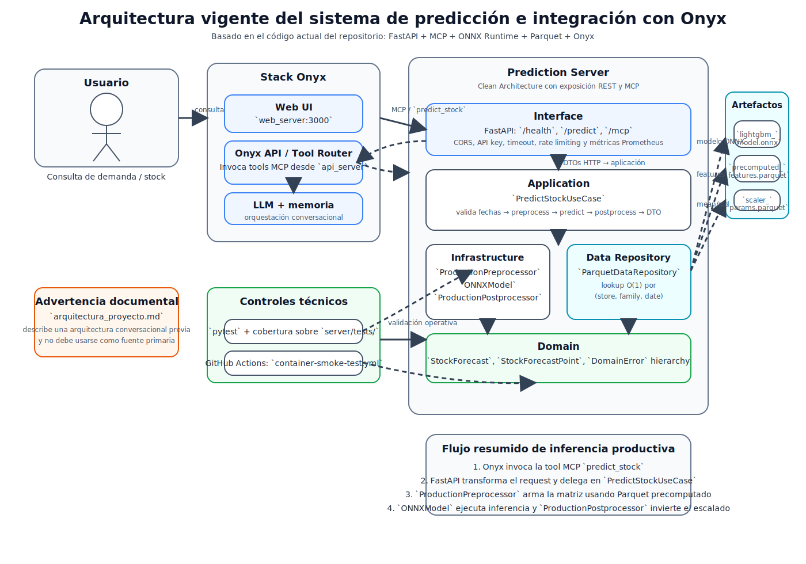

# [Título definitivo pendiente]

## Portada

_Se incorporará en la maquetación final conforme a la plantilla institucional._

## Página de aprobación

_Página reservada para aprobación institucional y firmas correspondientes._

## Fe de erratas

No se registran erratas en la presente versión del manuscrito.

## Descargo de responsabilidad

_Se incorporará en la maquetación final conforme al formato institucional aplicable._

## Dedicatoria y agradecimientos

_Se incorporarán en la versión final si corresponde._

## Cláusula de confidencialidad

No se incorpora cláusula de confidencialidad en esta versión, dado que la base principal de datos utilizada en el proyecto es pública.

## Tabla de contenido o índice

_Se generará automáticamente a partir de la estructura final del documento._

## Lista de tablas

1. `Tabla 1. Métricas recuperables para los modelos comparados.`

## Lista de figuras

1. `Figura 1. Ventas promedio, promociones, transacciones y petróleo.`
2. `Figura 2. Distribución de ventas en festividades nacionales.`
3. `Figura 3. Distribución de ventas en festividades regionales.`
4. `Figura 4. Distribución de ventas en festividades locales.`
5. `Figura 5. Patrones de ventas por variables de calendario.`
6. `Figura 6. Arquitectura vigente del sistema de predicción e integración con Onyx.`

## Lista de abreviaturas y siglas

| Abreviatura o sigla | Desarrollo |
|---|---|
| `API` | Application Programming Interface |
| `CI/CD` | Continuous Integration / Continuous Delivery |
| `CORS` | Cross-Origin Resource Sharing |
| `CSV` | Comma-Separated Values |
| `DTO` | Data Transfer Object |
| `EDA` | Exploratory Data Analysis |
| `HTTP` | Hypertext Transfer Protocol |
| `LLM` | Large Language Model |
| `MAE` | Mean Absolute Error |
| `MCP` | Model Context Protocol |
| `ML` | Machine Learning |
| `ONNX` | Open Neural Network Exchange |
| `REST` | Representational State Transfer |
| `RMSE` | Root Mean Squared Error |
| `RMSLE` | Root Mean Squared Logarithmic Error |


## Lista de símbolos

No se incorpora una lista de símbolos en esta versión del manuscrito.

## Glosario

| Término | Definición operativa en esta tesis |
|---|---|
| `predicción de demanda` | Estimación de ventas futuras a partir de información histórica, usada como apoyo a decisiones de reposición o planificación. |
| `serie temporal multiserie` | Conjunto de múltiples series temporales paralelas, en este caso una por combinación de tienda y familia de producto. |
| `modelo global` | Enfoque en el que un único modelo aprende conjuntamente sobre múltiples series, en lugar de entrenar un modelo separado para cada una. |
| `baseline` | Modelo de referencia utilizado para contextualizar el desempeño del modelo principal. |
| `horizonte de predicción` | Cantidad de períodos futuros que el modelo intenta estimar en cada corrida de pronóstico. |
| `validación temporal` | Estrategia de evaluación que respeta el orden cronológico y evita usar información futura durante el entrenamiento. |
| `rezago (lag)` | Valor histórico de una variable observado en períodos anteriores y usado como predictor. |
| `ingeniería de características` | Proceso de construcción de variables derivadas a partir de datos originales para mejorar la capacidad predictiva del modelo. |
| `escalado local por serie` | Estandarización aplicada individualmente a cada serie para reducir diferencias de escala entre combinaciones de tienda y familia. |
| `serving de modelos` | Conjunto de componentes y procesos que permiten ejecutar un modelo entrenado en un entorno de inferencia operativo. |
| `pre-cómputo de características` | Generación offline de variables de entrada para reutilizarlas en producción sin recalcularlas en cada solicitud. |
| `consistencia entre entrenamiento e inferencia` | Correspondencia entre las transformaciones, el orden y el significado de las variables usadas al entrenar el modelo y al consumirlo en producción. |
| `artefacto ONNX` | Archivo exportado en formato interoperable que contiene el modelo listo para ser ejecutado por un runtime compatible. |
| `pipeline` | Secuencia organizada de pasos de preparación, transformación, modelado y despliegue. |
| `reproducibilidad operativa` | Capacidad de reinstalar el entorno, reejecutar procesos y verificar el funcionamiento técnico del sistema con condiciones documentadas. |


## Resumen

Esta tesis aborda el problema de predicción de demanda en supermercados a partir de series temporales diarias por tienda y familia de producto. El trabajo se apoya en datos históricos del desafío público Store Sales de Kaggle y desarrolla un pipeline que combina preparación de datos, ingeniería de características, validación del modelo y despliegue del servicio de inferencia.

Metodológicamente, la solución implementa un enfoque global basado en `LightGBM` y `MLForecast`, utilizando rezagos, variables de calendario, promociones y feriados, junto con escalado local por serie. En paralelo, el proyecto materializa una arquitectura de serving que exporta el modelo a `ONNX`, precomputa características en artefactos `Parquet` y expone la funcionalidad de predicción mediante API REST y `MCP`, con integración prevista hacia Onyx.

La evidencia experimental preservada en el repositorio permite recuperar resultados baseline para `SeasonalNaive` y `AutoETS`, así como un `RMSLE = 0.5380629595521763` visible para `LightGBM`. Este valor constituye una señal favorable frente a los baselines disponibles. No obstante, la interpretación cuantitativa debe formularse con cautela, dado que no existe un artefacto tabular exportado de validación cruzada para `LightGBM`, no quedan trazables `MAE` ni `RMSE` equivalentes y la comparación documentada no está cerrada sobre el mismo conjunto de series.

En consecuencia, el principal aporte del trabajo radica en demostrar la viabilidad metodológica y de ingeniería de una solución de predicción de demanda desplegable, más que en presentar una validación cuantitativa exhaustiva del modelo final. La tesis concluye que el proyecto constituye una base sólida para apoyo a decisiones de reposición en un contexto supermercadista, aunque requiere un cierre experimental más homogéneo y reproducible para fortalecer sus afirmaciones finales.
## Palabras clave

1. predicción de demanda
2. series temporales multiserie
3. supermercados
4. LightGBM
5. MLForecast
6. ONNX
7. serving de modelos

## 1. Introducción

La gestión de inventarios en el sector supermercadista depende, en buena medida, de la capacidad de anticipar la demanda futura de productos en cada punto de venta. Desde una perspectiva operativa, esta necesidad se traduce en la estimación oportuna de cantidades requeridas para horizontes temporales definidos, con el fin de apoyar decisiones de reposición y reducir los costos asociados tanto al quiebre de stock como a la sobreasignación de inventario. En este marco, el problema abordado en este trabajo se ubica en la intersección entre la analítica predictiva y la implementación de soluciones de ciencia de datos orientadas a un caso de negocio concreto. Esta formulación es consistente con la literatura sobre forecasting minorista, que sitúa la predicción de demanda como un insumo central para decisiones comerciales y operativas en entornos retail complejos (Fildes, Ma, & Kolassa, 2022).

En términos observables, el repositorio analizado implementa un sistema de predicción de demanda para supermercados que expone capacidades de inferencia mediante una API REST y un endpoint MCP, con integración prevista hacia una interfaz conversacional basada en Onyx. La evidencia técnica disponible muestra que el núcleo predictivo se apoya en un modelo global `LightGBM` trabajado con `MLForecast`, posteriormente exportado a formato `ONNX` para su uso en producción. Asimismo, la solución incluye un pipeline de pre-cómputo de características, persistencia en archivos Parquet y una arquitectura por capas orientada a separar dominio, aplicación, infraestructura e interfaz. Estos elementos permiten afirmar que el proyecto no se limita al entrenamiento de un modelo aislado, sino que persigue la construcción de un artefacto reproducible e integrable en un entorno de uso aplicado.

El problema de negocio adquiere relevancia adicional por la naturaleza del escenario tratado. La documentación del proyecto y los notebooks indican que el trabajo se apoya en datos históricos del desafío público de Kaggle sobre ventas de supermercados, organizados por tienda, familia de producto y fecha. Esta estructura impone exigencias metodológicas propias de los problemas de series temporales multiserie: heterogeneidad entre unidades de análisis, presencia de estacionalidades, efecto de promociones, influencia del calendario y necesidad de mantener consistencia entre las transformaciones utilizadas durante el entrenamiento y las empleadas en la inferencia. La literatura reciente sobre modelos globales y sistemas ML productivos refuerza precisamente estas dos dimensiones del problema: el aprendizaje conjunto sobre múltiples series y el cuidado de la brecha entre entrenamiento e inferencia (Hewamalage, Bergmeir, & Bandara, 2020; Sculley et al., 2015; Breck et al., 2017). En consecuencia, la pertinencia del trabajo no radica únicamente en obtener pronósticos, sino en evaluar si dichos pronósticos pueden sostenerse dentro de una solución técnica coherente con un contexto de despliegue.

En función del problema descrito, la pregunta de investigación que guía esta tesis es la siguiente: ¿en qué medida es posible diseñar e implementar una solución de ciencia de datos, basada en un modelo global de series temporales y en una arquitectura de serving reproducible, que apoye la predicción de demanda y las decisiones de reposición en un contexto supermercadista a partir de información histórica? Esta pregunta delimita el trabajo hacia la construcción y evaluación de una solución aplicada, más que hacia la demostración de una teoría general sobre gestión de inventarios.

El objetivo general de la tesis es diseñar e implementar una solución de ciencia de datos capaz de apoyar la predicción de demanda o necesidades de stock en supermercados a partir de información histórica, mediante un enfoque de modelado temporal y una arquitectura de serving compatible con un entorno de uso operativo. De este objetivo general se desprenden los siguientes objetivos específicos: preparar y estructurar los datos para el modelado; construir variables explicativas consistentes con el comportamiento temporal de las series; entrenar y exportar un modelo apto para inferencia en producción; e integrar dicho modelo en un servicio accesible mediante interfaces programáticas y conversacionales. En este marco, el alcance del trabajo queda delimitado a la predicción y serving de demanda en el contexto representado por los datos y artefactos del repositorio, sin extenderse a la optimización completa de políticas de inventario ni a una validación causal del impacto operativo. En términos de negocio, el valor esperado de la solución consiste en mejorar la disponibilidad de información para decisiones diarias de reposición, reducir la incertidumbre en la planificación de cantidades por tienda y familia de producto y ofrecer una base analítica más consistente para mitigar, de manera potencial, riesgos de quiebre de stock o sobreasignación de inventario. Esta tesis no demuestra empíricamente esos efectos operativos finales, pero sí evalúa si existe una base técnica razonable para habilitarlos.

La hipótesis de trabajo de esta tesis es que un enfoque basado en un modelo global de series temporales implementado con `LightGBM` y `MLForecast`, exportado a `ONNX` e integrado en una arquitectura de serving con características precomputadas, constituye una base técnicamente consistente para apoyar decisiones de reposición en un caso de negocio supermercadista. La plausibilidad conceptual de este planteo se apoya en tres frentes ya reconocidos en la literatura utilizada: modelos globales para múltiples series, algoritmos de boosting eficientes sobre representaciones tabulares enriquecidas e interoperabilidad de artefactos para inferencia (Montero-Manso & Hyndman, 2021; Ke et al., 2017; ONNX, 2026). Esta hipótesis debe entenderse como una hipótesis de ingeniería aplicada, cuya evaluación empírica se realiza con el alcance y las limitaciones documentadas en los capítulos de experimentos y validación técnica, y no como una afirmación general sobre la totalidad de las decisiones de inventario.

Desde el punto de vista metodológico, la evidencia disponible muestra un flujo de trabajo compuesto por varias etapas complementarias. En primer lugar, se realiza la carga y preparación de los datos históricos, incluyendo limpieza de ventas, estructuración temporal y construcción de identificadores por serie. En segundo lugar, se desarrollan procesos de ingeniería de características que incorporan variables de rezago, transformaciones estadísticas, información de calendario, promociones y feriados relevantes. En tercer lugar, se entrena un modelo global con validación temporal y se genera un artefacto exportable a `ONNX`. Finalmente, ese artefacto se integra en un servicio de inferencia que emplea un repositorio de características precomputadas y mecanismos de preprocesamiento y postprocesamiento orientados a preservar la consistencia entre entrenamiento y producción. Esta metodología resulta especialmente pertinente para el problema planteado, dado que el valor aplicado de la solución depende tanto de la calidad del modelo como de su capacidad de operación dentro de un sistema reproducible, un punto que también enfatizan la literatura sobre deuda técnica en ML y la documentación oficial de las herramientas utilizadas (Breck et al., 2017; Nixtla, 2026; ONNX, 2026).

Ahora bien, la misma evidencia también obliga a reconocer limitaciones desde el inicio. El repositorio documenta la existencia de notebooks, scripts, artefactos de resultados y un backend funcional, pero no ofrece todavía una trazabilidad completa de todas las métricas finales del modelo principal en un formato cerradamente reproducible para el manuscrito. Del mismo modo, parte de la documentación técnica refleja estados previos de la arquitectura y la bibliografía académica aún no se encuentra consolidada en un sistema formal de citas. Por esta razón, el presente trabajo asume un criterio de explicitación de vacíos: toda afirmación empírica que no pueda sostenerse con evidencia directa del repositorio será tratada como limitación, inferencia o línea de mejora, según corresponda.

En este contexto, la contribución principal del trabajo puede entenderse en dos planos complementarios. En el plano metodológico, propone un pipeline de modelado temporal y transformación de datos orientado a un problema aplicado de predicción en supermercados. En el plano de ingeniería, materializa dicho pipeline en una solución desplegable basada en `ONNX`, exposición por API y compatibilidad con un entorno conversacional mediante `MCP`. La combinación de ambos planos es relevante porque sitúa el problema de predicción no solo como un ejercicio de modelado, sino como un caso de construcción de una solución de ciencia de datos con aspiración de uso operativo.

La tesis se organiza del siguiente modo. En primer lugar, se presenta el marco conceptual y el estado del arte pertinente al problema de predicción de demanda y a las técnicas utilizadas. En segundo término, se describe la metodología adoptada, incluyendo datos, preprocesamiento, ingeniería de características y selección del enfoque de modelado. A continuación, se expone el análisis exploratorio de datos y luego se desarrollan los experimentos y resultados disponibles. Posteriormente, se describe la arquitectura e implementación del sistema de serving que soporta la solución propuesta. Finalmente, se presentan las conclusiones, las limitaciones identificadas y las posibles líneas de trabajo futuro.


## 2. Estado del arte

### Alcance y criterio de esta sección

La presente sección cumple una doble función. Por un lado, organiza los conceptos teóricos necesarios para interpretar el problema abordado en la tesis: predicción de demanda, series temporales multiserie, ingeniería de características temporales, consistencia entre entrenamiento e inferencia, serving de modelos e integración de herramientas predictivas en una interfaz conversacional. Por otro lado, ofrece una base preliminar de estado del arte construida a partir de la documentación técnica disponible en el repositorio.

Corresponde introducir, desde el inicio, una limitación metodológica. El repositorio contiene documentación conceptual sólida para explicar decisiones de modelado y de arquitectura, y ahora dispone además de una bibliografía semilla y una matriz de literatura versionadas. Sin embargo, esta base todavía no equivale a una revisión bibliográfica exhaustiva ni sistemática. En consecuencia, esta sección debe leerse como un marco conceptual y un estado del arte preliminar con soporte bibliográfico mínimo, no como una revisión cerrada en sentido estricto. Toda afirmación que requiera contraste sistemático con literatura científica adicional debe considerarse pendiente hasta completar el aparato de referencias final de la tesis.

### Predicción de demanda y problema de reposición

El problema tratado en el repositorio puede formularse, en términos aplicados, como un problema de predicción de demanda o de soporte a decisiones de reposición en supermercados. La introducción del proyecto y la documentación de entrenamiento muestran que la unidad de análisis es la combinación de tienda, familia de producto y fecha, y que el objetivo operativo es estimar cantidades futuras a partir de observaciones históricas. Desde esta perspectiva, la predicción no constituye un fin en sí mismo, sino un insumo para reducir incertidumbre en decisiones de inventario. Este encuadre es consistente con la literatura sobre retail forecasting, que presenta la predicción de demanda como una capacidad central para enlazar analítica cuantitativa y decisiones operativas en contextos comerciales complejos (Fildes, Ma, & Kolassa, 2022).

Este encuadre es relevante porque determina el tipo de modelado adecuado. Cuando la demanda se observa a lo largo del tiempo y depende de patrones de calendario, promociones, shocks y heterogeneidad entre puntos de venta, el problema deja de ser un problema tabular estático y pasa a requerir una formulación temporal. En el repositorio, esta necesidad se refleja tanto en el uso de lags y medias móviles como en la validación temporal implementada en el notebook académico. La literatura reciente sobre forecasting minorista también enfatiza que este tipo de problemas exige articular patrones recurrentes, conocimiento del contexto comercial y restricciones de implementación, en lugar de reducir el análisis a una única técnica predictiva aislada (Fildes, Ma, & Kolassa, 2022; Fildes, Kolassa, & Ma, 2022).

### Series temporales multiserie y modelos globales

Un concepto central del trabajo es el de series temporales multiserie. El conjunto de datos empleado contiene múltiples trayectorias temporales paralelas, una por cada combinación de `store_nbr` y `family`. La metodología documentada en los notebooks y en [metodologia.md](/mnt/c/Users/juana/PycharmProjects/tesis-umpe-supermarket-stock-prediction/docs/metodologia.md) muestra que cada una de estas combinaciones se trata como una serie identificable mediante `unique_id`, pero que el entrenamiento se realiza de forma conjunta mediante un modelo global. Esta formulación resulta consistente con la literatura sobre modelos globales, que estudia escenarios donde varias series comparten regularidades explotables mediante aprendizaje conjunto (Hewamalage, Bergmeir, & Bandara, 2020; Montero-Manso & Hyndman, 2021).

El uso de un modelo global implica que una única estructura predictiva aprende regularidades compartidas entre múltiples series, en lugar de entrenar un modelo completamente independiente para cada una. En términos conceptuales, esto resulta coherente con un escenario donde existen miles de series, con distinta escala y comportamiento, pero también con componentes comunes como calendario, promociones o patrones semanales. El repositorio no contiene una comparación formal entre enfoque global y enfoque local, pero sí deja evidencia suficiente para afirmar que la solución implementada adopta explícitamente el paradigma global mediante `MLForecast` y `LightGBM`. En este punto, la documentación oficial de `MLForecast` funciona como soporte instrumental para entender cómo se operacionaliza ese enfoque en la práctica, aunque no reemplaza por sí sola la discusión académica del tema (Nixtla, 2026).

### Ingeniería de características temporales

La documentación del pipeline de entrenamiento y del pre-cómputo de variables permite identificar otro concepto teórico fundamental: la representación de la dinámica temporal a través de características derivadas. El modelo final no consume directamente la serie cruda como lo haría, por ejemplo, un enfoque secuencial extremo a extremo, sino un vector estructurado de atributos temporales y exógenos. En este vector aparecen rezagos de distinta longitud, medias móviles, media expandida, variables calendáricas, promociones y feriados seleccionados. Esta clase de diseño es consistente con trabajos que destacan la relevancia de señales calendarias y días especiales en forecasting minorista diario (Huber & Stuckenschmidt, 2020).

Desde una perspectiva conceptual, esta estrategia responde a una idea básica del modelado predictivo con árboles potenciados: cuando el algoritmo no incorpora memoria temporal intrínseca, es necesario introducir información histórica en forma explícita mediante variables derivadas. Los rezagos permiten incorporar dependencia temporal de corto, mediano y largo plazo, mientras que las medias móviles y la media expandida resumen tendencia y suavización. A su vez, las variables de calendario representan regularidades recurrentes, y las promociones o feriados permiten introducir señales exógenas potencialmente relevantes para la demanda. La elección de `LightGBM` como algoritmo base es coherente con este tipo de representación tabular enriquecida, dado que el método se propone precisamente como una variante eficiente de gradient boosting sobre árboles de decisión (Ke et al., 2017).

La presencia de `LocalStandardScaler` añade un segundo concepto importante: la heterogeneidad de escala entre series. El repositorio muestra que las ventas se estandarizan por combinación de tienda y familia antes de calcular rezagos y transformaciones. Conceptualmente, esta operación busca reducir diferencias de magnitud entre series muy distintas, preservando al mismo tiempo su estructura temporal relativa. La posterior inversión del escalado durante la inferencia evidencia que el tratamiento de escala no es accesorio, sino constitutivo del pipeline completo. La documentación de `MLForecast` también respalda, en el plano instrumental, el uso de transformaciones por serie dentro de pipelines de forecasting basados en features (Nixtla, 2026).

### Consistencia entre entrenamiento e inferencia

Uno de los conceptos más importantes en la documentación técnica del proyecto es la necesidad de preservar consistencia entre las transformaciones usadas durante el entrenamiento y las empleadas en producción. El documento [.docs/precompute_features_pipeline.md](/mnt/c/Users/juana/PycharmProjects/tesis-umpe-supermarket-stock-prediction/.docs/precompute_features_pipeline.md) formula este problema en términos de discrepancias entre entrenamiento e inferencia, distinguiendo desajustes de esquema, distribución y orden. Esta preocupación dialoga directamente con la literatura de ingeniería de sistemas de machine learning, que advierte sobre deuda técnica oculta y sobre la necesidad de evaluar readiness productiva más allá del desempeño de un modelo aislado (Sculley et al., 2015; Breck et al., 2017).

En el caso concreto del proyecto, el riesgo aparece porque el modelo exportado a `ONNX` no contiene por sí mismo toda la lógica de ingeniería de características construida durante el entrenamiento con `MLForecast`. Si el servicio de producción generara un vector de entrada distinto al utilizado durante el entrenamiento, aun manteniendo el mismo modelo, las predicciones podrían perder validez operativa. Conceptualmente, este punto conecta el capítulo metodológico con el capítulo de arquitectura: la calidad de una solución predictiva no depende solo del algoritmo, sino también de la fidelidad con la que se reproduce su espacio de entrada en producción. En este sentido, la solución implementada en el repositorio puede leerse como una respuesta de ingeniería a un problema ampliamente reconocido en sistemas ML productivos, no como una mera decisión de conveniencia local (Sculley et al., 2015; Breck et al., 2017).

### ONNX como formato de serving

La exportación del modelo a `ONNX` introduce un concepto relevante de interoperabilidad. En la solución documentada, `ONNX` funciona como formato canónico de serving para desacoplar el entrenamiento del despliegue. Esto significa que el modelo final puede ser consumido por el servidor de inferencia a través de un adaptador único, sin necesidad de reproducir en producción todo el entorno original del entrenamiento. La documentación oficial de `ONNX` define precisamente este tipo de objetivo general: representar modelos en un formato portable e interoperable entre herramientas y entornos de ejecución (ONNX, 2026).

Este punto tiene implicancias teóricas y prácticas. Desde el plano práctico, `ONNXModel` encapsula la carga del artefacto y la ejecución de inferencia mediante ONNX Runtime. Desde el plano conceptual, la elección sugiere una separación entre representación del modelo y lógica de aplicación, que favorece portabilidad e integración. El repositorio muestra, sin embargo, que la exportación a `ONNX` no resuelve automáticamente el problema de las transformaciones previas; por ello, el formato debe entenderse como una pieza del serving, no como una solución completa del pipeline de producción. Esta distinción es importante para no confundir interoperabilidad de artefacto con reproducibilidad integral del sistema.

### Serving con artefactos precomputados

La arquitectura de datos del sistema introduce otro concepto teórico relevante: el serving basado en artefactos precomputados. En [.docs/data_serving_architecture.md](/mnt/c/Users/juana/PycharmProjects/tesis-umpe-supermarket-stock-prediction/.docs/data_serving_architecture.md) se comparan varias estrategias posibles para abastecer al modelo de producción y se justifica la elección de archivos Parquet precalculados frente al cálculo online sobre CSVs o al uso de una base relacional para un dataset estático. En términos más generales, esta decisión puede interpretarse a la luz de la literatura sobre deuda técnica y readiness productiva: cuanto más compleja es la brecha entre entrenamiento e inferencia, mayor es la necesidad de controlar explícitamente los artefactos y transformaciones que ingresan a producción (Sculley et al., 2015; Breck et al., 2017).

En términos conceptuales, esta decisión puede leerse como una forma de trasladar complejidad desde el tiempo de inferencia al tiempo de preparación offline. En vez de recomputar rezagos y agregados en cada request, el sistema materializa previamente el espacio de características y lo consulta por clave durante la predicción. Esta solución no se presenta en el repositorio como una verdad universal, sino como una respuesta coherente con un contexto específico: datos históricos estáticos, necesidad de baja latencia y requerimiento fuerte de consistencia con el pipeline de entrenamiento.

### Interfaces conversacionales y herramientas predictivas

La integración con Onyx y MCP introduce un último conjunto de conceptos teóricos vinculados con sistemas de soporte conversacional. La documentación del proyecto muestra que el servidor de predicción no está diseñado como una aplicación aislada, sino como una capacidad especializada accesible tanto por API REST como por herramienta MCP. En este esquema, Onyx asume la interacción con el usuario, la orquestación del modelo de lenguaje y el enrutamiento de herramientas, mientras que el servidor de predicción encapsula el caso de uso cuantitativo.

Conceptualmente, esta separación permite distinguir entre dos niveles de inteligencia del sistema. El primero corresponde al componente predictivo, que genera cantidades estimadas a partir de datos históricos y variables derivadas. El segundo corresponde al componente conversacional, que interpreta intenciones, mantiene contexto y decide cuándo invocar la herramienta predictiva. El repositorio no pretende demostrar aquí una teoría general de agentes conversacionales, pero sí ofrece evidencia suficiente para sostener que la solución implementada combina inferencia predictiva estructurada con una interfaz de acceso más flexible para el usuario final.

### Síntesis del estado del arte disponible en el repositorio

Tomando la evidencia documental interna y la bibliografía mínima ya consolidada, el estado del arte disponible para esta tesis se organiza alrededor de cinco ejes: predicción temporal aplicada al negocio de supermercados, modelos globales de series temporales, ingeniería de variables temporales y exógenas, consistencia entre entrenamiento e inferencia, y despliegue de modelos mediante `ONNX` y herramientas conversacionales vía `MCP` y Onyx. Esta base conceptual es suficiente para sostener varias secciones metodológicas y de implementación de la tesis, y ya no depende exclusivamente de documentación interna del repositorio.

Sin embargo, el principal vacío de esta área no desaparece por completo. Aunque ya existe una base bibliográfica versionada, el capítulo todavía no desarrolla una comparación sistemática con trabajos previos ni cubre con suficiente amplitud temas como inventarios, stock de seguridad o métricas de forecast orientadas a decisiones de negocio. Por ello, el capítulo puede presentarse ya como marco conceptual con sustento bibliográfico inicial, pero el componente de “estado del arte” en sentido estricto sigue siendo parcial.

### Limitaciones y uso recomendado en la tesis

Esta sección puede utilizarse desde ahora como base para un capítulo teórico preliminar, siempre que se mantenga una formulación prudente. Lo que ya está sustentado por el repositorio y por la bibliografía mínima versionada es la definición de conceptos y la relación entre ellos dentro de la solución implementada. Lo que todavía no está completamente sustentado es una revisión comparativa de literatura científica más amplia y específica para el problema de reposición. En consecuencia, conviene que el manuscrito distinga explícitamente entre marco conceptual ya respaldado y estado del arte bibliográfico todavía en expansión.


## 3. Metodología

### Datos y alcance del problema

El trabajo se desarrolló sobre un conjunto de datos históricos de ventas de supermercados organizado por fecha, tienda y familia de producto. En el repositorio se encuentran disponibles los archivos `train.csv`, `test.csv`, `transactions.csv`, `stores.csv`, `oil.csv`, `holidays_events.csv` y `sample_submission.csv`, almacenados en el directorio `data/`. En términos observables, el conjunto de entrenamiento contiene 3.000.888 registros y seis variables (`id`, `date`, `store_nbr`, `family`, `sales`, `onpromotion`), mientras que el conjunto de prueba contiene 28.512 registros y cinco variables (`id`, `date`, `store_nbr`, `family`, `onpromotion`). Adicionalmente, se dispone de información complementaria sobre transacciones, tiendas, precio del petróleo y eventos de calendario.

Sin embargo, la evidencia del pipeline final obliga a distinguir entre datos disponibles y datos efectivamente utilizados en el modelo de producción. Aunque los notebooks cargan varios archivos auxiliares, el vector de entrada finalmente exportado a `ONNX` contiene treinta características derivadas de promociones, codificación de familia y tienda, variables de calendario, indicadores de feriados y transformaciones temporales sobre ventas históricas. En consecuencia, esta sección describe la metodología efectivamente materializada en el repositorio y no una metodología ideal o potencial basada en todos los archivos cargados en la etapa exploratoria.

Desde el punto de vista del problema, la tarea se abordó como un problema de predicción temporal multiserie. Cada combinación de tienda y familia de producto constituye una serie con dinámica propia, pero el enfoque adoptado busca modelarlas de forma conjunta mediante un modelo global. Esta decisión es consistente con la evidencia disponible en los notebooks, en los que se construyen identificadores por serie (`unique_id`) y se entrena un `LGBMRegressor` dentro de `MLForecast` sobre múltiples series temporales. En términos conceptuales, esta formulación es coherente con la literatura sobre modelos globales para grupos de series, que discute el aprovechamiento de regularidades compartidas en escenarios con múltiples trayectorias temporales heterogéneas (Hewamalage, Bergmeir, & Bandara, 2020; Montero-Manso & Hyndman, 2021).

### Preparación y estructuración de los datos

La preparación de datos observada en el notebook académico comienza con la estandarización del formato temporal y la construcción de un identificador único para cada serie formada por la combinación de `store_nbr` y `family`. Posteriormente, las ventas se someten a un proceso de limpieza en el cual los valores negativos se recortan a cero y los ceros exactos se reemplazan por `0.01`. Esta transformación también se replica en el script de producción `scripts/precompute_features.py`, lo que permite afirmar que el tratamiento de la variable objetivo fue mantenido de manera consistente entre entrenamiento y serving.

Un segundo componente de la preparación consiste en completar la grilla temporal de cada serie. En el notebook, esta operación se realiza mediante la construcción de un rango completo de fechas y la posterior imputación de filas faltantes, con el propósito de mantener continuidad temporal en las transformaciones de rezago. Desde una perspectiva metodológica, esta decisión es relevante porque las variables de rezago y medias móviles dependen de la disponibilidad ordenada de observaciones previas. Por tanto, la regularización de la estructura temporal no constituye un detalle de implementación menor, sino una condición de posibilidad para el modelado posterior.

El pipeline también incorpora una codificación categórica de la familia de producto mediante `pd.factorize`. El script de pre-cómputo explicita que dicha codificación se replica respetando el orden original de aparición en el conjunto de entrenamiento, a fin de conservar correspondencia con el modelo exportado. Esta decisión resulta metodológicamente importante porque el modelo final no consume etiquetas textuales, sino una representación numérica que debe ser consistente en entrenamiento e inferencia.

### Ingeniería de características

La ingeniería de características constituye el núcleo metodológico del trabajo. La evidencia disponible en los notebooks y en el script `precompute_features.py` muestra que el enfoque adoptado combina información exógena, variables de calendario y transformaciones temporales sobre la propia serie. En primer lugar, se incorpora la variable `onpromotion` como señal observable de presión comercial. En segundo término, se agregan variables de calendario como `day_of_week`, `is_month_end` e `is_month_start`, orientadas a capturar patrones semanales y de cierre o apertura de mes. En tercer lugar, se codifican once indicadores de feriados seleccionados a partir de un análisis de correlación en el notebook académico, donde se retienen únicamente aquellos eventos cuyo valor absoluto de correlación con las ventas supera `0.1`. Este tipo de representación es consistente con trabajos que destacan la relevancia metodológica de variables calendarias y días especiales en forecasting minorista diario (Huber & Stuckenschmidt, 2020).

El componente más relevante de la representación está dado por las variables de rezago y sus transformaciones. El modelo se entrena con rezagos de 1, 7, 14, 28, 90 y 365 días, que permiten capturar dependencia de corto, mediano y largo plazo. Sobre esos rezagos se construyen además una media expandida y varias medias móviles con ventanas de 7, 28 y 365 días. En los documentos técnicos del repositorio se justifica esta estrategia por su capacidad para representar estacionalidades y tendencias suavizadas dentro de un modelo de árboles potenciados, que no posee memoria temporal intrínseca. La coherencia de este diseño con el algoritmo elegido también puede leerse a la luz de la formulación de `LightGBM` como método eficiente de boosting sobre árboles aplicado a entradas tabulares estructuradas (Ke et al., 2017).

Un aspecto central de la metodología es que estas transformaciones no se calculan sobre ventas crudas, sino sobre una versión estandarizada de cada serie mediante `LocalStandardScaler`. El repositorio muestra que el escalado se aplica por combinación `(store_nbr, family)`, persistiendo para cada serie la media y la desviación estándar necesarias para la transformación inversa en la etapa de inferencia. Esta decisión metodológica cumple una doble función: por un lado, normaliza series con escalas heterogéneas; por otro, habilita un postprocesamiento consistente de las predicciones del modelo en producción.

La evidencia disponible permite identificar, finalmente, una decisión metodológica adicional de alto impacto: el vector de entrada del modelo fue fijado en un orden estricto de treinta características. Este orden se documenta tanto en el notebook como en el script de pre-cómputo y se corresponde con la firma de entrada del artefacto `server/models/lightgbm_model.onnx`, cuyo tensor de entrada tiene forma `[None, 30]`. En este sentido, la metodología no solo define qué variables se usan, sino también en qué estructura deben presentarse para evitar divergencias entre entrenamiento y serving.

### Modelado y estrategia de validación

El enfoque de modelado adoptado en el repositorio se basa en un modelo global `LightGBM` implementado a través de la librería `MLForecast`. El uso de un modelo global implica que múltiples series temporales son aprendidas dentro de una misma estructura predictiva, en lugar de entrenar un modelo independiente por cada combinación de tienda y familia. Esta decisión es observable en la configuración del notebook, donde se utiliza `unique_id` para identificar series y se entrena un único `LGBMRegressor` sobre el conjunto integrado. En términos instrumentales, la documentación oficial de `MLForecast` resulta consistente con este patrón de trabajo basado en identificadores de serie, rezagos y transformaciones por grupo dentro de un pipeline de forecasting con features (Nixtla, 2026).

La estrategia de validación implementada es de tipo temporal. El notebook académico define una validación cruzada con horizonte `h=16`, `n_windows=5` y `step_size=120`, aplicada sobre un subconjunto aleatorio de 100 series, con semilla `42` para el muestreo. La métrica explícitamente definida para esta evaluación es `RMSLE`. No obstante, la trazabilidad completa del valor final de `RMSLE` del modelo principal no queda cerrada en el estado actual del repositorio debido a un error de sintaxis en la celda que debía imprimir dicho resultado. En términos metodológicos, esto obliga a distinguir entre la estrategia de evaluación, que sí está documentada, y la disponibilidad del resultado final, que permanece incompleta.

Además de la validación temporal, el notebook muestra una etapa posterior de entrenamiento del modelo final sobre el conjunto expandido de datos preparados, seguida por la generación de predicciones para el conjunto de prueba y la construcción de `submission.csv`. El repositorio conserva este archivo de salida y una tabla de importancia de variables, lo que permite observar cuáles atributos adquieren mayor peso dentro del modelo entrenado. Sin embargo, dado que la presente sección se concentra en la metodología, estas salidas se interpretan aquí como evidencia de ejecución del pipeline y no como prueba concluyente de desempeño.

### Exportación a ONNX y serving en producción

Una de las decisiones metodológicas distintivas del trabajo es la exportación del modelo entrenado a formato `ONNX`. Esta etapa se documenta en el notebook académico y se materializa en el archivo `server/models/lightgbm_model.onnx`. La relevancia de esta decisión radica en que el trabajo no se limita a estimar pronósticos en un entorno de notebook, sino que busca trasladar el modelo a un contexto de inferencia productiva con un formato interoperable y desacoplado del entorno de entrenamiento original. Esta interpretación es consistente con la documentación oficial de `ONNX`, que presenta el formato como un mecanismo de portabilidad e interoperabilidad entre herramientas y entornos de ejecución (ONNX, 2026).

La documentación técnica del repositorio muestra, sin embargo, que la exportación del modelo no incluye automáticamente el pipeline de transformación de variables. Para resolver esta brecha, se implementa un enfoque de pre-cómputo offline de características mediante `scripts/precompute_features.py`. Este script replica el pipeline de entrenamiento, genera `precomputed_features.parquet` con 1.701.810 filas y 33 columnas, y produce `scaler_params.parquet` con 1.782 registros. En la práctica, esto permite que el servicio de inferencia consulte un vector ya preparado para cada combinación de tienda, familia y fecha, manteniendo consistencia con el entrenamiento.

El serving productivo se organiza mediante tres componentes principales. En primer lugar, `ParquetDataRepository` carga e indexa las características precomputadas y los parámetros de escalado. En segundo lugar, `ProductionPreprocessor` recupera para cada fecha del horizonte el vector de entrada correspondiente. En tercer lugar, `ProductionPostprocessor` aplica la transformación inversa de escalado y reconstruye cantidades no negativas en la escala original de ventas. El adaptador `ONNXModel`, por su parte, utiliza estos vectores cuando están disponibles y conserva compatibilidad hacia atrás con un modo básico basado en características temporales simplificadas.

Metodológicamente, esta etapa resuelve un problema central del trabajo: la consistencia entre entrenamiento e inferencia. En lugar de recalcular características complejas en cada petición, la solución precomputa y persiste el espacio de variables en un artefacto estable. La justificación técnica de esta elección se apoya en dos hechos observables del repositorio: el carácter estático del conjunto de datos utilizado y la necesidad de evitar discrepancias entre el pipeline del notebook y el pipeline del servicio desplegado. Este tipo de preocupación es coherente con la literatura sobre deuda técnica y readiness productiva en sistemas de machine learning, que enfatiza la necesidad de controlar explícitamente artefactos, contratos y transformaciones entre entrenamiento y serving (Sculley et al., 2015; Breck et al., 2017).

### Consideraciones de reproducibilidad y alcance

La metodología implementada presenta fortalezas claras desde el punto de vista de la reproducibilidad técnica. El repositorio contiene datos, notebooks, scripts de pre-cómputo, artefactos ONNX, configuración de despliegue, pruebas automatizadas y documentación de arquitectura. Esta disponibilidad permite reconstruir buena parte del flujo de trabajo seguido en el proyecto y constituye una base favorable para una tesis aplicada.

No obstante, también existen limitaciones que deben reconocerse expresamente. En primer lugar, los notebooks conservan dependencias instaladas en caliente y rutas de carga no totalmente alineadas con la estructura actual del repositorio, lo que introduce fricción en una reejecución limpia. En segundo lugar, la métrica final del modelo principal no está exportada en un artefacto documental autosuficiente. En tercer lugar, parte de la documentación técnica mantiene rastros de estados previos de la arquitectura, lo cual obliga a una lectura crítica para distinguir entre componentes planificados y componentes efectivamente desplegados. Por tanto, la metodología aquí expuesta debe entenderse como la reconstrucción más consistente posible del flujo realmente implementado, basada en la evidencia disponible y explicitando sus vacíos cuando corresponde.


## 4. Análisis exploratorio de datos (EDA)

### Alcance y fuentes del análisis

El análisis exploratorio se apoya en dos tipos de evidencia complementaria. Por un lado, se utilizaron directamente los archivos `train.csv`, `test.csv`, `oil.csv`, `transactions.csv`, `stores.csv` y `holidays_events.csv` contenidos en `data/`. Por otro, se incorporó el material documental y visual disponible en los notebooks `.notebooks/analisis_exploratorio_ecuador_sales_forecast.ipynb`, `.notebooks/analisis_exploratorio_ecuador_sales_forecast_academic.ipynb` y `.notebooks/Global_Simple_LightGBM_Timeseries_Forecast_Final_academic.ipynb`. Esta combinación permite distinguir entre hallazgos descriptivos recalculados directamente sobre los datos y hallazgos visuales ya explicitados dentro de los cuadernos. Desde una perspectiva de tesis aplicada, este tipo de análisis resulta consistente con la literatura que sitúa el forecasting minorista como un problema donde la comprensión descriptiva del calendario, la heterogeneidad y las señales comerciales es relevante antes de fijar el diseño predictivo final (Fildes, Ma, & Kolassa, 2022).

En términos observables, el conjunto de entrenamiento contiene 3.000.888 registros y seis variables (`id`, `date`, `store_nbr`, `family`, `sales`, `onpromotion`), mientras que el conjunto de prueba contiene 28.512 registros y cinco variables (`id`, `date`, `store_nbr`, `family`, `onpromotion`). El entrenamiento cubre desde el 1 de enero de 2013 hasta el 15 de agosto de 2017, y el conjunto de prueba desde el 16 hasta el 31 de agosto de 2017. El problema queda así definido como un panel temporal multiserie de ventas diarias por combinación tienda-familia.

La estructura básica del panel es consistente con la formulación del problema de negocio. El archivo `train.csv` registra 54 tiendas, 33 familias de producto y 1.782 series temporales únicas, cifra que coincide con el output documentado en el notebook exploratorio. Sin embargo, el análisis del nuevo cuaderno permite precisar un punto importante que en una versión anterior de esta sección aparecía simplificado: el conjunto crudo no cubre todos los días del intervalo calendario. El notebook reporta 1.684 fechas únicas dentro de un rango de 1.688 días y muestra que las cuatro fechas ausentes son `2013-12-25`, `2014-12-25`, `2015-12-25` y `2016-12-25`. En consecuencia, el panel observado es completo respecto de las fechas efectivamente presentes en el archivo, pero no respecto del calendario continuo, por lo que la regularización temporal posterior constituye una decisión metodológica sustantiva y no un detalle menor. Esta observación también es coherente con la literatura sobre múltiples series, donde la estructura temporal y la comparabilidad entre trayectorias son condiciones relevantes para modelado conjunto posterior (Hewamalage, Bergmeir, & Bandara, 2020; Montero-Manso & Hyndman, 2021).

### Calidad de datos y completitud temporal

En la auditoría directa de los CSV no se detectaron valores nulos en las variables de `train.csv` ni en `holidays_events.csv`. Tampoco se registran ventas negativas en el conjunto de entrenamiento. No obstante, sí aparecen 939.130 observaciones con ventas iguales a cero, equivalentes al 31,30 % del total. Este rasgo no debe entenderse como un problema de faltantes, sino como una manifestación estructural del fenómeno observado: una parte relevante de las series presenta días sin ventas, ya sea por baja demanda, indisponibilidad de producto o cierres operativos.

El nuevo notebook refina esta lectura al mostrar que la estructura de ceros no es homogénea. Una vez reindexado el panel para cubrir el calendario continuo, se identifican 53 series con ventas nulas en todos los días del período. Asimismo, entre las 1.729 series restantes se observa una distribución muy asimétrica de ceros iniciales: la mediana es de 2 días, pero el cuartil superior alcanza 366 y el máximo llega a 1.651. En términos prácticos, 724 series presentan más de 365 días iniciales sin ventas. En cambio, los ceros finales son mucho menos frecuentes: la mediana es 0, el tercer cuartil también es 0, y solo 12 series superan 365 días finales sin ventas. Estas cifras respaldan una afirmación más precisa que la disponible en la versión previa del EDA: el problema dominante no es la desaparición masiva de productos al final del período, sino la presencia de series con inicios tardíos o largos tramos iniciales sin actividad.

El tratamiento de covariables auxiliares también revela limitaciones de completitud. El notebook muestra que `oil.csv` presenta 486 fechas faltantes entre el inicio del entrenamiento y el fin del horizonte de prueba, y que las 486 corresponden a fines de semana. Esta regularidad es consistente con la lógica de mercados no operativos en sábado y domingo, pero genera un desalineamiento con las ventas supermercadistas, que sí se registran en esos días. De modo análogo, el archivo `transactions.csv` debería contener 91.152 registros para cubrir los 54 locales a lo largo de los 1.688 días del rango de entrenamiento una vez regularizado el calendario. Sin embargo, el cuaderno reporta 83.488 registros observados, 7.546 ausencias atribuibles a días con ventas agregadas iguales a cero y 118 registros faltantes adicionales. Estos resultados justifican las decisiones posteriores de interpolación y completitud descritas en la metodología.

### Heterogeneidad entre series, tiendas y familias

El agregado de ventas por familia muestra una concentración marcada en un conjunto reducido de categorías. Durante el período analizado, `GROCERY I` acumula el mayor volumen total de ventas, seguida por `BEVERAGES`, `PRODUCE`, `CLEANING` y `DAIRY`. Este patrón indica que las escalas de venta difieren considerablemente entre familias, por lo que una misma variación absoluta no tiene igual significado en todos los productos. Desde la perspectiva del modelado, esta heterogeneidad refuerza la conveniencia de utilizar transformaciones que atenúen diferencias de escala antes de entrenar un modelo global.

La misma lógica se observa a nivel de tienda. El agregado por `store_nbr` muestra que las tiendas 44, 45, 47 y 3 concentran los mayores volúmenes acumulados. En términos de negocio, esto implica que la demanda no puede interpretarse como un fenómeno uniforme dentro de la cadena, sino como una combinación de mercados locales con intensidades distintas. La necesidad de modelar el comportamiento por combinación de tienda y familia, en lugar de trabajar únicamente con promedios globales, queda así empíricamente respaldada.

La variabilidad temporal agregada también es significativa. Las ventas totales diarias oscilan entre 2.511,62 y 1.463.083,96 en la escala original de `sales`. Esta amplitud no permite asumir estabilidad temporal simple y hace razonable explorar componentes semanales, mensuales y de calendario. En este punto, el notebook exploratorio aporta además evidencia visual de que la cantidad diaria de series con ventas iguales a cero muestra una tendencia descendente general a lo largo del tiempo, con picos notorios en Navidad y en el primer día del año. Dado que este último hallazgo está sustentado principalmente en visualizaciones del cuaderno y no en una tabla exportada independiente, conviene tratarlo como un patrón visual documentado y no como una medición cerrada adicional.

### Promociones, transacciones, petróleo y patrones de calendario

La variable `onpromotion` es una de las señales exógenas más relevantes del repositorio. En `train.csv`, el 20,37 % de las observaciones presenta promociones activas y el valor máximo observado es 741. A nivel descriptivo, las observaciones con promoción registran una media de ventas de 1.137,69 y una mediana de 373, frente a 158,25 y 3, respectivamente, en observaciones sin promoción. Esta diferencia no autoriza por sí sola una interpretación causal, pero sí respalda la hipótesis de que la variable captura información útil para anticipar cambios en la demanda. En términos conceptuales, esta lectura es compatible con trabajos que destacan la relevancia de señales comerciales y días especiales para la predicción de demanda en retail (Huber & Stuckenschmidt, 2020).

El notebook exploratorio agrega una segunda capa de evidencia al analizar series agregadas y escaladas. Reproduciendo el procesamiento allí implementado, la correlación lineal entre ventas medias diarias y promociones medias diarias es `0,5749`, mientras que la correlación con las transacciones medias diarias es `0,6867` y la correlación con el precio del petróleo interpolado es `-0,6202`. Estos valores cuantifican, a nivel descriptivo agregado, la misma dirección de asociación que el cuaderno sugiere visualmente. Debe subrayarse, sin embargo, que se trata de correlaciones sobre series agregadas y preprocesadas, por lo que no corresponden a inferencias causales ni reemplazan un análisis por segmento o una validación predictiva.

La Figura 1 resume la relación descriptiva entre las ventas promedio y tres covariables agregadas de interés: promociones, transacciones y precio del petróleo.


**Figura 1. Ventas promedio, promociones, transacciones y petróleo.** Relación descriptiva entre la evolución temporal de las ventas promedio y las covariables agregadas `onpromotion`, `transactions` y `oil`, junto con sus gráficos de asociación visual. La figura se utiliza como evidencia exploratoria del vínculo descriptivo entre demanda y variables exógenas. Fuente: elaboración propia a partir de `.notebooks/analisis_exploratorio_ecuador_sales_forecast.ipynb`, celda 57.

Los patrones de calendario también resultan relevantes. En la agregación directa por día de la semana, las ventas medias son mayores en domingo (`463,09`) y sábado (`433,34`) que en el resto de la semana, mientras que jueves presenta el menor promedio (`283,54`). A nivel mensual, diciembre exhibe la mayor media del período (`453,74`) y febrero una de las menores (`320,93`). El notebook exploratorio refuerza estos hallazgos mediante boxplots y curvas promedio para `day`, `month`, `year`, `day_of_week`, `day_of_year`, `week_of_year` y `date_index`, y documenta además un patrón de crecimiento general por año. En este caso también corresponde distinguir entre hecho y lectura interpretativa: el repositorio contiene evidencia visual suficiente para sostener la presencia de patrones temporales, pero no una prueba estadística formal de estacionalidad en todas las series. La atención prestada aquí a calendario y días especiales resulta consistente con la literatura usada en esta tesis para justificar la posterior incorporación de variables temporales derivadas (Huber & Stuckenschmidt, 2020).

La Figura 5 concentra los principales patrones de calendario observados en el EDA, incluyendo diferencias por día de la semana, mes y año, así como variaciones intraanuales.


**Figura 5. Patrones de ventas por variables de calendario.** Distribución y evolución de las ventas según `day_of_week`, `month`, `year`, `day`, `day_of_year` y `week_of_year`, utilizando períodos sin feriados para reducir interferencias del calendario festivo. La figura aporta evidencia visual sobre regularidades semanales, mensuales y anuales que justifican el uso posterior de variables temporales derivadas. Fuente: elaboración propia a partir de `.notebooks/analisis_exploratorio_ecuador_sales_forecast.ipynb`, celda 67.

### Feriados, escala territorial y relevancia relativa

El archivo `holidays_events.csv` contiene 350 registros sin valores nulos y 103 descripciones únicas de eventos, distribuidos entre 221 filas de tipo `Holiday`, 56 de tipo `Event`, 51 de tipo `Additional`, 12 de tipo `Transfer`, 5 de tipo `Bridge` y 5 de tipo `Work Day`. El nuevo notebook aporta una desagregación útil sobre el alcance territorial de estos eventos: las festividades nacionales tienen como `locale_name` único a `Ecuador`, las regionales se asocian a cuatro provincias (`Cotopaxi`, `Imbabura`, `Santa Elena`, `Santo Domingo de los Tsachilas`) y las locales se distribuyen entre 19 ciudades. Esta evidencia justifica el tratamiento diferenciado de feriados nacionales, regionales y locales durante el preprocesamiento.

El mismo cuaderno muestra además que muchas festividades aparecen fragmentadas en descripciones adyacentes o variantes semánticas, como ocurre con `Navidad-4`, `Navidad-3`, `Navidad-2`, `Navidad-1`, `Navidad` y `Navidad+1`. Esta fragmentación respalda la decisión de estandarizar etiquetas y agrupar eventos de naturaleza similar antes de convertirlos en variables indicadoras. En la salida del notebook puede verse también la generación de dummies nacionales como `nat_navidad`, `nat_dia trabajo`, `nat_terremoto` y `nat_primer dia ano`, así como dummies locales y regionales.

Respecto de su efecto sobre ventas, el cuaderno exploratorio aporta evidencia visual mediante boxplots. Allí se afirma que algunos eventos nacionales, como Día del Trabajo, Navidad y el terremoto de 2016, presentan diferencias más marcadas entre días festivos y no festivos que las observadas en feriados regionales y locales. Esta lectura es coherente con el resultado tabular del notebook de modelado, donde once eventos son retenidos por correlación absoluta superior a `0,1`, incluyendo `Navidad-2`, `Traslado Primer dia del ano`, `Terremoto Manabi+2`, `Primer dia del ano` y `Navidad`. Dado que la evidencia de impacto relativo proviene mayormente de inspección visual y de correlaciones descriptivas agregadas, corresponde tratarla como soporte exploratorio para la selección de variables festivas, no como demostración causal definitiva.

La Figura 2 muestra que ciertos eventos nacionales presentan diferencias visuales más marcadas entre días festivos y no festivos, lo que respalda su consideración dentro del análisis exploratorio.


**Figura 2. Distribución de ventas en festividades nacionales.** Comparación visual de la distribución de ventas entre días festivos nacionales y días no festivos para eventos seleccionados, incluyendo feriados de alcance nacional y sábados designados como `Work Day`. La figura aporta evidencia exploratoria sobre la relevancia relativa de ciertos eventos nacionales en la dinámica de ventas. Fuente: elaboración propia a partir de `.notebooks/analisis_exploratorio_ecuador_sales_forecast.ipynb`, celda 60.

La Figura 3 sugiere que las festividades regionales presentan diferencias visuales más acotadas que las observadas en los eventos nacionales.


**Figura 3. Distribución de ventas en festividades regionales.** Comparación visual entre días con festividad regional y días sin festividad regional en las provincias para las que el dataset registra este tipo de eventos. La figura se interpreta como evidencia descriptiva y no como prueba causal del efecto de los feriados regionales sobre las ventas. Fuente: elaboración propia a partir de `.notebooks/analisis_exploratorio_ecuador_sales_forecast.ipynb`, celda 63.

La Figura 4 complementa el análisis territorial al mostrar la distribución de ventas en festividades locales para ciudades seleccionadas.


**Figura 4. Distribución de ventas en festividades locales.** Comparación visual de la distribución de ventas entre días con festividad local y días sin festividad local en ciudades seleccionadas del panel. La figura permite contrastar la heterogeneidad espacial de los eventos locales y su menor impacto relativo frente a los eventos nacionales. Fuente: elaboración propia a partir de `.notebooks/analisis_exploratorio_ecuador_sales_forecast.ipynb`, celda 64.

### Implicancias para el problema de negocio y el modelado

Los hallazgos exploratorios permiten precisar varias implicancias concretas para el problema de predicción de demanda en supermercados. En primer lugar, la coexistencia de 1.782 series, escalas muy heterogéneas y una proporción alta de observaciones con ventas iguales a cero obliga a descartar un enfoque simplificado basado en promedios globales sin tratamiento por serie. En segundo lugar, la presencia de 53 series completamente nulas y de 724 series con más de un año inicial sin ventas sugiere que la apertura efectiva de ciertas combinaciones tienda-familia y la disponibilidad de producto son parte sustantiva del problema, no ruido periférico. Esta lectura es consistente con la idea de que en contextos multiserie la heterogeneidad entre trayectorias no debe tratarse como una excepción marginal, sino como parte constitutiva del fenómeno a modelar (Hewamalage, Bergmeir, & Bandara, 2020; Montero-Manso & Hyndman, 2021).

En tercer lugar, las asociaciones descriptivas con promociones, transacciones, precios del petróleo y variables de calendario ofrecen una justificación empírica razonable para incorporar covariables exógenas y atributos temporales en el pipeline predictivo. En cuarto lugar, la evidencia sobre feriados muestra que no todos los eventos tienen la misma relevancia y que su escala territorial importa. En este sentido, el EDA no solo describe los datos, sino que proporciona el puente argumental entre el problema de negocio y las decisiones metodológicas adoptadas más adelante: regularización del calendario, tratamiento explícito de ceros, uso de promociones y calendario, y selección acotada de indicadores festivos.

### Limitaciones del análisis exploratorio disponible

El fortalecimiento del EDA mediante el nuevo notebook y la exportación de figuras reduce varios vacíos de la versión anterior, pero no elimina todas las limitaciones. La primera es que varias interpretaciones del cuaderno, especialmente las referidas a impacto de feriados o tendencia de los ceros, siguen apoyándose en inspección visual y por tanto requieren ser formuladas con prudencia en la tesis. La segunda es que el análisis continúa fuertemente agregado; el repositorio aún no contiene un estudio sistemático por segmento de tienda, familia o clúster comercial que permita refinar la lectura del negocio. La tercera es que, aunque las cinco figuras ya fueron seleccionadas para el capítulo principal, todavía será necesario integrarlas con numeración, pies de figura y referencias cruzadas consistentes dentro del manuscrito final.


## 5. Arquitectura e implementación del sistema

La Figura 6 resume la arquitectura vigente del sistema, mostrando la separación por capas del servidor de predicción, su exposición por REST y MCP, y su integración con Onyx y con los artefactos de inferencia.



**Figura 6. Arquitectura vigente del sistema de predicción e integración con Onyx.** Diagrama de alto nivel de la arquitectura efectivamente implementada en el repositorio. La figura muestra la interacción entre el usuario, el stack conversacional de Onyx, el servidor de predicción organizado según Clean Architecture, los artefactos de inferencia en `ONNX` y `Parquet`, y los principales controles técnicos observables en la solución. Fuente: elaboración propia a partir de [README.md](/mnt/c/Users/juana/PycharmProjects/tesis-umpe-supermarket-stock-prediction/README.md), [.docs/data_serving_architecture.md](/mnt/c/Users/juana/PycharmProjects/tesis-umpe-supermarket-stock-prediction/.docs/data_serving_architecture.md), [.docs/onyx_integration.md](/mnt/c/Users/juana/PycharmProjects/tesis-umpe-supermarket-stock-prediction/.docs/onyx_integration.md), [container.py](/mnt/c/Users/juana/PycharmProjects/tesis-umpe-supermarket-stock-prediction/server/infrastructure/container.py), [api.py](/mnt/c/Users/juana/PycharmProjects/tesis-umpe-supermarket-stock-prediction/server/interface/http/api.py) y [docker-compose.yml](/mnt/c/Users/juana/PycharmProjects/tesis-umpe-supermarket-stock-prediction/docker-compose.yml).*

### Arquitectura lógica del sistema

La solución implementada en el repositorio adopta una organización por capas consistente con el patrón de Clean Architecture, explicitado en la documentación principal del proyecto y verificable en la estructura del directorio `server/`. En términos observables, la aplicación se divide en cuatro niveles: `domain`, `application`, `infrastructure` e `interface`. Esta partición no cumple solo una función de ordenamiento del código, sino que establece una regla de dependencias según la cual las capas internas no dependen de decisiones tecnológicas de las capas externas. En consecuencia, la lógica del problema y la orquestación del caso de uso principal pueden describirse de manera relativamente independiente del framework web, del formato del modelo o del mecanismo de despliegue. En el contexto de sistemas de machine learning aplicados, este tipo de separación también es coherente con la necesidad de contener deuda técnica y controlar de manera explícita los puntos de contacto entre lógica de negocio, artefactos de modelo y componentes operativos (Sculley et al., 2015; Breck et al., 2017).

La capa de dominio contiene las entidades `StockForecast` y `StockForecastPoint`, además de la jerarquía de excepciones `DomainError`, `ValidationError`, `PredictionError` y `DataNotFoundError`. Desde una perspectiva de diseño, estas clases definen el vocabulario mínimo del problema de predicción sin incorporar dependencias a FastAPI, ONNX Runtime ni esquemas HTTP. Este desacoplamiento es un rasgo arquitectónico central de la implementación observada, ya que evita que las reglas esenciales del sistema queden mezcladas con preocupaciones de transporte o infraestructura.

La capa de aplicación formaliza el contrato interno del servicio. Allí se definen los DTOs `PredictStockInput`, `PredictStockOutput` y `PredictionPoint`, junto con los puertos `PreprocessorPort`, `ModelPort`, `PostprocessorPort` y `DataRepositoryPort`. La presencia de estos puertos permite afirmar que el sistema no depende de una implementación única del preprocesamiento, del modelo o del repositorio de datos, sino de interfaces que pueden ser satisfechas por adaptadores distintos. Esta observación es relevante porque el repositorio implementa, de hecho, variantes alternativas para varias responsabilidades: un backend `dummy` para pruebas y desarrollo, y un backend `onnx` para inferencia real; un preprocesamiento `basic` y otro `production`; un postprocesamiento simple y otro basado en parámetros de escalado persistidos en archivos Parquet.

La orquestación del flujo de predicción se concentra en `PredictStockUseCase`. Este caso de uso valida la ventana temporal solicitada, invoca el preprocesamiento, ejecuta el modelo, postprocesa el resultado y finalmente transforma la salida de dominio en un DTO apto para su exposición externa. La implementación también redondea las cantidades al entero más cercano al momento de construir `PredictStockOutput`, decisión coherente con el hecho de que la salida se utiliza como soporte para decisiones discretas de reposición. La existencia de esta unidad central de orquestación refuerza la lectura de que la arquitectura no está organizada alrededor del framework web, sino alrededor del caso de uso principal del sistema: producir predicciones de demanda o stock para una combinación de producto, tienda y rango temporal.

### Adaptadores de infraestructura y pipeline de inferencia

La capa de infraestructura materializa las interfaces definidas por la capa de aplicación. En ella se encuentran los adaptadores de modelo, los componentes de preprocesamiento y postprocesamiento, la configuración por entorno y el contenedor de dependencias. La pieza central de ensamblado es `server/infrastructure/container.py`, donde se implementa la selección de backends y la construcción del `PredictStockUseCase` a partir de la configuración activa.

El diseño distingue dos modos de inferencia. El primero, orientado a desarrollo y pruebas, utiliza `DummyModel`, `BasicPreprocessor` y `BasicPostprocessor`. Este flujo devuelve predicciones constantes o basadas en rasgos temporales muy simples, y su principal valor es permitir la validación funcional del servicio sin depender de un modelo entrenado ni de artefactos de datos pesados. El segundo modo, destinado al escenario productivo, utiliza `ONNXModel`, `ProductionPreprocessor`, `ProductionPostprocessor` y `ParquetDataRepository`. Esta segunda ruta es la más relevante para la tesis, dado que representa la implementación efectiva del pipeline de inferencia del modelo de demanda entrenado fuera del servicio.

El adaptador `ONNXModel` encapsula la interacción con ONNX Runtime. Su responsabilidad es resolver la ruta del artefacto `.onnx`, cargar la sesión de inferencia de forma diferida y ejecutar el modelo sobre una matriz de entrada de tipo `float32`. El código muestra que este adaptador puede operar de dos maneras: si `PreprocessedData` incluye una matriz de `features`, la utiliza directamente; si no la incluye, recurre a un modo básico en el que genera cuatro atributos temporales simples (`horizon_step`, `day_of_week`, `month`, `is_weekend`). Esta capacidad de fallback cumple una función de compatibilidad hacia atrás, pero al mismo tiempo deja claro que el modo productivo esperado es el basado en características precomputadas. La elección de `ONNX` como formato del artefacto es consistente con su definición oficial como mecanismo de interoperabilidad y portabilidad entre herramientas y entornos de inferencia (ONNX, 2026).

El componente `ProductionPreprocessor` constituye un elemento particularmente importante del diseño. En lugar de recalcular rezagos, medias móviles y variables exógenas durante cada request, este adaptador consulta un repositorio de datos precomputados a través de `DataRepositoryPort`. Para cada fecha solicitada realiza una búsqueda por `(store_id, product_id, target_date)` y ensambla una matriz de características lista para ser consumida por el modelo ONNX. Cuando la fecha solicitada excede el máximo disponible en el repositorio, el preprocesador reutiliza la última fila precomputada disponible. Esta regla es observable en el código y debe ser descrita como una decisión de implementación para manejo de horizontes futuros, no como una garantía empírica de optimalidad predictiva.

El repositorio concreto que implementa este contrato es `ParquetDataRepository`. Su funcionamiento se basa en la carga en memoria de dos archivos Parquet: uno con las características precomputadas y otro con los parámetros del `LocalStandardScaler` por serie. Una vez cargados, construye índices en memoria para búsquedas de complejidad constante por `(store_nbr, family, date)` y por `(store_nbr, family)`. El diseño resultante es adecuado para el caso analizado porque la documentación técnica y el propio repositorio asumen que los datos de Kaggle son estáticos. En ese contexto, el costo de un pre-cómputo offline y de una carga inicial en memoria se considera aceptable frente al costo de recomputar atributos temporales complejos en cada invocación.

El `ProductionPostprocessor` completa el pipeline productivo aplicando la transformación inversa del escalado local. A partir de los parámetros `(mean, std)` recuperados del repositorio, reconstruye las predicciones en la escala original de ventas y luego recorta los valores negativos a cero. Esta decisión es consistente con la naturaleza del problema de negocio, donde las cantidades pronosticadas representan demanda o necesidades de stock y, por tanto, no deberían tomar valores negativos. Corresponde señalar, sin embargo, que esta regla es una decisión de postprocesamiento de ingeniería; no demuestra por sí misma que el modelo esté bien calibrado, sino que adapta su salida a un dominio operativo interpretable.

### Capa de interfaz: API REST, contratos HTTP y MCP

La capa `interface` expone las capacidades del sistema mediante FastAPI. El archivo `server/interface/http/api.py` define dos endpoints principales: `GET /health` como sonda de vida y `POST /predict` como punto de entrada para solicitudes de predicción. Sobre esta misma aplicación se monta además la integración MCP mediante `FastApiMCP`, lo que permite que la operación `predict_stock` sea descubierta automáticamente por asistentes basados en LLM, en particular por Onyx.

Desde el punto de vista de implementación, la API no contiene lógica de negocio sustantiva. Su función consiste en validar el payload de entrada mediante esquemas Pydantic, transformar el request HTTP en un DTO de aplicación, invocar el caso de uso singleton y mapear las excepciones de dominio a respuestas HTTP. Esta separación confirma que el framework web opera como un adaptador de entrada y no como el centro del sistema.

El esquema `PredictionRequest` impone restricciones relevantes: longitud mínima y máxima para identificadores, validación del rango temporal y un límite superior para el horizonte de predicción, controlado por la variable `MAX_HORIZON_DAYS`. Asimismo, el request puede incluir `history`, aunque el estado actual del repositorio no demuestra de manera concluyente que este campo modifique el comportamiento del backend productivo basado en Parquet. En este punto conviene distinguir entre capacidad del contrato HTTP y uso efectivo del dato en la ruta de inferencia actualmente implementada.

La capa HTTP incorpora además un conjunto de preocupaciones transversales relevantes para una implementación aplicada: middleware de correlación (`CorrelationIdMiddleware`), autenticación por API key (`ApiKeyMiddleware`), timeout (`TimeoutMiddleware`), CORS, rate limiting mediante `slowapi` e instrumentación Prometheus. Estos elementos muestran que la implementación no se limita a servir un modelo, sino que considera requisitos operativos de trazabilidad, seguridad y observabilidad. En el contexto de una tesis aplicada, esta observación refuerza la idea de que el artefacto construido aspira a una operación controlada y no solo a una demostración experimental dentro de un notebook, un enfoque alineado con criterios de readiness productiva para sistemas ML más amplios que la mera exactitud predictiva (Breck et al., 2017).

La integración MCP merece una mención específica porque conecta el servidor con la interfaz conversacional. El endpoint `/mcp` se monta sobre la misma aplicación FastAPI y expone la operación `predict_stock` con un esquema de entrada derivado del contrato HTTP. La evidencia de pruebas en `server/tests/test_mcp.py` indica que esta integración no es meramente declarativa: el repositorio valida el handshake de inicialización, la exposición del tool esperado y la exclusión del endpoint de salud del catálogo de herramientas.

### Integración con Onyx y topología de despliegue

La documentación del proyecto y el archivo `docker-compose.yml` muestran que el servidor de predicción no opera de forma aislada, sino como parte de una solución compuesta que integra un stack completo de Onyx. En el despliegue definido por Compose conviven, además del `prediction_server`, los servicios `api_server`, `web_server`, `background`, `model_server`, `index`, `relational_db` y `cache`, junto con el frontend `app_web`. Esta topología ubica al servidor de predicción como un servicio especializado, consumido internamente por Onyx a través del endpoint MCP.

La decisión de usar el alias de red `prediction-server.local` para el servicio de predicción está documentada en la guía de integración con Onyx. Su propósito es resolver una restricción práctica de validación de URL del cliente MCP de Onyx dentro de la red Docker compartida. Este detalle evidencia que parte de la implementación responde a necesidades reales de interoperabilidad entre servicios, no solo a consideraciones del modelo de predicción.

El `Dockerfile` adopta una estrategia de construcción en dos etapas. La primera instala dependencias de runtime en un prefijo aislado, mientras que la segunda construye una imagen final basada en `python:3.11-slim`, copia el código fuente, define variables de entorno por defecto y ejecuta el servidor con `uvicorn`. Un aspecto particularmente importante de este archivo es la justificación explícita del uso de un único worker: dado que el preprocesador de producción carga en memoria un diccionario grande derivado de Parquet, múltiples workers multiplicarían el consumo de memoria. Esta observación constituye una justificación técnica concreta y trazable para una decisión de despliegue que, de otro modo, podría parecer arbitraria. En términos más generales, explicitar este tipo de trade-off operativos es consistente con la literatura que advierte que en sistemas ML productivos las decisiones de infraestructura forman parte del control de complejidad y no solo del empaquetado final (Sculley et al., 2015).

La configuración del sistema se concentra en la dataclass `Settings`, cargada desde variables de entorno. Entre las más relevantes se encuentran `MODEL_BACKEND`, `MODEL_PATH`, `PREPROCESSOR_BACKEND`, `DATA_PATH`, `SCALER_PATH`, `API_KEY`, `RATE_LIMIT` y `MAX_HORIZON_DAYS`. Este enfoque permite que el mismo código soporte diferentes modos de operación sin cambios estructurales. Desde una perspectiva aplicada, esta configurabilidad es relevante porque separa lógica estable de parámetros de despliegue y facilita la portabilidad operacional entre entornos de desarrollo, pruebas y ejecución containerizada.

### Evidencia de implementación y controles técnicos

La arquitectura implementada no se sostiene solo en documentación declarativa. El repositorio contiene una suite de pruebas unitarias e integrales que cubren componentes de dominio, adaptadores de infraestructura, contratos HTTP y transporte MCP. A esto se suman flujos de integración continua en GitHub Actions: `test.yml` ejecuta `pytest` con cobertura sobre `server/tests/`, mientras que `container-smoke-test.yml` construye la imagen, inicia el servicio con backend `dummy` y verifica la accesibilidad de `/health`, `/docs`, `/openapi.json` y `/predict`. Esta evidencia no prueba el desempeño del modelo productivo, pero sí respalda que la implementación software fue concebida con criterios mínimos de validación técnica.

Corresponde distinguir, sin embargo, entre validación del sistema y validación del modelo. Las pruebas y workflows observados confirman la estabilidad del servicio, sus contratos de entrada y salida y la viabilidad del empaquetado containerizado, pero no sustituyen la evaluación experimental de la calidad predictiva del modelo final. Esta distinción es importante para no sobredimensionar el aporte arquitectónico como si equivaliera a evidencia de exactitud empírica.

### Alcance real de la arquitectura vigente y límites documentales

Aunque el repositorio contiene un documento titulado `arquitectura_proyecto.md`, este debe leerse con cautela. El propio archivo declara que la arquitectura originalmente planificada de un agente conversacional basado en LangChain fue reemplazada por Onyx como plataforma de chat. Por tanto, ese documento conserva valor como antecedente histórico o referencia de diseño, pero no debe utilizarse como fuente primaria para describir la arquitectura vigente del sistema. La arquitectura actualmente implementada se apoya en FastAPI, MCP, ONNX Runtime, preprocesamiento con Parquet y despliegue con Docker Compose junto a Onyx.

En este sentido, la contribución de implementación del proyecto puede resumirse como la construcción de un servicio especializado de predicción que desacopla el modelo de inferencia, el pipeline de preparación de datos y la interfaz conversacional. El servidor encapsula el caso de uso de predicción y lo expone simultáneamente como API REST y como herramienta MCP, mientras que Onyx se encarga de la interacción conversacional, la orquestación del LLM y el enrutamiento de herramientas. Esta separación de responsabilidades constituye una decisión arquitectónica observable y coherente con la aspiración de integrar ciencia de datos en un entorno de uso aplicado.

No obstante, el repositorio también deja vacíos que deben reconocerse. El primero es que parte de la documentación aún mezcla componentes vigentes con elementos heredados de una arquitectura previa. El segundo es que existen capacidades de interfaz, como el campo `history`, cuya explotación efectiva no queda completamente demostrada en la ruta productiva actual. El tercero es que la validación operativa del stack completo con Onyx depende de un entorno de contenedores relativamente pesado, lo que limita su reproducibilidad en contextos con recursos reducidos. Estas limitaciones no invalidan la arquitectura implementada, pero sí deben ser explicitadas para evitar sobrepresentar el grado de madurez del sistema.


## 6. Experimentos

### Diseño experimental y criterio de evaluación

La fase experimental del proyecto se orienta a evaluar un enfoque global de predicción de demanda sobre múltiples series temporales de supermercado, utilizando un conjunto de baselines estadísticos y un modelo basado en `LightGBM` implementado con `MLForecast`. En términos observables, la evidencia experimental disponible en el repositorio se concentra en el notebook [Global_Simple_LightGBM_Timeseries_Forecast_Final_academic.ipynb](/mnt/c/Users/juana/PycharmProjects/tesis-umpe-supermarket-stock-prediction/.notebooks/Global_Simple_LightGBM_Timeseries_Forecast_Final_academic.ipynb), en el archivo [cv_results_baseline_retrained.csv](/mnt/c/Users/juana/PycharmProjects/tesis-umpe-supermarket-stock-prediction/.notebooks/cv_results_baseline_retrained.csv) y en el archivo [submission.csv](/mnt/c/Users/juana/PycharmProjects/tesis-umpe-supermarket-stock-prediction/.notebooks/submission.csv).

La métrica de evaluación adoptada en el notebook es `RMSLE` y aparece definida explícitamente en la sección metodológica del cuaderno. Esta elección es coherente con un problema de ventas donde interesa amortiguar el efecto de escalas muy diferentes entre series y penalizar de forma sensible errores relativos en magnitudes bajas y medias. No obstante, conviene distinguir entre la definición de la métrica, que sí está documentada, y la disponibilidad de todos los resultados finales asociados a ella, que no es completa en el estado actual del repositorio.

El diseño experimental observable combina dos niveles. Por un lado, existen baselines estadísticos tabulados en un artefacto CSV reutilizable. Por otro, existe un flujo de validación temporal para el modelo global `LightGBM`, seguido de una etapa de entrenamiento final y generación de predicciones para el conjunto de prueba. Este esquema es consistente con la literatura sobre forecasting minorista y modelos globales, donde los baselines permiten contextualizar la dificultad del problema y la validación temporal evita mezclar información futura con entrenamiento pasado (Fildes, Ma, & Kolassa, 2022; Hewamalage, Bergmeir, & Bandara, 2020; Montero-Manso & Hyndman, 2021).

### Baselines disponibles y resultados trazables

El único artefacto experimental plenamente tabulado y reutilizable en el repositorio es [cv_results_baseline_retrained.csv](/mnt/c/Users/juana/PycharmProjects/tesis-umpe-supermarket-stock-prediction/.notebooks/cv_results_baseline_retrained.csv). Este archivo contiene 7.760 filas y seis columnas (`unique_id`, `ds`, `cutoff`, `y`, `SeasonalNaive`, `AutoETS`), correspondientes a 97 series evaluadas en cinco cortes temporales. A partir de este artefacto, ya auditado en [RESULTS_SUMMARY.md](/mnt/c/Users/juana/PycharmProjects/tesis-umpe-supermarket-stock-prediction/docs/RESULTS_SUMMARY.md), pueden recuperarse con trazabilidad completa tres métricas por baseline.

La Tabla 1 resume esas métricas derivadas directamente del archivo versionado.

| Modelo | RMSLE | MAE | RMSE | Trazabilidad |
|---|---:|---:|---:|---|
| SeasonalNaive | 0.6852 | 76.2865 | 269.6715 | CSV versionado |
| AutoETS | 0.5814 | 65.1614 | 243.2491 | CSV versionado |
| LGBMRegressor | 0.5381 | N/D | N/D | output embebido de notebook |

**Tabla 1.** Métricas recuperables para los modelos comparados. Las de `SeasonalNaive` y `AutoETS` derivan de [cv_results_baseline_retrained.csv](/mnt/c/Users/juana/PycharmProjects/tesis-umpe-supermarket-stock-prediction/.notebooks/cv_results_baseline_retrained.csv) y están consolidadas en [RESULTS_SUMMARY.md](/mnt/c/Users/juana/PycharmProjects/tesis-umpe-supermarket-stock-prediction/docs/RESULTS_SUMMARY.md). El `RMSLE` de `LGBMRegressor` proviene del output embebido en la celda 35 del notebook académico y quedó documentado en [LGBM_CV_EVIDENCE.md](/mnt/c/Users/juana/PycharmProjects/tesis-umpe-supermarket-stock-prediction/docs/LGBM_CV_EVIDENCE.md). `N/D` indica que el repositorio no conserva `MAE` ni `RMSE` equivalentes para `LightGBM`. Adicionalmente, la comparación no es perfectamente homogénea en alcance: el baseline tabulado cubre 97 series y la validación documentada de `LightGBM` se describe sobre un subconjunto de 100 series.

Este resultado permite sostener, con evidencia directa, tres afirmaciones acotadas. La primera es que el problema presenta un nivel de dificultad suficiente como para que dos baselines razonables produzcan diferencias cuantificables entre sí. La segunda es que, dentro de esa comparación basal, `AutoETS` domina a `SeasonalNaive` en `RMSLE`, `MAE` y `RMSE`. La tercera es que el output preservado del notebook ubica a `LGBMRegressor` en `RMSLE = 0.5380629595521763`, valor inferior a los `RMSLE` observados para los dos baselines tabulados. Esta última comparación debe leerse con cautela, porque los baselines provienen de un CSV sobre 97 series y la validación documentada de `LightGBM` se describe sobre un subconjunto de 100 series. Lo que no puede afirmarse todavía, con el mismo nivel de trazabilidad, es una comparación completa en `MAE`, `RMSE`, errores por ventana o un analisis de robustez equivalente, porque el repositorio no conserva un archivo de validación cruzada exportado para ese modelo.

### Configuración experimental del modelo global LightGBM

El notebook académico documenta la configuración del modelo global mediante `MLForecast` con `LGBMRegressor`, frecuencia diaria, rezagos en `1`, `7`, `14`, `28`, `90` y `365` días, `LocalStandardScaler` como transformación por serie, medias expandida y móviles como transformaciones de lag, y variables de calendario como `day_of_week`, `is_month_end` e `is_month_start`. A esta configuración se suman las variables de feriados y covariables descritas en [metodologia.md](/mnt/c/Users/juana/PycharmProjects/tesis-umpe-supermarket-stock-prediction/docs/metodologia.md). En términos experimentales, esto implica que el modelo se evalúa sobre una representación tabular enriquecida y no sobre la serie cruda.

La validación temporal del modelo se implementa mediante la llamada `mlf.cross_validation(...)` sobre un subconjunto de 100 series, con horizonte `h=16`, `n_windows=5` y `step_size=120`. Según el propio cuaderno, este diseño busca simular una situación real de forecasting donde, en cada ventana, el modelo solo dispone de información pasada para predecir los siguientes 16 días. La estructura general de esta evaluación es metodológicamente consistente con un problema de series temporales multiserie y con la necesidad de evitar fuga temporal de información (Hewamalage, Bergmeir, & Bandara, 2020; Montero-Manso & Hyndman, 2021).

La evidencia disponible también confirma que la corrida de validación del modelo fue efectivamente iniciada. La celda de validación contiene logs de `LightGBM` que reportan, entre otros elementos, puntos de entrenamiento de `77600`, `89240` y `100880` observaciones, así como números de features usados entre `26` y `29` según la ventana. Este hecho permite afirmar que la validación cruzada del modelo no fue solo declarada, sino ejecutada al menos parcialmente en el entorno del notebook.

### Resultados disponibles del modelo LightGBM y límites de trazabilidad

El principal límite experimental del repositorio aparece precisamente en el punto donde debería consolidarse el resultado cuantitativo del modelo principal en un artefacto reutilizable. La celda del notebook que imprime el valor de `RMSLE` para `cv_results_lgbm` contiene actualmente un error de sintaxis en la `f-string`, debido al uso inconsistente de comillas internas. Sin embargo, el output embebido del notebook sí preserva la línea `LGBM RMSLE: 0.5380629595521763`, ya consolidada en [LGBM_CV_EVIDENCE.md](/mnt/c/Users/juana/PycharmProjects/tesis-umpe-supermarket-stock-prediction/docs/LGBM_CV_EVIDENCE.md). Por lo tanto, el valor de `RMSLE` sí queda trazable como evidencia documental del notebook, aunque no como resultado exportado y recomputable a partir de un archivo tabular independiente.

Esta situación obliga a una formulación académicamente prudente, pero ya no impide toda comparación. Es un hecho observable que el modelo fue configurado, entrenado y sometido a validación temporal. También es un hecho observable que el notebook genera un objeto `cv_results_lgbm`, registra logs de entrenamiento y conserva en su salida embebida el valor final de `RMSLE`. En consecuencia, sí puede afirmarse que el `RMSLE` visible de `LightGBM` es inferior a los `RMSLE` observados en los dos baselines tabulados. Sin embargo, esa lectura debe mantenerse como comparación parcial y no como cierre concluyente, tanto por la falta de un artefacto de CV exportado como por la diferencia de alcance entre el baseline auditado (97 series) y la validación documentada de `LightGBM` (100 series). Lo que no puede afirmarse todavía, con el mismo nivel de trazabilidad exigido por esta tesis, es una superioridad cuantitativa global del modelo sobre la base de un conjunto completo de métricas equivalentes ni una comparacion plenamente reproducible por corte temporal.

El repositorio sí conserva, no obstante, una salida secundaria relevante: la tabla de importancia de variables del modelo final. En ella, las diez características con mayor importancia observada son `lag1`, `family`, `lag7`, `day_of_week`, `onpromotion`, `store_nbr`, `lag365`, `lag14`, `lag28` y `rolling_mean_lag7_window_size7`. Esta salida no reemplaza a las métricas de validación, pero permite una lectura cualitativa del comportamiento del modelo: los rezagos de corto plazo, la pertenencia a familia y tienda, el calendario semanal y las promociones aparecen entre los atributos de mayor peso. Esta observación es consistente con el EDA y con la metodología descrita previamente, aunque debe tratarse como evidencia interpretativa del modelo y no como medida de desempeño predictivo.

### Entrenamiento final y generación de predicciones para el conjunto de prueba

Más allá de la validación cruzada, el notebook documenta una etapa posterior de entrenamiento final seguida por la generación de predicciones para el conjunto de prueba. La celda correspondiente muestra que `final_forecast` tiene forma `(28512, 3)`, con columnas `unique_id`, `ds` y `LGBMRegressor`. Este resultado es coherente con la cardinalidad del conjunto de prueba y con el horizonte total esperado para todas las series incluidas en la competencia.

Posteriormente, el notebook reconstruye el mapeo entre `unique_id`, `store_nbr` y `family`, combina las predicciones con el conjunto `test` y genera el archivo [submission.csv](/mnt/c/Users/juana/PycharmProjects/tesis-umpe-supermarket-stock-prediction/.notebooks/submission.csv). La validación interna del cuaderno exige que la longitud de `submission` coincida con la del conjunto de prueba y que no existan valores nulos en la columna `sales`. La existencia de este archivo permite sostener que el pipeline experimental llegó hasta la producción de un entregable final para evaluación externa, aunque el repositorio no conserva aquí el puntaje de competencia asociado a esa entrega.

En términos de tesis, esta evidencia permite afirmar que el flujo experimental fue completo desde el punto de vista operativo: preparación de datos, validación temporal, entrenamiento final y exportación de predicciones. Lo que sigue faltando es el cierre cuantitativo del modelo principal en formato reutilizable y recomputable, de modo que la comparación directa dentro del manuscrito no dependa solo del output embebido del notebook.

### Síntesis crítica de la evidencia experimental disponible

La evidencia experimental disponible permite sostener con confianza cinco puntos. Primero, que el proyecto definió una métrica de evaluación coherente con el problema y la documentó explícitamente en el notebook. Segundo, que existen baselines trazables y comparables, con `AutoETS` mejor que `SeasonalNaive` en las tres métricas recuperables. Tercero, que el modelo global `LightGBM` fue configurado y ejecutado sobre una validación temporal multiventana con una representación rica en rezagos, variables calendarias y señales exógenas. Cuarto, que el output embebido del notebook preserva un `RMSLE = 0.5380629595521763` para `LightGBM`, inferior a los `RMSLE` observados en los baselines tabulados, aunque bajo una comparación solo parcial. Quinto, que el pipeline produce un archivo final de predicciones para el conjunto de prueba y una tabla de importancia de variables.

La principal debilidad sigue siendo importante y debe declararse sin ambigüedad: el repositorio no conserva una tabla de validación cruzada del modelo `LightGBM` equivalente a la de los baselines ni métricas adicionales como `MAE` y `RMSE` derivables con la misma trazabilidad. A esto se suma que la comparación hoy visible no está cerrada sobre exactamente el mismo conjunto de series. Por ello, esta sección puede presentar ya una comparación parcial en `RMSLE`, pero no una comparación final cerrada entre baselines y modelo global en un marco métrico completo, homogéneo y plenamente recomputable. El capítulo de experimentos, en su estado actual, debe entenderse como `parcial`: suficientemente sólido para describir el protocolo y sostener una señal favorable en `RMSLE`, pero todavía incompleto para una evaluación cuantitativa exhaustiva del modelo final.


## 7. Validación técnica y reproducibilidad

### Alcance de la validación técnica

La validación técnica del proyecto debe entenderse en dos planos diferentes. El primero corresponde a la validación del sistema software: contratos HTTP, comportamiento de los adaptadores, integración entre capas, empaquetado en contenedores y exposición del endpoint MCP. El segundo corresponde a la reproducibilidad operativa: condiciones necesarias para reinstalar dependencias, volver a ejecutar pruebas y reconstruir el entorno de despliegue descrito en el repositorio. La evidencia disponible permite documentar ambos planos con un grado razonable de trazabilidad, aunque no todos los procedimientos pudieron ser reejecutados en el entorno local de esta auditoría. Esta distinción es consistente con la literatura sobre sistemas de machine learning productivos, que separa el desempeño de un modelo de la robustez del sistema que lo contiene y de la disciplina necesaria para controlar deuda técnica y readiness operativa (Sculley et al., 2015; Breck et al., 2017).

En términos observables, el repositorio contiene una estrategia explícita de validación basada en pruebas automatizadas, integración continua, smoke tests de contenedor y guías de validación end-to-end. Sin embargo, también presenta restricciones de reproducibilidad que deben declararse de forma abierta: la ejecución local actual no dispone de `pytest`, parte de los notebooks no está totalmente cerrada en términos de dependencias y la validación E2E completa con Onyx exige un entorno Docker de mayor costo operativo.

### Evidencia de pruebas automatizadas

La principal evidencia de pruebas automatizadas se encuentra en el directorio `server/tests/` y en el workflow [test.yml](/mnt/c/Users/juana/PycharmProjects/tesis-umpe-supermarket-stock-prediction/.github/workflows/test.yml). A partir de un recuento estático realizado sobre el repositorio, el proyecto contiene 23 archivos de prueba en `server/tests/` y 183 funciones de prueba declaradas. Asimismo, se detectan 10 usos de `@pytest.mark.anyio`, lo que indica la presencia de una capa específica de validación para flujos asíncronos, en particular para el transporte MCP.

El workflow de pruebas de GitHub Actions fija un procedimiento concreto y reproducible a nivel declarativo: instala las dependencias de desarrollo mediante `pip install -e ".[dev]"`, ejecuta `pytest server/tests/ -v --tb=short --cov=server --cov-report=xml --cov-report=term-missing` y publica el archivo `coverage.xml` como artefacto. Además, este workflow fija variables de entorno mínimas para la ejecución controlada del servicio en pruebas, en particular `MODEL_BACKEND=dummy` y `DEFAULT_PREDICTION_VALUE=10`. Esto permite afirmar que la estrategia de validación continua no depende del artefacto ONNX productivo ni del repositorio Parquet para verificar estabilidad básica del sistema. Desde el punto de vista conceptual, esta separación entre validación estructural del servicio y evaluación del modelo es coherente con criterios de readiness productiva que recomiendan aislar componentes críticos y reducir acoplamientos innecesarios durante la verificación (Breck et al., 2017).

Desde el punto de vista de cobertura funcional, la suite de pruebas observada cubre componentes de dominio, DTOs, configuración, middlewares, contratos Pydantic, modelo ONNX, backend dummy, caso de uso principal, integración HTTP y transporte MCP. Esta amplitud es relevante porque muestra que la validación no se concentra en un único nivel del sistema, sino que atraviesa desde piezas unitarias hasta flujos integrados. No obstante, la evidencia disponible en el repositorio no permite convertir automáticamente esta amplitud en una afirmación fuerte sobre ausencia de defectos, sino únicamente en una constatación de que el proyecto implementa una estrategia técnica explícita de prueba.

### Validación del contenedor y del contrato de servicio

El segundo componente fuerte de validación técnica aparece en [container-smoke-test.yml](/mnt/c/Users/juana/PycharmProjects/tesis-umpe-supermarket-stock-prediction/.github/workflows/container-smoke-test.yml). Este workflow construye la imagen desde el `Dockerfile`, inicia el servicio con backend `dummy`, espera la disponibilidad de `/health` y ejecuta una batería mínima de verificaciones sobre `/health`, `/docs`, `/openapi.json` y `/predict`. En términos de ingeniería, esta decisión es importante porque valida la ejecutabilidad del empaquetado containerizado, no solo la corrección del código Python aislado.

Los chequeos del smoke test están alineados con propiedades observables del servicio. Se verifica que `GET /health` responda con estado correcto, que `GET /docs` exponga la documentación interactiva, que `GET /openapi.json` contenga las operaciones esperadas y que `POST /predict` devuelva una estructura coherente con el contrato del endpoint. También se prueba una entrada inválida para confirmar que el sistema devuelve `422` cuando falta `product_id`. Esta batería no reemplaza una validación de negocio o de calidad predictiva, pero sí constituye evidencia directa de robustez básica del contrato de servicio.

La decisión de usar `MODEL_BACKEND=dummy` y `DEFAULT_PREDICTION_VALUE=10` en el smoke test cumple una función metodológica clara: desacoplar la validación del contenedor respecto del artefacto productivo y hacer que la salida esperada sea determinística. En consecuencia, el workflow sirve para demostrar que la infraestructura del servicio y la propagación de datos a través del stack funcionan bajo una configuración controlada. Lo que no demuestra, y debe declararse expresamente, es el desempeño del modelo ONNX productivo ni la fidelidad de sus predicciones. Esta cautela es importante porque la literatura sobre sistemas ML advierte precisamente contra la confusión entre éxito de integración técnica y validez empírica del componente predictivo (Sculley et al., 2015; Breck et al., 2017).

### Validación end-to-end e integración con Onyx

La validación E2E está documentada en [.docs/e2e_validation.md](/mnt/c/Users/juana/PycharmProjects/tesis-umpe-supermarket-stock-prediction/.docs/e2e_validation.md) y en el script [e2e_validate.sh](/mnt/c/Users/juana/PycharmProjects/tesis-umpe-supermarket-stock-prediction/scripts/e2e_validate.sh). Ambos materiales describen una secuencia verificable de escenarios: health check, predicción válida, predicción con `history`, respuesta del endpoint MCP, presencia de operaciones en OpenAPI, manejo de payloads inválidos, validación de rango invertido, soporte para horizonte largo y presencia de cabeceras CORS.

Además de los escenarios automatizados, la guía E2E define un checklist manual para la demostración con Onyx. Allí se explicita cómo verificar, desde la interfaz conversacional, que el asistente invoque `predict_stock`, conserve contexto multi-turno y reporte fallos cuando el servidor no está disponible. Esta documentación resulta valiosa para la tesis porque permite mostrar que la solución fue concebida no solo para pruebas internas de API, sino para una interacción aplicada mediada por un frontend conversacional.

Sin embargo, corresponde diferenciar entre procedimiento documentado y ejecución demostrada. El repositorio contiene la especificación de estos escenarios y los scripts para correrlos, pero en la presente auditoría no se encontraron logs, capturas ni artefactos versionados que documenten una corrida final archivada del stack completo con Onyx. Por ello, la integración E2E debe presentarse como un flujo técnicamente especificado y soportado por scripts, no como una validación empírica exhaustivamente archivada en el repositorio.

### Condiciones de reproducibilidad del entorno

La reproducibilidad operativa del proyecto depende de un conjunto de prerequisitos que sí están explicitados en el repositorio. El archivo [pyproject.toml](/mnt/c/Users/juana/PycharmProjects/tesis-umpe-supermarket-stock-prediction/pyproject.toml) fija `Python >=3.11` como versión mínima y separa dependencias de runtime, desarrollo y entrenamiento. Entre las dependencias relevantes para reproducibilidad se encuentran `onnxruntime`, `fastapi-mcp`, `mcp>=1.8.0,<1.26.0`, `pandas`, `pyarrow`, y en el extra `dev`, paquetes como `pytest`, `pytest-cov`, `pytest-anyio`, `httpx` y `asgi-lifespan`.

La configuración por entorno se documenta en [.env.example](/mnt/c/Users/juana/PycharmProjects/tesis-umpe-supermarket-stock-prediction/.env.example), donde se definen las variables necesarias para seleccionar backend de modelo, backend de preprocesamiento, rutas de artefactos, seguridad, observabilidad y parámetros del stack Onyx. A esto se suma [containers.md](/mnt/c/Users/juana/PycharmProjects/tesis-umpe-supermarket-stock-prediction/.docs/containers.md), que explicita requerimientos de Docker, memoria, disco y comandos de administración del entorno. En términos de reproducibilidad, esta documentación constituye un punto fuerte del proyecto, ya que separa razonablemente la configuración del código y la hace portable entre entornos. En términos más generales, esta explicitación de configuración contribuye a reducir fricción operativa y ambigüedad de despliegue, un aspecto alineado con el enfoque de readiness productiva adoptado como marco conceptual en esta tesis (Breck et al., 2017).

También existe un script de operación, [containers.sh](/mnt/c/Users/juana/PycharmProjects/tesis-umpe-supermarket-stock-prediction/scripts/containers.sh), que automatiza verificaciones preliminares, creación de contenedores, arranque, parada, reinicio, logs y destrucción del entorno. Este tipo de automatización reduce fricción para la reejecución y disminuye el margen de error manual durante demostraciones o reinstalaciones. No obstante, su utilidad depende de que el usuario cuente con Docker funcional, un archivo `.env` correctamente configurado y recursos de hardware suficientes para el stack completo.

### Límites observables de reproducibilidad

La presente auditoría también permite identificar límites concretos. El primero es que el entorno local desde el cual se revisó el repositorio no cuenta actualmente con `pytest`, hecho verificado al ejecutar `python3 -m pytest --version`, lo que impidió reejecutar en esta instancia la suite de pruebas dentro de este workspace. Esta limitación no invalida la existencia del pipeline de prueba declarado en el repositorio, pero sí impide presentar una nueva corrida local como evidencia adicional en esta sección.

El segundo límite es que el proyecto no está acompañado por un lockfile de dependencias equivalente a `poetry.lock` o `requirements-dev.txt` congelado con versiones exactas. Si bien `pyproject.toml` fija rangos razonables y el workflow de CI documenta el procedimiento de instalación, la reproducibilidad estricta entre máquinas puede verse afectada por cambios menores en dependencias dentro de esos rangos. Esta observación es especialmente relevante para paquetes de integración como `mcp` y para el ecosistema de testing asíncrono.

El tercer límite es que la validación automatizada fuerte se concentra en el backend `dummy` y en el contrato de servicio, mientras que la ruta productiva basada en `ONNX` y `Parquet` depende de artefactos adicionales y de una configuración específica del entorno. El repositorio contiene esos artefactos y los puntos de montaje necesarios, pero la presente evidencia no incluye una corrida archivada de CI equivalente para la configuración productiva completa. En consecuencia, la reproducibilidad de la arquitectura es mejor que la reproducibilidad demostrada de la operación productiva end-to-end.

El cuarto límite deriva de la coexistencia entre documentación vigente y documentación histórica. Algunos archivos describen con claridad el estado actual del sistema, mientras que otros conservan trazas de una arquitectura conversacional previa. Desde el punto de vista de la tesis, esto obliga a un criterio de selección de evidencia: solo debe considerarse como base primaria aquello que esté alineado con el código efectivamente implementado y con la topología actual FastAPI + MCP + Onyx.

### Síntesis crítica

En síntesis, la evidencia del repositorio permite sostener que el proyecto dispone de una base técnica seria de validación software: suite de pruebas versionada, integración continua declarada, smoke test de contenedor, scripts E2E y documentación explícita de prerequisitos. También permite sostener que la reproducibilidad operativa fue considerada como parte del diseño del sistema, especialmente mediante variables de entorno, scripts de administración y separación entre modos `dummy` y `onnx`. Este tipo de diseño es consistente con la idea de que la calidad de una solución de ciencia de datos desplegable no depende solo del modelo, sino del conjunto de controles técnicos que permiten operarlo y auditarlo de forma repetible (Sculley et al., 2015; Breck et al., 2017).

Al mismo tiempo, la reproducibilidad debe describirse de forma honesta como parcial y condicionada. Es un hecho observado que el entorno de esta auditoría no dispone de las dependencias necesarias para reejecutar pruebas inmediatamente. Es una limitación documentada que la validación continua prioriza el backend `dummy` y no un pipeline productivo completo con Onyx y modelo final. Y es una inferencia razonable, no una demostración cerrada, que la existencia de documentación y scripts bien estructurados debería facilitar la reinstalación del entorno en una máquina preparada. Esta distinción entre hecho observado, limitación e inferencia es importante para que la tesis no sobredeclare el grado de reproducibilidad realmente demostrado.


## 8. Conclusiones

### Síntesis de los hallazgos principales

La evidencia consolidada en esta tesis permite sostener que el proyecto logró materializar una solución aplicada de ciencia de datos orientada a la predicción de demanda en supermercados sobre un problema multiserie de ventas diarias por tienda y familia de producto. En términos observables, el trabajo no se limitó al entrenamiento de un modelo experimental, sino que integró un pipeline completo de preparación de datos, ingeniería de características, validación temporal, exportación del modelo a `ONNX` y exposición del servicio de inferencia mediante API REST y `MCP`, con integración prevista hacia un entorno conversacional basado en Onyx.

Desde el punto de vista metodológico, el repositorio demuestra la construcción de un enfoque global basado en `LightGBM` y `MLForecast`, sustentado en rezagos temporales, variables de calendario, promociones, feriados y escalado local por serie. Esta formulación es coherente con la estructura del problema y con el análisis exploratorio realizado, que mostró heterogeneidad entre series, presencia de ceros estructurales, relevancia descriptiva de promociones y efectos de calendario que justifican la incorporación de variables temporales y festivas en el modelo.

Desde el punto de vista de ingeniería, el proyecto también deja una contribución concreta. La solución implementada desacopla dominio, aplicación, infraestructura e interfaz, utiliza artefactos `Parquet` para preprocesamiento productivo, despliega el modelo en formato `ONNX` y lo integra en un servicio validado por pruebas, smoke tests y documentación operativa. Esta evidencia permite afirmar que el trabajo aborda el problema no solo como ejercicio de forecasting, sino como construcción de un sistema técnicamente desplegable para apoyar un caso de negocio realista. En ese sentido, la tesis aporta tanto un pipeline analítico como una arquitectura operativa, una combinación consistente con enfoques de sistemas ML productivos donde la utilidad práctica depende de la integración entre modelo, datos e infraestructura (Sculley et al., 2015; Breck et al., 2017).

### Respuesta prudente al problema planteado

Sobre la base de la evidencia preservada en el repositorio, puede sostenerse que el trabajo construyó una solución técnicamente consistente para apoyar tareas de predicción de demanda o reposición en un contexto supermercadista. También puede sostenerse que el modelo principal `LightGBM` fue efectivamente entrenado y evaluado bajo validación temporal, y que el repositorio conserva un `RMSLE = 0.5380629595521763` visible en el output embebido del notebook académico. Este valor es inferior a los `RMSLE` observados en los dos baselines tabulados disponibles (`SeasonalNaive` y `AutoETS`), lo que constituye una señal favorable para el modelo principal.

Sin embargo, esa señal no debe confundirse con una demostración concluyente de superioridad global del enfoque. La conclusión defendible no es que el modelo final haya quedado cuantitativamente probado de manera exhaustiva frente a todas las alternativas, sino que el repositorio conserva evidencia suficiente para afirmar una mejora parcial en `RMSLE` y una implementación más madura desde el punto de vista operativo que la de un experimento aislado de notebook. En consecuencia, la hipótesis de trabajo puede considerarse respaldada de forma parcial: el proyecto demuestra viabilidad técnica y una señal empírica favorable, pero no un cierre experimental completamente homogéneo y reproducible en todas las métricas relevantes.

### Limitaciones que condicionan la interpretación

La primera limitación crítica es la ausencia de un artefacto tabular exportado de validación cruzada para `LightGBM`, equivalente a [cv_results_baseline_retrained.csv](/mnt/c/Users/juana/PycharmProjects/tesis-umpe-supermarket-stock-prediction/.notebooks/cv_results_baseline_retrained.csv). Esto impide recomputar o auditar con la misma facilidad los resultados del modelo principal fuera del output embebido del notebook.

La segunda limitación es que, en ausencia de ese artefacto, no quedan trazables con el mismo nivel de detalle métricas adicionales como `MAE`, `RMSE` ni el comportamiento por `cutoff` o ventana temporal del modelo `LightGBM`. Por lo tanto, la comparación experimental solo puede sostenerse hoy en `RMSLE`, no en un conjunto métrico completo.

La tercera limitación es que la comparación actualmente visible no es perfectamente homogénea en alcance. El artefacto baseline auditado cubre 97 series, mientras que la validación documentada de `LightGBM` se describe sobre un subconjunto de 100 series. Esto obliga a interpretar la mejora observada en `RMSLE` como una evidencia parcial y no como una comparación cerrada sobre exactamente el mismo universo experimental.

Estas tres limitaciones no invalidan el valor del trabajo, pero sí condicionan el nivel de fuerza con el que pueden formularse las conclusiones cuantitativas. La tesis, por tanto, debe distinguir con claridad entre hecho observado, interpretación razonable y afirmación que todavía requeriría evidencia adicional.

### Implicancias para el problema de negocio

Pese a esas restricciones, el trabajo deja una base sólida para un caso de uso de negocio centrado en apoyo a decisiones de reposición. El repositorio muestra que es posible combinar datos históricos públicos, ingeniería de características temporalmente consistente, un modelo global de boosting y una arquitectura de serving preparada para integrarse con interfaces conversacionales. En términos aplicados, esto significa que la solución ya no depende exclusivamente de una etapa exploratoria o experimental, sino que puede ser pensada como un componente reutilizable dentro de un flujo operativo más amplio.

La implicancia principal es que el valor del proyecto no reside únicamente en la reducción observada de una métrica respecto de los baselines, sino en haber llevado ese enfoque hasta una implementación técnicamente integrable. Para un escenario de negocio, esta combinación es relevante porque una mejora predictiva solo resulta útil si puede transformarse en un servicio accesible, trazable y razonablemente reproducible.

En términos operativos, la utilidad esperada de una solución de este tipo radica en ofrecer mejores insumos para decidir cuánto reponer, dónde priorizar revisión de demanda y cómo anticipar con mayor consistencia variaciones entre tiendas y familias de producto. Dicho de otro modo, el aporte esperado no debe interpretarse como una promesa ya verificada de reducción de quiebres o sobrestock, sino como la disponibilidad de una capacidad analítica y técnica que puede servir de apoyo a esas decisiones. Esta distinción es importante porque el repositorio demuestra la viabilidad del sistema y una señal cuantitativa favorable del modelo principal, pero no una medición directa del impacto operativo final sobre el negocio.

### Líneas de mejora y trabajo futuro

La mejora más importante y directa consiste en exportar un artefacto de validación cruzada completo para `LightGBM`, de modo que la comparación frente a los baselines pueda realizarse con `RMSLE`, `MAE`, `RMSE` y detalle por ventana sobre un mismo conjunto de series. Este paso permitiría convertir la señal favorable actual en una evaluación cuantitativa mucho más robusta.

Una segunda línea de mejora consiste en homogeneizar por completo el alcance experimental, asegurando que baselines y modelo principal sean evaluados exactamente sobre el mismo subconjunto de series, horizonte y cortes temporales. Esto cerraría una fuente de ambigüedad importante en la interpretación de resultados.

Una tercera línea de trabajo es reforzar la reproducibilidad del proyecto mediante corrección del notebook académico, congelamiento más estricto de dependencias y archivado de corridas productivas completas del stack con Onyx. Esto no solo fortalecería la tesis como documento académico, sino también la mantenibilidad futura del sistema.

Finalmente, desde una perspectiva aplicada, sería valioso extender la evaluación hacia métricas o criterios más próximos al negocio, por ejemplo asociados a error operativo de reposición, sensibilidad a quiebre de stock o robustez por familia y tienda. Esa ampliación permitiría conectar de manera más directa el desempeño predictivo con decisiones concretas de inventario.

### Cierre

En síntesis, la tesis permite concluir que el proyecto alcanzó una base metodológica y de ingeniería suficientemente sólida para demostrar viabilidad técnica en la predicción de demanda supermercadista y su integración en un sistema desplegable. La evidencia preservada en el repositorio respalda una mejora parcial del modelo `LightGBM` en `RMSLE` respecto de los baselines disponibles y documenta una arquitectura operativa consistente con el objetivo aplicado del trabajo. Al mismo tiempo, las limitaciones identificadas impiden presentar esa mejora como una validación cuantitativa exhaustiva y completamente homogénea. La conclusión más rigurosa, por tanto, es que el trabajo cumple de manera convincente como prueba de concepto aplicada y como base documental robusta para una solución productiva, pero todavía requiere un cierre experimental más completo para sostener afirmaciones cuantitativas finales con menor ambigüedad.


## 9. Referencias bibliográficas

1. Breck, Eric and Cai, Shanqing and Nielsen, Eric and Salib, Michael and Sculley, D. (2017). *The ML Test Score: A Rubric for ML Production Readiness and Technical Debt Reduction*. 2017 IEEE International Conference on Big Data (Big Data). URL: [https://research.google/pubs/the-ml-test-score-a-rubric-for-ml-production-readiness-and-technical-debt-reduction/](https://research.google/pubs/the-ml-test-score-a-rubric-for-ml-production-readiness-and-technical-debt-reduction/)
2. Fildes, Robert and Ma, Shu-Hsien and Kolassa, Stephan (2022). *Retail forecasting: Research and practice*. International Journal of Forecasting, 38(4), 1283--1318. DOI: `10.1016/j.ijforecast.2019.06.004`. URL: [https://ideas.repec.org/a/eee/intfor/v38y2022i4p1283-1318.html](https://ideas.repec.org/a/eee/intfor/v38y2022i4p1283-1318.html)
3. Fildes, Robert and Kolassa, Stephan and Ma, Shu-Hsien (2022). *Post-script---Retail forecasting: Research and practice*. International Journal of Forecasting, 38(4), 1319--1324. DOI: `10.1016/j.ijforecast.2021.09.012`. URL: [https://pmc.ncbi.nlm.nih.gov/articles/PMC9534457/](https://pmc.ncbi.nlm.nih.gov/articles/PMC9534457/)
4. Huber, Jan and Stuckenschmidt, Heiner (2020). *Daily retail demand forecasting using machine learning with emphasis on calendric special days*. International Journal of Forecasting, 36(4), 1420--1438. DOI: `10.1016/j.ijforecast.2020.02.005`. URL: [https://www.sciencedirect.com/science/article/pii/S0169207020300224](https://www.sciencedirect.com/science/article/pii/S0169207020300224)
5. Hewamalage, Hansika and Bergmeir, Christoph and Bandara, Kasun (2020). *Global Models for Time Series Forecasting: A Simulation Study*. arXiv preprint arXiv:2012.12485. URL: [https://arxiv.org/abs/2012.12485](https://arxiv.org/abs/2012.12485)
6. Ke, Guolin and Meng, Qi and Finley, Thomas and Wang, Taifeng and Chen, Wei and Ma, Weidong and Ye, Qiwei and Liu, Tie-Yan (2017). *LightGBM: A Highly Efficient Gradient Boosting Decision Tree*. Advances in Neural Information Processing Systems 30. URL: [https://papers.nips.cc/paper_files/paper/2017/hash/6449f44a102fde848669bdd9eb6b76fa-Abstract.html](https://papers.nips.cc/paper_files/paper/2017/hash/6449f44a102fde848669bdd9eb6b76fa-Abstract.html)
7. Montero-Manso, Pablo and Hyndman, Rob J. (2021). *Principles and algorithms for forecasting groups of time series: Locality and globality*. International Journal of Forecasting, 37(4), 1632--1653. DOI: `10.1016/j.ijforecast.2021.03.004`. URL: [https://research.monash.edu/en/publications/principles-and-algorithms-for-forecasting-groups-of-time-series-l/](https://research.monash.edu/en/publications/principles-and-algorithms-for-forecasting-groups-of-time-series-l/)
8. Sculley, D. and Holt, Gary and Golovin, Daniel and Davydov, Eugene and Phillips, Todd and Ebner, Dietmar and Chaudhary, Vinay and Young, Michael and Crespo, Jean-Francois and Dennison, Dan (2015). *Hidden Technical Debt in Machine Learning Systems*. Advances in Neural Information Processing Systems 28. URL: [https://proceedings.neurips.cc/paper/2015/file/86df7dcfd896fcaf2674f757a2463eba-Paper.pdf](https://proceedings.neurips.cc/paper/2015/file/86df7dcfd896fcaf2674f757a2463eba-Paper.pdf)
9. Nixtla (2026). *MLForecast Documentation*. Official documentation, accessed 2026-03-18. URL: [https://nixtlaverse.nixtla.io/mlforecast/core.html](https://nixtlaverse.nixtla.io/mlforecast/core.html)
10. ONNX (2026). *Overview*. Official documentation, accessed 2026-03-18. URL: [https://onnx.ai/onnx/repo-docs/Overview.html](https://onnx.ai/onnx/repo-docs/Overview.html)

### 9.1 Bibliografía consultada

La bibliografía consultada para esta versión consolidada comprende las fuentes académicas y técnicas utilizadas para sostener el marco conceptual, metodológico y tecnológico del manuscrito.

### 9.2 Estilo de citas y referencias

El manuscrito utiliza una convención autor-año en el cuerpo del texto y una lista final de referencias ordenada alfabéticamente por autor o autor corporativo.

## 10. Anexos y material complementario

### Anexo A. Reejecución y validación operativa del entorno

### Objetivo

Este anexo resume los prerequisitos mínimos y los comandos de referencia para reinstalar el entorno, levantar el servicio y ejecutar las validaciones técnicas documentadas en el repositorio. Su propósito es complementar la sección [validacion_reproducibilidad.md](/mnt/c/Users/juana/PycharmProjects/tesis-umpe-supermarket-stock-prediction/docs/validacion_reproducibilidad.md) con una guía operativa breve y trazable.

### 1. Prerequisitos mínimos

#### 1.1 Entorno Python

- `Python >= 3.11`
- Instalación editable del proyecto:

```bash
pip install -e .
pip install -e ".[dev]"
```

- Dependencias relevantes observables en [pyproject.toml](/mnt/c/Users/juana/PycharmProjects/tesis-umpe-supermarket-stock-prediction/pyproject.toml):
  - runtime: `fastapi`, `uvicorn`, `onnxruntime`, `fastapi-mcp`, `mcp`, `pandas`, `pyarrow`
  - desarrollo: `pytest`, `pytest-cov`, `pytest-anyio`, `httpx`, `asgi-lifespan`
  - entrenamiento: `scikit-learn`, `skl2onnx`, `onnx`

#### 1.2 Entorno Docker

Para el stack completo documentado en el repositorio:

- `Docker Engine 24+`
- `Docker Compose v2`
- memoria libre recomendada: `12 GB`
- disco libre recomendado: `32 GB`

Fuente: [containers.md](/mnt/c/Users/juana/PycharmProjects/tesis-umpe-supermarket-stock-prediction/.docs/containers.md).

### 2. Configuración mínima

#### 2.1 Archivo `.env`

Crear el archivo a partir de [.env.example](/mnt/c/Users/juana/PycharmProjects/tesis-umpe-supermarket-stock-prediction/.env.example):

```bash
cp .env.example .env
```

Variables mínimas observables para levantar el stack:

- `POSTGRES_PASSWORD`
- `ENCRYPTION_KEY_SECRET`
- `GEN_AI_MODEL_PROVIDER`
- `GEN_AI_MODEL_VERSION`
- `GEN_AI_API_KEY` o configuración alternativa posterior en Onyx
- `MODEL_BACKEND`
- `MODEL_PATH`
- `PREPROCESSOR_BACKEND`
- `DATA_PATH`
- `SCALER_PATH`

#### 2.2 Modos de operación del servidor

Modo liviano para validación funcional:

```bash
MODEL_BACKEND=dummy python -m server.main
```

Modo productivo documentado:

```bash
MODEL_BACKEND=onnx \
PREPROCESSOR_BACKEND=production \
DATA_PATH=data/precomputed_features.parquet \
SCALER_PATH=data/scaler_params.parquet \
python -m server.main
```

Observación: la presente auditoría no reejecutó este segundo modo en el workspace actual.

### 3. Comandos de validación técnica

#### 3.1 Suite de pruebas

Comando declarado en CI:

```bash
pytest server/tests/ -v --tb=short --cov=server --cov-report=xml --cov-report=term-missing
```

Estado en esta auditoría:

- `python3 -m pytest --version` falla porque `pytest` no está instalado en este entorno local.
- Por tanto, este anexo documenta el procedimiento, pero no agrega una nueva corrida local como evidencia.

#### 3.2 Smoke test del contenedor

Procedimiento equivalente al workflow [container-smoke-test.yml](/mnt/c/Users/juana/PycharmProjects/tesis-umpe-supermarket-stock-prediction/.github/workflows/container-smoke-test.yml):

```bash
docker build -t prediction-server:test .

docker run -d \
  --name prediction_server_test \
  -p 8000:8000 \
  -e MODEL_BACKEND=dummy \
  -e DEFAULT_PREDICTION_VALUE=10 \
  prediction-server:test

curl http://localhost:8000/health
curl http://localhost:8000/docs
curl http://localhost:8000/openapi.json
```

#### 3.3 Validación E2E del servidor

Script disponible:

```bash
bash scripts/e2e_validate.sh
```

Chequeos principales documentados:

- `GET /health`
- `POST /predict` válido
- `POST /predict` con `history`
- respuesta del endpoint `/mcp`
- presencia de operaciones en `/openapi.json`
- manejo de errores `400` y `422`
- horizonte largo
- cabeceras CORS

### 4. Comandos de operación del stack Docker

Script de referencia:

```bash
bash scripts/containers.sh start
bash scripts/containers.sh status
bash scripts/containers.sh logs prediction_server
bash scripts/containers.sh stop
```

Servicios principales esperados:

- `prediction_server`
- `api_server`
- `web_server`
- `background`
- `model_server`
- `index`
- `relational_db`
- `cache`
- `app_web`

### 5. Límites conocidos

- No hay lockfile estricto con versiones exactas para todas las dependencias.
- La validación continua fuerte se apoya en `MODEL_BACKEND=dummy`, no en una corrida productiva completa.
- La integración total con Onyx requiere recursos de hardware significativamente mayores que una corrida local simple.
- En este workspace no fue posible reejecutar `pytest` por ausencia de la dependencia.

### 6. Uso recomendado dentro de la tesis

Este anexo puede citarse como respaldo operativo de:

- la sección [validacion_reproducibilidad.md](/mnt/c/Users/juana/PycharmProjects/tesis-umpe-supermarket-stock-prediction/docs/validacion_reproducibilidad.md)
- la sección [arquitectura_implementacion.md](/mnt/c/Users/juana/PycharmProjects/tesis-umpe-supermarket-stock-prediction/docs/arquitectura_implementacion.md)

No debe utilizarse como evidencia de calidad predictiva del modelo, sino como evidencia de reproducibilidad operativa y de procedimientos de validación técnica.


### Repositorio de soporte

El repositorio de soporte de la tesis contiene tanto el código fuente como la base documental utilizada para redactar el manuscrito. Los artefactos principales de soporte son los siguientes:

- Código y servicio principal: [README.md](/mnt/c/Users/juana/PycharmProjects/tesis-umpe-supermarket-stock-prediction/README.md)
- Inventario documental de notebooks: [NOTEBOOKS.md](/mnt/c/Users/juana/PycharmProjects/tesis-umpe-supermarket-stock-prediction/docs/NOTEBOOKS.md)
- Mapa de evidencia por sección: [EVIDENCE_MAP.md](/mnt/c/Users/juana/PycharmProjects/tesis-umpe-supermarket-stock-prediction/docs/EVIDENCE_MAP.md)
- Resumen de resultados y artefactos: [RESULTS_SUMMARY.md](/mnt/c/Users/juana/PycharmProjects/tesis-umpe-supermarket-stock-prediction/docs/RESULTS_SUMMARY.md)
- Evidencia puntual de validación cruzada `LightGBM`: [LGBM_CV_EVIDENCE.md](/mnt/c/Users/juana/PycharmProjects/tesis-umpe-supermarket-stock-prediction/docs/LGBM_CV_EVIDENCE.md)
- Numeración maestra del manuscrito: [MANUSCRIPT_NUMBERING.md](/mnt/c/Users/juana/PycharmProjects/tesis-umpe-supermarket-stock-prediction/docs/MANUSCRIPT_NUMBERING.md)
- Revisión global tipo tribunal: [TRIBUNAL_REVIEW.md](/mnt/c/Users/juana/PycharmProjects/tesis-umpe-supermarket-stock-prediction/docs/TRIBUNAL_REVIEW.md)
